# 深入浏览器之渲染过程与原理

> 文章从个人的掘金账号搬运而来，👉 [我的掘金主页](https://juejin.cn/user/3844369926334215/posts)

> 粗浅理解，文中若有错误，欢迎您的批评指正！👇👇👇

基于上期的文章，👉 [深入浏览器原理之事件循环](./eventLoop.md)，我们继续来学习浏览器相关的核心知识。

## 经典问题：从输入一个网址到网页显示，这个过程背后都发生了什么？

这是个老生常谈的问题，如下面这张图所示：

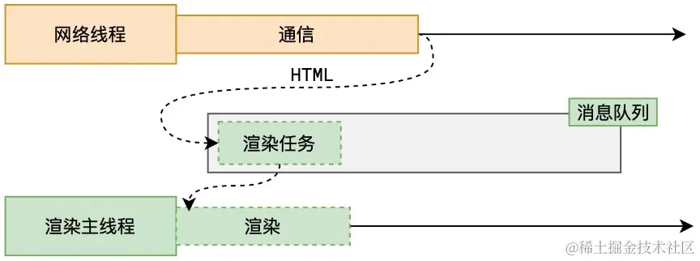

> 基于上期的文章，我们知道浏览器会开启一个网络进程，每一个标签页也会对应一个渲染主线程。

1. 我们打开某个浏览器，输入某个网址，这个网址在经过 url 解析、DNS 解析等操作后得到了服务器的IP地址。

2. 浏览器的网络线程调用 Socket 库，委托操作系统中的协议栈工作，经过 TCP 三次握手，与服务器建立连接之后，向这个服务器地址发送 http 请求，服务器会将浏览器需要的 HTML 文档等资源发送给我们客户端这边的协议栈，交付给网络线程。

3. 浏览器的网络线程在接收到 HTML 文档之后开始解析，会产生一个渲染任务，并将其传递给渲染主线程的消息队列。

4. 在事件循环机制的作用下，渲染主线程取出消息队列中的渲染任务，开启渲染流程。完成渲染后，才到了我们最终看到的页面。

这个过程前两个步骤其实是**网络请求与响应过程**，后面两个步骤其实是**渲染过程**。以下我就从这两个角度来简单阐述一下，重点还是讲解渲染过程。

想直接学习了解浏览器渲染过程的掘友，可以直接点击目录中的**渲染过程解析**。

## 网络过程解析

网络请求与响应这个过程，相信各位掘友们都挺熟悉的了，有一篇带佬的文章写得比较详细。 乱星海传送大阵已开启！ 👉  [输入一个网址到网页过程中都发生了什么？](https://blog.csdn.net/weixin_45639224/article/details/127150234)

下面就以我个人的理解，简单阐述一下这个网络过程中的知识点：

### DNS解析

> DNS，Domain Name System，也称为域名系统，主要功能就是将域名解析为相应的 IP 地址。

先看如下图的 DNS 查询过程：

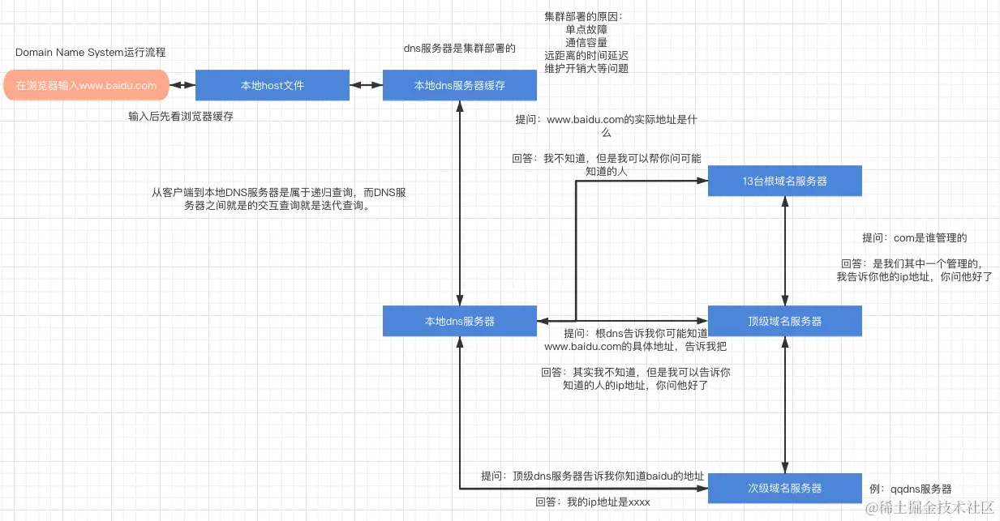

> 这张图片可以新开一个标签页打开看，图片太大，缩放之后有点糊。

1. 以 www.baidu.com 为例，我们浏览器这一端，也就是 DNS 客户端，会先查看浏览器缓存，也就是本地 host 文件；

2. 如果查询未果，DNS 客户端则会将查询请求提交到本地 DNS 服务器，本地 DNS 服务器会先查找自己的 DNS 缓存；

3. 如果查询未果，本地 DNS 则会向根域名服务器提交查询申请；

4. 根域名服务器则会向本地 DNS 返回 .com 域的 DNS 服务器地址；

5. 本地 DNS 收到之后，则会向 .com 域名的顶级域名服务器提交查询申请；

6. .com 域名的顶级域名服务器则会向本地 DNS 返回 baidu.com 域 DNS 的地址；

7. 本地 DNS 向 baidu.com 域的次级域名服务器发送查询申请；

8. 该次级域名服务器则会返回查询结果，告诉他对应的服务器 IP 地址；

9. 本地 DNS 在收到返回结果后，则会本地先缓存一份，然后再向客户端返回查询结果。

总结这个查询顺序：客户端 ————> **本地主机表** —— 递归查询 ——> **本地 DNS** —— 迭代查询 ——> **根、顶级、次级 DNS**。

> 在 DNS 系统中，有两种查找记录的方法：递归查询和迭代查询。
> 
> 递归查询：由 DNS 客户端发起，逐级提交查询应用，直至查询终止（上述描述流程中的2和9步骤）；
> 
> 迭代查询：通常在 DNS 服务器之间完成，即本地 DNS 将查询提交给上层 DNS。上层 DNS 不会直接返回查询结果，但会告诉本地 DNS 在哪里查找（上述描述流程中的3-8步骤）。
> 
> 如总结的顺序中所指，客户端向本地 DNS 服务器是递归查询，本地 DNS 服务器向根、顶级、次级 DNS 是迭代查询。

### TCP三次握手

TCP协议是可靠传输（UDP是不可靠传输），该协议中客户端与服务器建立连接的过程，一般比较形象的称之为三次握手；断开连接的过程，则是四次挥手。

http数据是基于TCP协议传输的。经过域名解析，客户端知道了 www.baidu.com 的服务器地址，因此需要先与该 IP 地址建立连接，然后再传递 http 请求等数据。

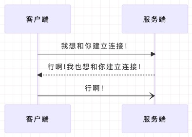

三次握手这个过程，如上面这张图所示，比较简单形象的说法：

1. 客户端向服务器发送一个尝试连接的请求。
 
2. 服务器收到请求之后，返回给客户端一个相应的确认连接请求（“行啊！”），但是这个时候还只是客户端到服务器的单向连接。因此，服务器还会向客户端发送一个连接请求。
 
3. 客户端收到服务器的确认信息和连接请求，先查看确认信息是不是自己想要的最新的连接请求所对应的确认信息。确认没错的话，也得确认一下服务器的连接请求（“行啊！”），这时才建立了可以双向传输的连接。

> 从上面这个过程中，你差不多可以明白建立连接需要三次握手就够了吧，两次不够，四次浪费且没必要！最重要的是：**三次握手的主要/首要原因是为了防止旧的重复连接初始化造成混乱**。
> 
> 那么断开连接，为啥就得四次呢？你可以这样看，断开一个单向连接就得两次挥手，那么双向的话就得四次。其中两次挥手包含：一个请求断开，另一个确认断开。当客户端主动请求断开时，等到双方都确认断开后，客户端会进入Time-wait状态，服务器率先进入close状态，过会客户端才进入close状态。

握手、挥手过程，有一篇带佬的文章写得超超超详细。乱星海传送大阵再次开启！👉 [超超超详细讲解TCP三次握手与四次挥手（大图解），值得收藏](https://zhuanlan.zhihu.com/p/591865232)

### IP协议和ARP协议

IP协议是网际互连协议，是 TCP/IP 体系中的网络层协议，是 TCP/IP 协议簇的核心，是网络互联互通的基础。

DNS域名解析后得到的服务器地址也就是IP地址，而由IP地址解析得到MAC地址的则是通过ARP协议（地址解析协议）。

网络过程大概如此，讲的比较糙，咱们还是将本文重心放在**渲染过程**上。

## 渲染过程解析⭐⭐⭐

渲染过程主要由相应的标签页的渲染主线程来主导执行，整个渲染流程分为多个阶段，分别是：解析HTML、样式计算、布局、分层、绘制、分块、光栅化、合成。

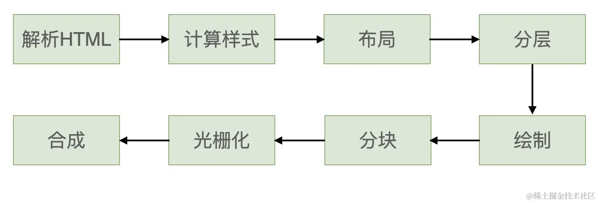

每个阶段都有明确的输入输出，上一个阶段的输出会成为下一个阶段的输入。

以下就分别对渲染过程的各个阶段作原理性说明：

### 解析HTML

渲染主线程从消息队列中获取渲染任务，开始进行HTML文档的解析。如下面这张图所示，解析过程中遇到 CSS 则解析 CSS，遇到 JS 则执行 JS ，最终会得到 DOM 树和 CSSOM 树，浏览器的默认样式、内部样式、外部样式、行内样式均会包含在 CSSOM 树中。

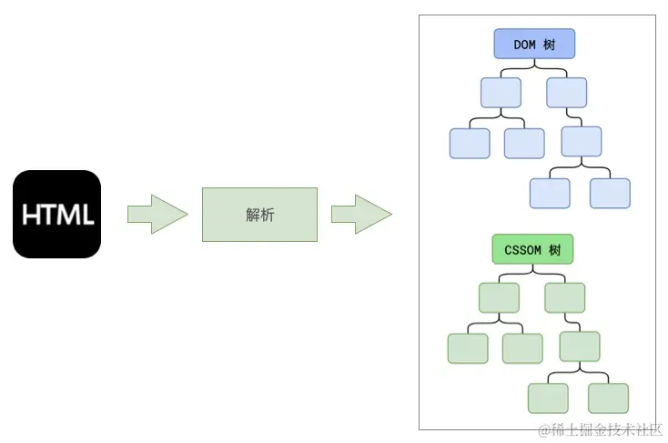

由渲染主线程解析 HTML 生成 CSSOM 树和 DOM 树的过程中，主要包含**标记化**和**构建 DOM 树**两个过程。

1.  *标记化：*

    两个步骤：词法分析（标记）、创建标记队列。

    -   *词法分析：* 主线程会将原始的 HTML 文档分解成一个个的标记（HTML 文档中的最小单元，例如一个标签、一个属性、文本内容等）。
    -   *创建标记队列：* 主线程会创建一个标记队列，将 HTML 文档中的所有标记按照它们在文档中的顺序排列到队列中。

2.  *构建 DOM 树：*

    主线程先创建一个 DOM 树的根节点，然后按照标记队列的顺序遍历每个标记，根据标记的类型和内容构建 DOM 树的节点。例如：对于元素标记（如 `
`、`
` 等），主线程创建相应的元素节点并设置标签名和属性，然后添加到 DOM 树；对于文本内容标记，主线程创建文本节点，并将其附加到适当的元素节点上。此外，还会根据标记的嵌套关系，建立父子关系，形成完整的 DOM 树结构。

为了提高解析效率和页面加载速度，浏览器在开始解析前，还会启动一个**预解析线程**，率先查看HTML，识别出需要提前加载的外部资源，其中包括**外部 CSS 文件**和 **外部的 JS 文件**，并通知网络线程下载这些外部资源。预解析的目的是在用户请求页面之前提前获取并加载页面所需的资源，从而加速页面的渲染过程。

如果渲染主线程解析到`link`位置（也就是外部样式表），此时外部的 CSS 文件还没有下载解析好，主线程不会等待，继续解析后续的 HTML。这是因为下载和解析 CSS 的工作是在预解析线程中进行的。因此，**CSS 不会阻塞 HTML 的解析！！！**

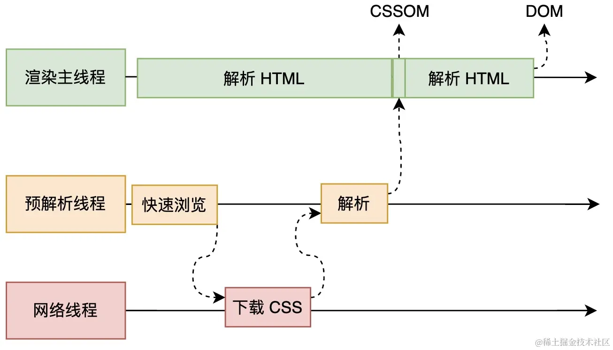

如上面这张图所示，预解析线程识别 HTML 文档中外部 CSS 文件，然后通知网络线程下载，下载完成后由预解析线程做一些铺垫工作，然后由渲染主线程生成 CSSOM 树。

当渲染主线程解析到`script`位置（也就是JS/TS代码），则会暂停解析 HTML，等待网络线程 JS 文件下载好，并且将全局代码执行完成后，才能继续解析 HTML。因此，**JS 会阻塞 HTML 的解析！！！**

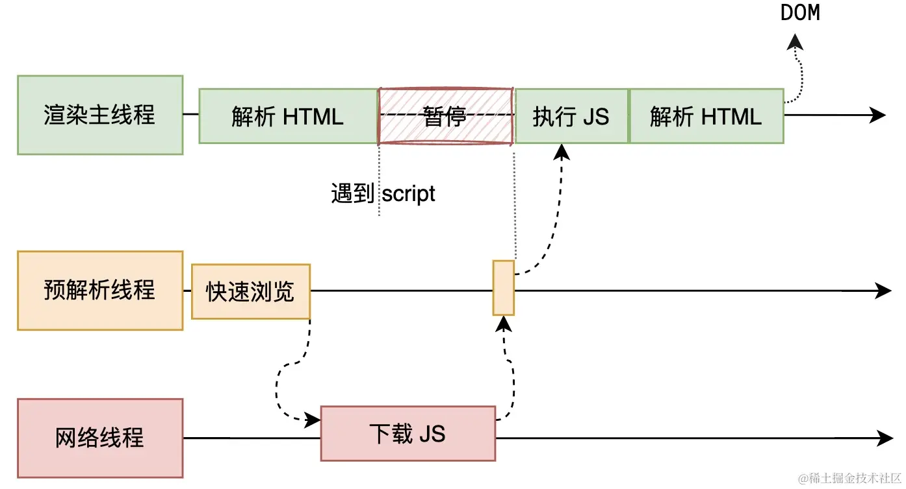

同样的，如上面这张图所示，预解析线程还会识别 HTML 文档中外部 JS 文件，然后通知网络线程下载，下载完成后由预解析线程交还给渲染主线程立即执行。当渲染主线程完成 JS 代码执行后，才会继续解析 HTML ，生成 DOM 树。

> *为什么一定要暂停解析，等待JS文件下载完成呢？*
> 
> 这是因为 JS 代码中，可能会存在修改当前 DOM 树的操作。你如果想等当前渲染任务完成的话，再去执行JS，如果修改了当前的dom树，是不是就肯定得 reflow 或者 repaint ？这岂不是会违背提高渲染效率和页面显示等初衷？所以 DOM 树的生成必须暂停，先执行完 JS 代码。

### 计算样式

渲染主线程会遍历得到的 DOM 树，依次计算每个元素应用的样式，包括从CSS文件中获取并解析构建出样式表规则，计算出最终的样式信息（Computed Style），并将这些规则分别放到对应的DOM树节点上。这一步完成后，会得到一棵带有样式属性的 DOM 树。

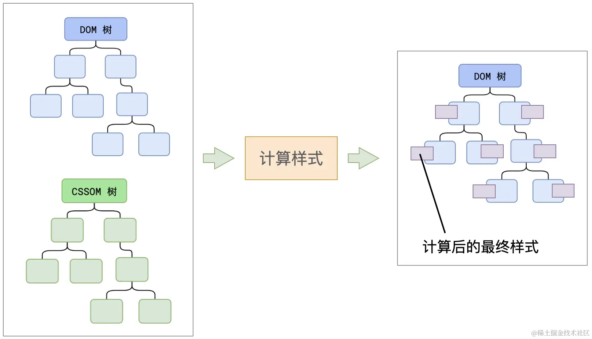

在这一过程中，很多预设值会变成绝对值，比如`red`会变成`rgb(255,0,0)`；相对单位会变成绝对单位，比如`em`会变成`px`。

### 布局

布局阶段会依次遍历 DOM 树的每一个节点，结合上一步计算出的最终样式信息，计算每个节点的几何信息（每个元素在屏幕上的位置和大小）。例如节点的宽高、相对包含块的位置。

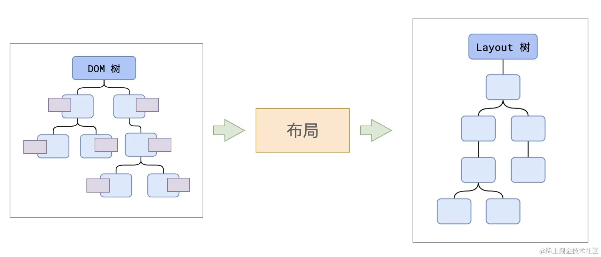

但是我们得注意，大部分时候，**DOM 树和布局树其实并非一一对应**，下面举例说明：

- 比如，DOM 树中`display:none`的隐藏节点，它没有几何信息，因此不会生成到布局树。
- 又比如，使用了伪元素选择器，虽然 DOM 树中不存在这些伪元素节点，但它们拥有几何信息，所以会生成到布局树中。
- 还有匿名行盒、匿名块盒等等也都会导致 DOM 树和布局树无法一一对应。

> **回流（Reflow）**
> 
> 其本质就是重新计算布局树。当进行了会影响布局树的操作后，需要重新计算布局树。
> 
> 因此，为了避免连续多次操作导致布局树反复计算，浏览器会合并这些操作，当 JS 代码全部完成后再进行统一计算。所以，改动属性造成的 reflow 是**异步**完成的。
> 
> 那么，紧接着，因为 reflow 是异步完成的，当 JS 获取布局属性时，就可能会造成无法获取到最新的布局信息。
> 
> 因此，浏览器在反复权衡下，最终决定**获取属性时立即 reflow**。
>
> 
> 
> 这部分肯定会问 如何减少回流次数：使用DocumentFragment对象 将其当作暂时的DOM节点存储器 完成其中节点操作后一次性添加到DOM树中 减少直接操作DOM树中节点的操作。
> [DocumentFragment相关博客](https://www.cnblogs.com/echolun/p/10098752.html)

### 分层

渲染主线程会使用一套复杂的策略，根据布局树将页面划分为多个图层，这些图层可以独立绘制和重绘。这样做的主要好处就是，可单独处理每个图层，优化渲染性能。如果某一个层将来改变了，那么也仅会对该层进行后续处理，而不必重新绘制整个页面，从而提升效率。

> 微信截的图，有点糊，右边的预览页面没截，截出来这图直接没法看了，掘友见谅！

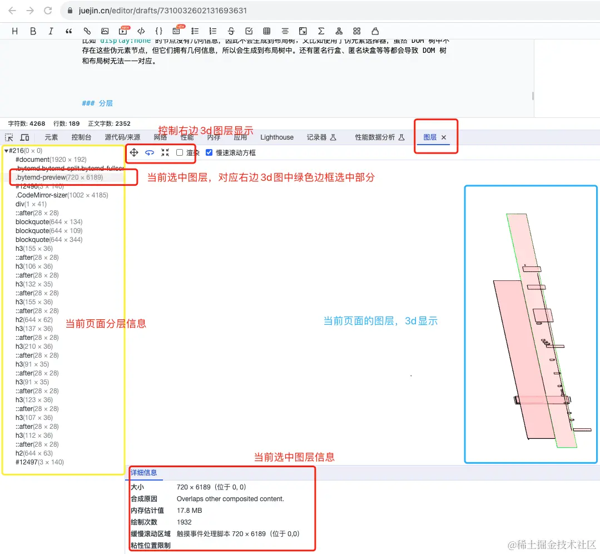

这是我写这篇文章时的页面的渲染图层截图，我们可以看到当前选中的图层是写文章的预览页面，不熟悉的掘友可以了解了解🫡。

至于如何分层，滚动条、堆叠上下文、transform、opacity 等样式都会或多或少的影响分层结果，也可以通过`will-change`属性更大程度的影响分层结果（该属性相当于告知浏览器某个元素将会发生一些变化，以便更好分层，做好性能优化）。

### 绘制页面

渲染主线程会根据计算好的样式和布局信息，为每个图层单独生成绘制指令集（或者叫构建绘制树），用于描述这一层的内容该如何画出来。以浏览器可见区域为画布，左上角为(0,0)基础坐标，从左到右，从上到下，从 DOM 树的根节点开始，将页面内容绘制到各个图层上。

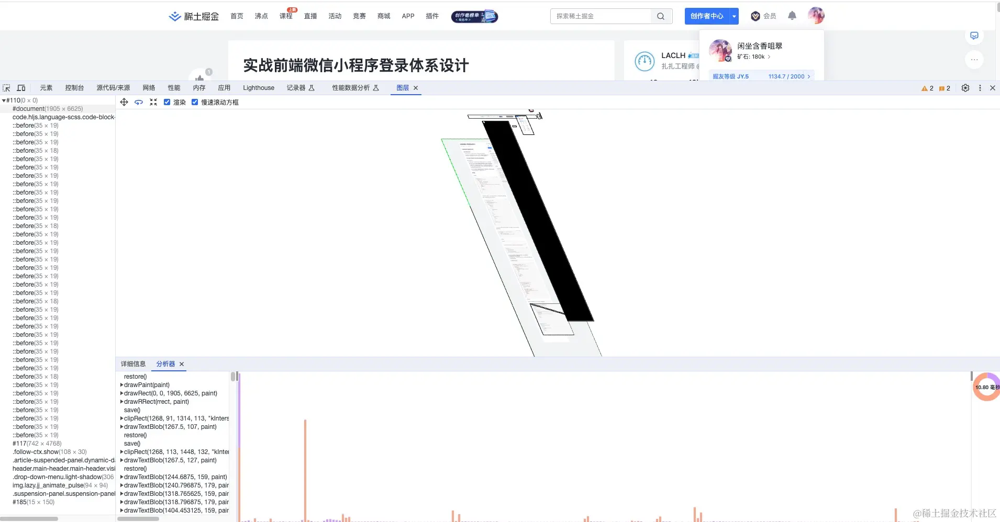

比如，上面这张图中的图层部分，点击渲染后，我们可以从分析器中可以看到选中图层的绘制指令等。

上面的图比较糊，重新放个清楚的，选中图层如下：

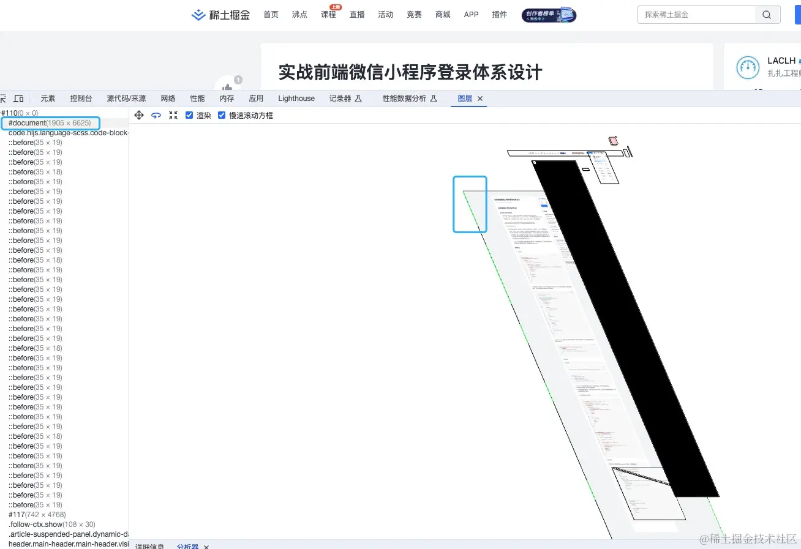

蓝色框标记的那个图层，其实也就是当前看的这篇文章的页面，而不是右边个人中心等其他图层。

该图层绘制指令如下：

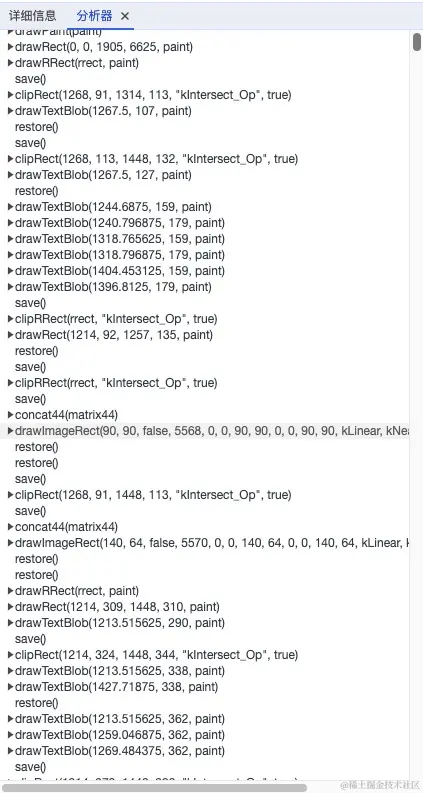

指令很多，由此也能看到这个浏览器的设计与实现真的是🐮！

> **重绘（Repaint）**
> 
> repaint 的本质就是重新根据分层信息计算绘制指令（或构建绘制树）。
> 
> 当改动了**可见样式**后，就会引发 repaint，重新计算。
> 
> 由于元素的布局信息也属于可见样式，所以**reflow 一定会引起 repaint**。

### 分块

完成绘制后，渲染主线程将每个图层的绘制信息提交给合成线程，剩余工作将由合成线程完成。

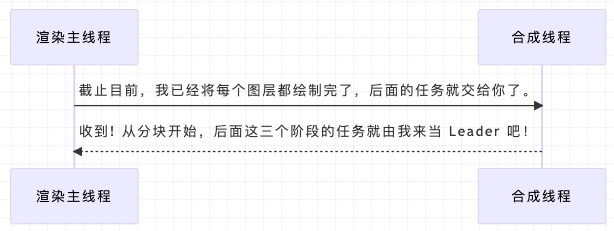

合成线程会从线程池中拿取多个线程，然后将每个图层分割成小块，甚至划分为更多的小区域，以便更高效地处理和显示。说到底，这也是有助于提高渲染效率的。

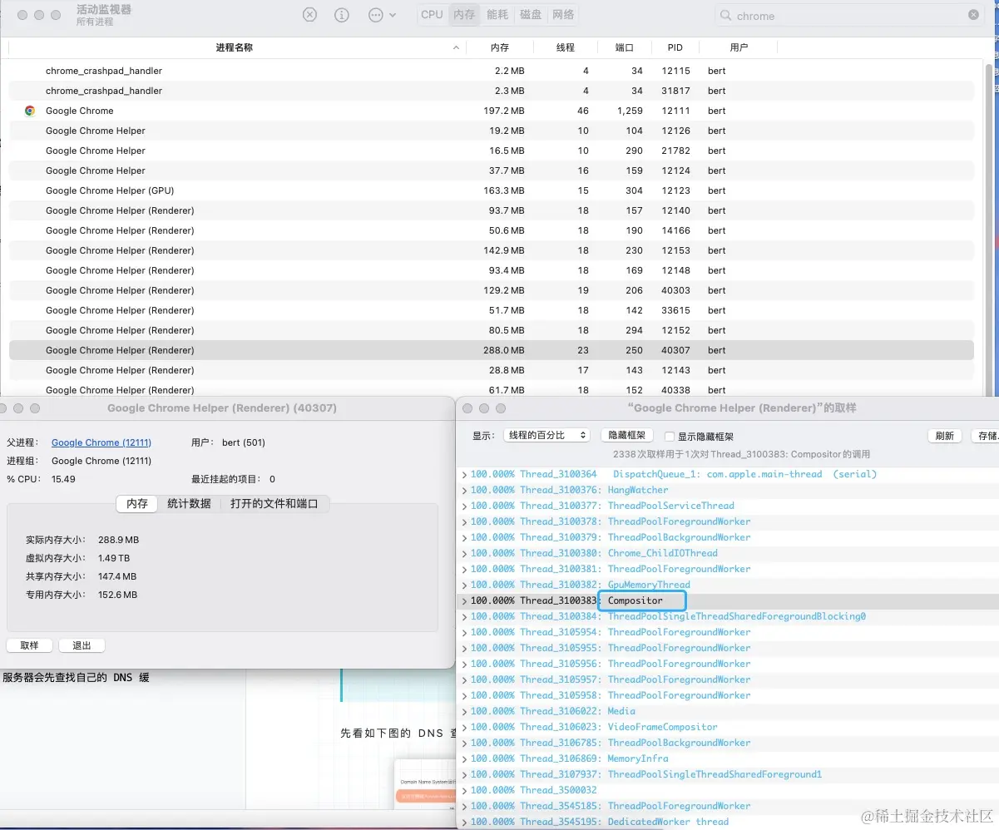

上面这张图中即是对当前的掘金写文章标签页的渲染进程的取样，其中蓝色边框框选的进程即是合成线程Compositer。

### 光栅化

完成分块之后，进入光栅化阶段。光栅化则是将每个块中信息转换为像素（将矢量图形转化为屏幕上的像素），形成最终的位图。

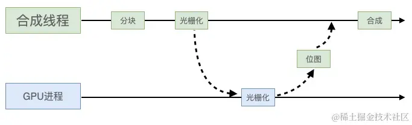

如上面这张图所示，合成线程将块信息交给 GPU 进程，而 GPU 进程会开启多个线程以极高的速度完成光栅化，并且优先处理靠近视口区域的块。然后， GPU 进程再将这一块一块的位图交还给合成线程。

### 合成

该阶段是将不同图层按照正确的顺序绘制到屏幕上，合成为最终的屏幕图像。

大致原理是这样：合成线程拿到每个图层、每个分块的位图后，生成一个个**指引（quad）信息**。合成线程会把这个指引提交给 GPU 进程，由 GPU 进程产生系统调用，提交给 GPU 硬件，完成最终的屏幕成像。

*上述中提到的**指引信息**会标识出每个位图应该画到屏幕的哪个位置，以及反映旋转、缩放等变形信息。*

> 为什么`transform`的效率，相比较 Reflow 和 Repaint 要高很多呢？
> 
> 因为`transform`属性的变形操作就发生在渲染过程的合成阶段，由合成线程主导执行，与渲染主线程无关，无需重新执行合成前面的阶段。

至此，由 HTML 文档到浏览器页面的渲染过程就执行完成了。

## 总结

总结浏览器的渲染过程，按照顺序主要分为这几个阶段：

解析HTML ————> 计算样式 ————>  布局  ————> 分层  ————> 绘制  ————> 分块 ————> 光栅化 ————> 合成。

我们可以基于文章中的理解，根据下面的思维导图，来记忆这个渲染过程。

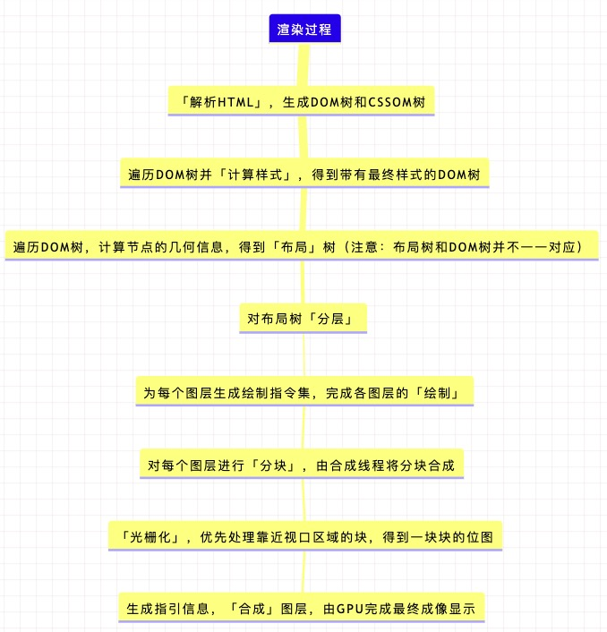

此外，从**解析HTML**到**绘制**阶段一直由渲染主线程主导执行，而**分块**到**合成**阶段则一直由合成线程主导执行。