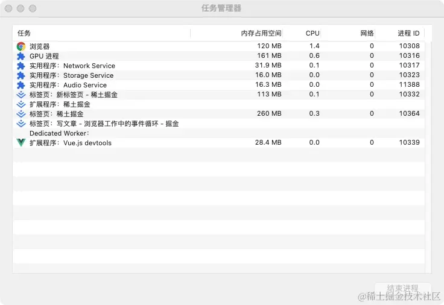
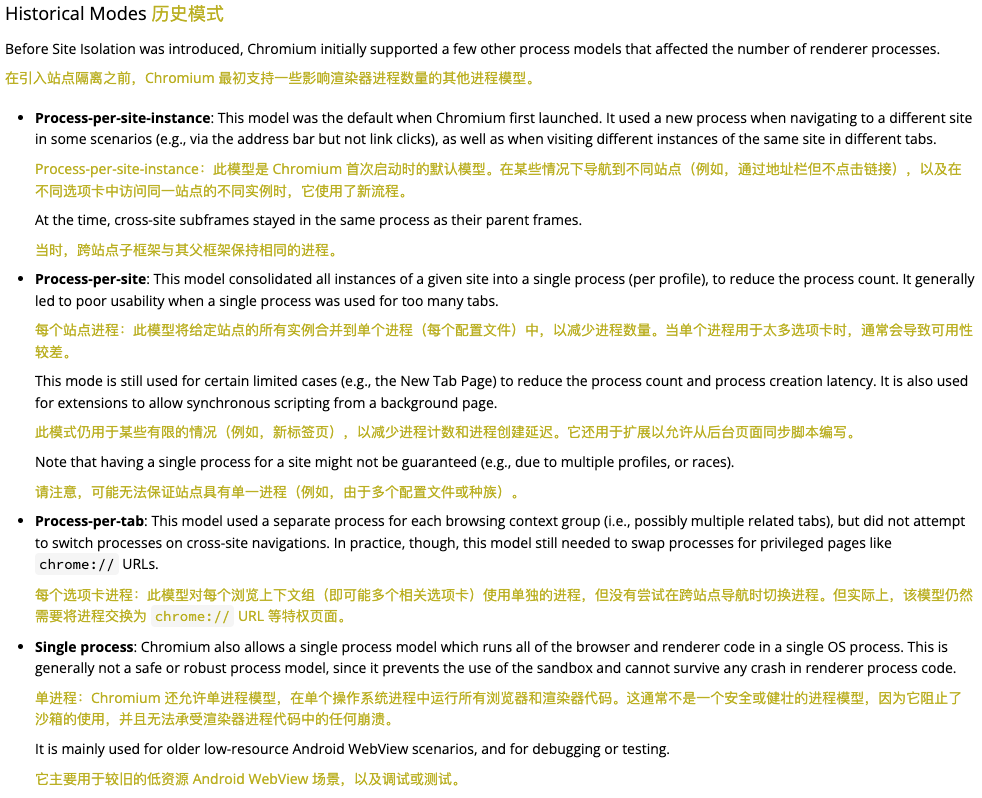
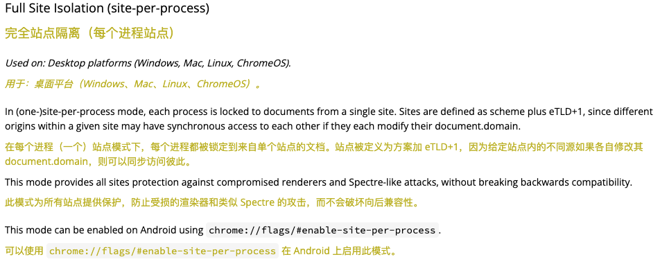
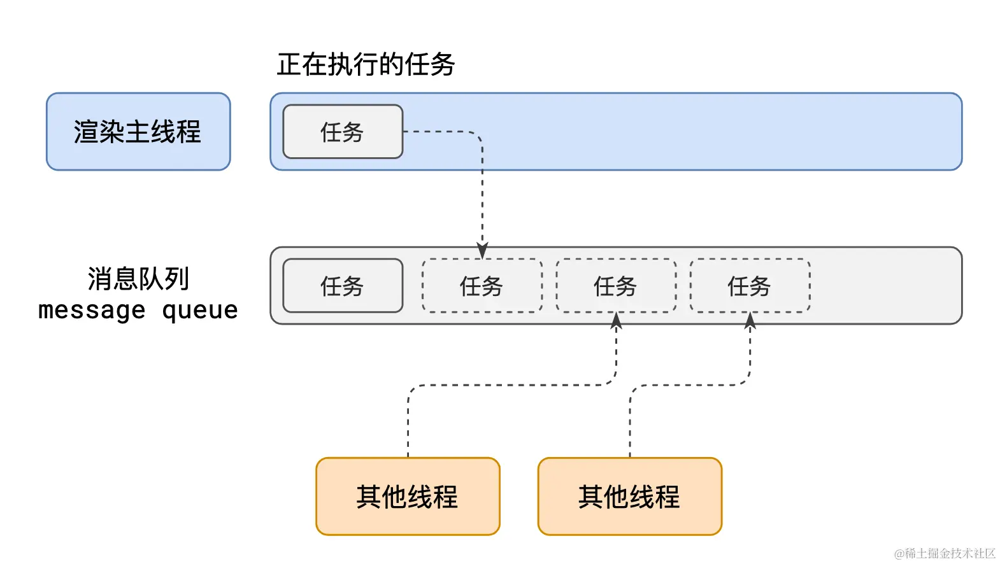
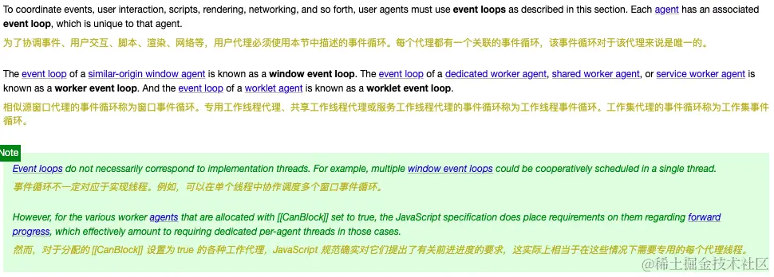
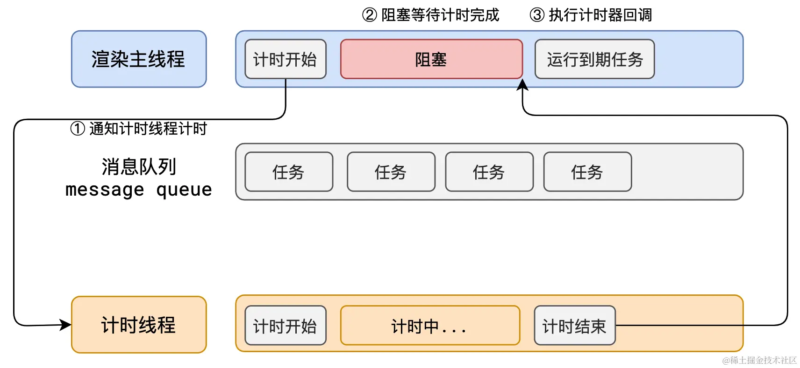
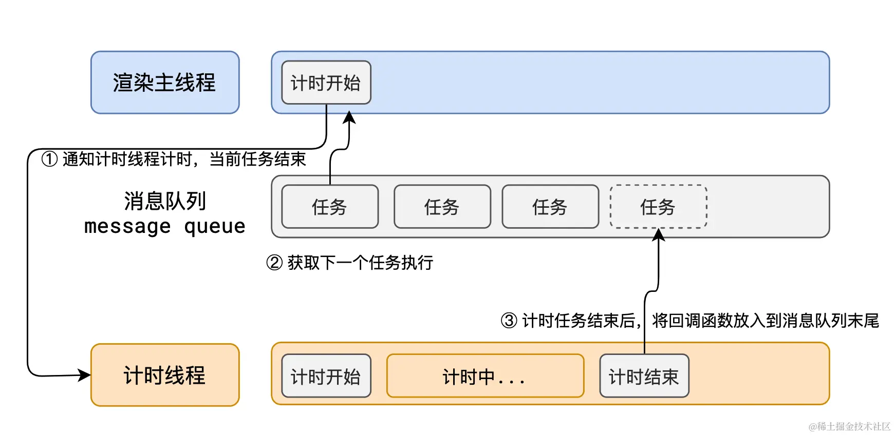
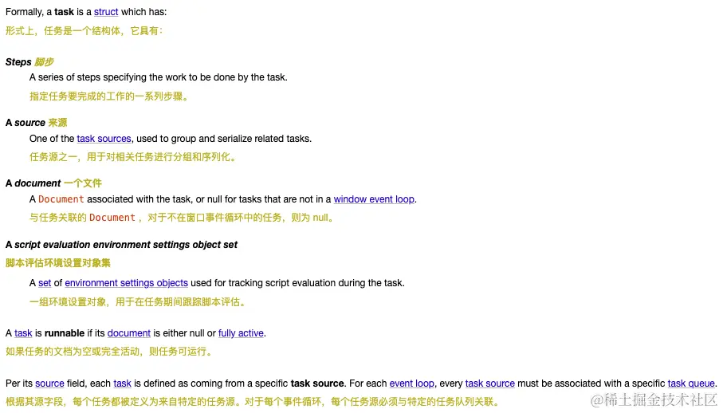

# 深入浏览器原理之事件循环

> 文章从个人的掘金账号搬运而来，👉 [我的掘金主页](https://juejin.cn/user/3844369926334215/posts)

> 粗浅理解，文中若有错误，欢迎您的批评指正！

## 进程、线程

### 什么是进程

进程是一个实体，狭义定义是，一个正在运行的程序的实例。

每个应用至少有一个进程，进程之间相互独立，即使要通信，也需要双方同意。
那么比如说你在手机或者电脑上，打开一个应用软件运行，那么肯定也会有一个进程产生。

程序运行需要有它自己专属的内存空间，每一个进程都有它自己的地址空间。一般情况下，包括文本区域（text region）、数据区域（data region）和堆栈（stack region）。
    
| 进程中一般包括的区域  | 区域的作用  |
| :-----: | :--------------: |
| 文本区域 | 存储处理器执行的代码  |
| 数据区域 | 存储变量和进程执行期间使用的动态分配的内存 |
| 堆栈区域 | 存储着活动过程调用的指令和本地变量|

### 什么又是线程

一个标准的线程由线程ID，当前指令指针（PC），寄存器集合和堆栈组成。

线程是进程中的一个实体，是被系统独立调度和分派的基本单位，线程自己不拥有系统资源，只拥有一些在运行中必不可少的资源，但它可与同属一个进程的其它线程共享进程所拥有的全部资源。

线程的提供可以更加高效且方便的实现任务的并发处理。

### 进程、线程之间的关系

1. 一个进程至少有一个线程，所以在进程开启后会自动创建一个线程来运行代码，该线程称之为主线程；如果程序需要同时执行多块代码，主线程就会启动更多的线程来执行代码，所以一个进程中可以包含多个线程。
2. 进程是资源分配的基本单位，同一个进程的所有线程共享该进程的所有资源。
3. 真正在处理器中运行的是线程而不是进程。
4. 线程在执行的过程中需要协作同步；不同进程的线程之间实现协作同步则需要消息通信。

## 浏览器中有哪些进程和线程？

**浏览器是一个多进程多线程的应用程序**。为了避免相互影响，减少连环崩溃的几率，当启动浏览器后，它会自动启动多个进程。

> 如下面这张图中所示，我们可以在浏览器的任务管理器中查看当前浏览器窗口中开启的所有进程。

其中，有以下进程：

1.  浏览器进程（图中ID为10308的进程）

    主要负责界面显示、用户交互、子进程管理等。浏览器进程内部会启动多个线程处理不同的任务。
    
    >+ 界面显示：浏览器标签页用户信息，页头包括url等；
    >+ 用户交互：鼠标、键盘等用户输入；
    >+ 子进程管理：启动其他子进程，比如其他页面的渲染进程。

2.  GPU进程（图中ID为10316的进程）
    
    主要负责3D绘制等。
    
3.  网络进程（图中ID为10317的进程）

    主要负责加载网络资源。网络进程内部会启动多个线程来处理不同的网络任务。
    
4.  存储进程（图中ID为10323的进程）

    主要控制tab页面的前进、后退、创建和销毁。

5.  音频进程（图中ID为10388的进程）

    这是Chrome 76版本中做出的改变，将音频服务从浏览器进程中隔离出来。官方表示这样做的好处是，提高浏览器的稳定性。长期好处是，使音频处理逻辑能够在音频处理过程中运行，并且尽可能不将音频缓冲区传递给渲染器进程，这意味着具有更稳定的音频路径延迟和更好的性能。

6.  **浏览器渲染进程**（图中ID为10332、10364的进程）

    主要负责页面的渲染。Chrome的**默认策略**：每个标签页都会有一个渲染进程，以保证不同的标签页之间不相互影响。

    渲染进程启动后，会开启一个**渲染主线程**，由其负责执行 HTML、CSS、JS 代码。
    
    > 这里其实也解释了为什么 JS 是一门单线程的语言？
    > 
    > 因为它运行在浏览器的渲染主线程中，而对应到每个标签页或者站点，渲染主线程只有一个。 
    
    实际上，并不是每个标签页都会开启一个渲染进程。准确的说，应该是同一个站点的标签页使用/共享同一个渲染进程。这对应**process-per-site-instance**策略：如果一个页面打开了一个新页面，而两者又同属于一个站点，那么新页面就会使用父页面的渲染进程。比如淘宝网站和其具体的商品，有多个标签页时，因为其商品也是从属于淘宝网站，因此仅开一个渲染进程，而不是一个标签页一个进程。
    

我在Chrome[官方文档中](https://chromium.googlesource.com/chromium/src/+/main/docs/process_model_and_site_isolation.md#Full-Site-Isolation-site_per_process)把进程模型这部分截屏了出来，以前使用的进程模型如上面这张图，有**Process-per-site-instance**、**Process-per-site**、**Process-per-tab**、**Single process**，这里就不过多解释。

为什么这些模式还会成为历史？因为以上进程模型虽然是为每个页面创建一个渲染进程，但是还是存在**不同的网站用同一个进程的情况**，如iframes和父页面、同一个标签页里的页面跳转、标签页过多等。

因此，如下面这张图所示，Site Isolation引入了一个新的更为严格的策略叫做 Full Site Isolation（site-per-process）：只要是**不同的网站**，不论是打开新的标签页，还是在同一个标签页跳转，还是嵌在 iframes 里，均要开启一个新的渲染进程。

7.  插件进程（图中ID为10339的进程）

    因为插件易崩溃，所以每个扩展中安装运行的插件都会有一个相应的插件进程，这种与浏览器进程等其他进程隔离的方式，保证了插件崩溃等异常情况不会对其他进程造成影响，影响浏览器的运行和用户的使用。

## 渲染主线程是如何工作的？

从上面可以看到，每个浏览器渲染进程都会有一个渲染主线程。渲染主线程是浏览器中最繁忙的线程，它需要处理的任务包括但不限于：

*   解析 HTML
*   解析 CSS
*   计算样式
*   布局
*   处理图层
*   每秒把页面画 60 次
*   执行全局 JS 代码
*   执行事件处理函数
*   执行计时器的回调函数
*   ......

要处理这么多的任务，有个问题：如何调度任务呢？

渲染主线程处理这个问题的思路/方法：让所有任务排队。

如上面这张图所示：
1.  在最开始的时候，渲染主线程会进入一个无限循环。
2.  每一次循环，渲染主线程会检查消息队列中是否有任务存在。如果有，就取出第一个任务执行，执行完一个后进入下一次循环；如果没有，则进入休眠状态。
3.  其他所有线程（包括其他进程的线程）可以随时向消息队列添加任务，添加至消息队列末尾。在添加新任务时，如果主线程是休眠状态，则会将其唤醒以继续循环拿取任务。

**整个过程，被称之为事件循环 event loop（消息循环 message loop）**。

[W3C标准](https://html.spec.whatwg.org/multipage/webappapis.html#definitions-3) 中是这样定义的：

如此一来，每个任务貌似都得到了执行和处理，这个过程其实是同步。但是，问题又出现了：
1. 发生了一个用户点击事件，但是此时消息队列里有很多任务。如果他慢慢排队，则会让用户觉得怎么卡死了呢？
2. 如果某段代码里有个计时器/延时任务，处理器在处理这段代码过程中，一直等待这个计时器，则会浪费处理器资源。

也就是说，如果使用同步的方式，就极有可能导致主线程产生阻塞，从而导致消息队列中的很多其他任务无法得到执行。这样一来，一方面会导致繁忙的主线程白白的消耗时间，另一方面导致页面无法及时更新，给用户造成卡死现象。

因此，异步的概念就引申出来了。

## 何为异步？

代码在执行过程中，会遇到一些无法立即处理的任务，比如：

*   计时完成后需要执行的任务 —— `setTimeout`、`setInterval`
*   网络通信完成后需要执行的任务 -- `XHR`、`Fetch`
*   用户操作后需要执行的任务 -- `addEventListener`

如下面这张图中所示，如果渲染主线程在执行需要计时的到期任务时，在通知计时线程开始计时后，就一直阻塞，等待计时完成后执行回调函数。其中，渲染主线程长期处于「阻塞」的状态，从而导致浏览器「卡死」。

可以类似用处理器来理解渲染主线程，处理器的资源何其珍贵，如果让某个阻塞的进程一直占着却不执行其他进程任务，岂不是白白浪费和耽误其他任务执行，系统工作效率也就降低了。

同样的，**渲染主线程**也承担着极其重要的工作，比如渲染页面、执行 JS等，**无论如何都不能阻塞**！因此，浏览器使用**异步**工作方式来解决这个问题。

如上面这张图中所示，当渲染主线程遇到计时器、网络、事件监听等任务时，将其交给其他线程处理，自身立即结束任务的执行，转而转而执行事件循环，从消息队列中拿取下一个任务进行执行。当其他线程完成时，将事先传递的回调函数包装成任务，加入到消息队列的末尾排队，等待主线程调度执行。

使用这种异步的方式，**渲染主线程永不阻塞**，最大限度的保证了单线程的流畅运行。

## 任务有优先级吗？

从上一节异步的讲述，我们可以发现，渲染主线程在遇到计时器、网络、事件监听等任务时，将其交给其他线程执行，自身转而拿取其他任务，这是否说明其他任务比计时器、网络、事件监听任务有更高的优先级呢？

答案其实是否定的，任务没有优先级，都是在消息队列中排队，有着类似先进先出的原则。

但是**消息队列是有优先级的**。

根据 W3C 的最新解释:

*   每个任务都有一个任务类型，同一个类型的任务必须在一个队列，不同类型的任务可以分属于不同的队列。
    在一次事件循环中，浏览器可以根据实际情况从不同的队列中取出任务执行。
       

比如上面这张图中，W3C 规定了任务的形式/定义，其中 source 字段定义为特定任务源，从而与特定任务队列相关联。
    
*   浏览器必须准备好一个微队列，微队列中的任务优先所有其他任务执行。

比如上面这张图中，W3C 规定每个事件循环都必须有一个微任务队列。

更多官方解释，点击[W3C-事件循环](https://html.spec.whatwg.org/multipage/webappapis.html#event-loops)阅读。

> 此外，随着浏览器的复杂度急剧提升，W3C 不再使用宏队列的说法，仅用微任务队列和其他任务队列进行说明。

而目前在 Chrome 的实现中，至少包含了下面的队列：

*   微队列：用户存放需要最快执行的任务，优先级「最高」；
*   交互队列：用于存放用户操作后产生的事件处理任务，优先级「高」；
*   延时队列：用于存放计时器到达后的回调任务，优先级「中」。

## 总结

看到这里，我们肯定对浏览器的进程模型有了一些了解。此时，你是否明白了事件循环呢？

结合 Chrome浏览器，我们可以这样简单理解，事件循环也叫消息循环，是浏览器渲染主线程的工作方式。在 Chrome 的源码中，它开启一个不会结束的 for 循环，每次循环从消息队列中获取第一个任务执行，而其他线程只需要在合适的时候将任务加入到队列末尾即可。

过去把消息队列简单分为宏队列和微队列，这种说法目前已无法满足复杂的浏览器环境，取而代之的是一种更加灵活多变的处理方式。

根据 W3C 官方的解释，每个任务有不同的类型，同类型的任务必须在同一个队列，不同类型的任务可以属于不同的队列。不同任务队列有不同的优先级，在一次事件循环中，由浏览器自行决定取哪一个队列的任务。但浏览器必须有一个微队列，微队列的任务一定具有最高的优先级，必须优先调度执行。比如，Chrome浏览器中按照执行优先级从高到低分别实现了微队列、交互队列、延时队列......