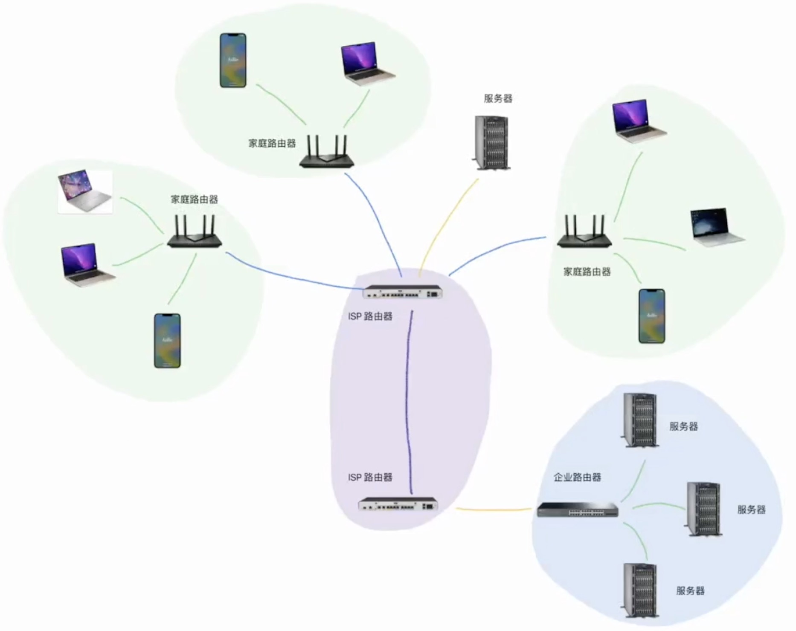

# 前端必学网络

## 先认识网络通信



## 分层模型和应用协议

### 分层模型

网络要解决的问题是： **两个程序之间如何交换数据**。

这是一个非常复杂的问题。

面对复杂的问题，可以使用分层的方式来简化。

经过不断的演化，网络最终形成了五层模型：

##### 五层网络模型

应用层：跟具体应用相关的消息格式？ HTTP、FTP、DNS、SMTP、POP3

传输层：如何保证消息的可靠传递？ TCP（可靠协议）、UDP（广播协议，不可靠协议）

网络层：如何在互联网中找到对方甚至优化传输路径？ IP、路由器

数据链路层：如何在一个字网中找到对方？ MAC地址、交换机

物理层：上面给我的东西如何用信号表示（光信号、电磁波、电信号）？ 光纤、双绞线、同轴电缆、集线器


### 数据的传输


### 四层、五层、七层


### 应用层协议

##### URL

URL(uniform resource locator，统一资源定位符)用于定位网络服务


URL是一个固定格式的字符串

http:// a.com:80/news/detail?id=1#t1

schema  domain port path     query hash


他表达了：

从网络中*哪台计算机（domain）中的哪个程序（port）*寻找*哪个服务（path）*，并注明了获取服务的*具体细节（path）*，以及要用什么样的*协议通信（schema）*

包含一些细节：
+ 当协议是http端口为80时，端口可以省略
+ 当协议是https端口为443时，端口可以省略
+ schema、domain、path是必填的，其他的根据具体

##### HTTP

超文本传输协议（Hyper Text Transfer Protocol，*HTTP*）是一个广泛运用于互联网的应用层协议。

99%的情况下，前端开发者接触的都是HTTP协议。

该协议规定了两个方面的内容：

- **传递消息的模式**
- **传递消息的格式**

#### 传递消息的模式


HTTP使用了一种极为简单的消息传递模式，「请求-响应」模式

发起请求的称之为客户端，接收请求并完成响应的称之为服务器。

「请求-响应」完成后，一次交互结束。

#### 传递消息的格式


> 图中错误：响应头 响应体

HTTP的消息格式是一种纯文本的格式，文本分为三个部分：

```
请求行：请求方法 query+path 协议及版本
请求头

请求体
```

##### 其他关键信息

###### 请求方法

请求行中的第一个单词是请求方法

**在HTTP协议中，请求方法仅有语义的区别**，只是表达了这次请求的「愿望」。

> 关于请求方法的协议原文见 [HTTP/1.1规范RFC7231-Chapter4](https://www.rfc-editor.org/rfc/rfc7231.html)
>
> 
>
> 

比如`GET`表达了客户端想要获取一些东西，`POST`表达了客户端想要提交一些东西

常见的请求方法有：

- `GET`：获取
- `POST`：提交
- `PUT`：修改
- `DELETE`：删除

**具体在开发中应该选择什么请求方法，一定是看服务方的要求**

通常情况下：

- 获取数据一般使用`GET`
- 提交数据一般使用`POST`
- 各种静态资源的获取，一般使用`GET`

###### 请求头 - `Host`

`Host`标注了`URL`地址中的`Domain + Port`

示例：

```
Host: study.duyiedu.com
```


###### 请求头 - Content-Type

`Content-Type`标注了附带的请求体是什么格式（告诉服务器 请求体中的格式）

比如，请求体的数据为`loginId:admin, loginPwd:123456`，请求体可以用不同的格式发出

```
Content-Type: application/x-www-form-urlencoded

loginId=admin&loginPwd=123123
```

```
Content-Type: application/json

{ "loginId": "admin", "loginPwd": "123123" }
```

```
Content-Type: multipart/form-data; boundary=aaa

--aaa
Content-Disposition: form-data; name="loginId"

admin
--aaa
Content-Disposition: form-data; name="loginPwd"

123456
--aaa
Content-Disposition: form-data; name="avatar"; filename="small.jpg"
Content-Type: image/jpeg

文件的二进制
--aaa--

```

application/x-www-form-urlencoded  又称 MIME 传输格式中的字符串格式

application/json

multipart/form-data; boundary=aaa 分割符使用 aaa （参数间使用分割符）； multipart/form-data常用于文件上传

> base64：将二进制转换成字符

###### 响应码

响应也分为三个部分：

```
响应行：HTTP/1.1（协议及版本） 301（响应码） Moved Permanently（响应消息）
响应头

响应体
```

响应码（状态码、消息码）是响应行中的一个数字，后面往往跟上一个对应的单词，用于表达服务器对这个响应的整体「态度」

常见的响应码有：


常见的状态码有：

1. 200 OK：一切正常。

2. 301 Moved Permanently：资源已被永久重定向。

   ```你的请求我收到了，但是呢，你要的东西不在这个地址了，我已经永远的把它移动到了一个新的地址，麻烦你取请求新的地址，地址我放到了响应头的Location中了```

   > 试试请求：www.douyutv.com
   >
   > 尽管永久重定向了，但是当我仍然用之前的网址访问网站资源时，会返回 301，并且在响应头中的 location 字段给出新的地址。

3. 302 Found：资源已被临时重定向。

   ```你的请求我收到了，但是呢，你要的东西不在这个地址了，我临时的把它移动到了一个新的地址，麻烦你取请求新的地址，地址我放到了请求头的Location中了```

   > 比如 网站升级时，可以使用 302 暂时重定向到一个新页面

4. 304 Not Modified：文档内容未被修改。

   ```你的请求我收到了，你要的东西跟之前是一样的，没有任何的变化，所以我就不给你结果了，你自己就用以前的吧。啥？你没有缓存以前的内容，关我啥事```

5. 400 Bad Request：语义有误，当前请求无法被服务器理解。

   ```你给我发的是个啥啊，我听都听不懂```

6. 403 Forbidden：服务器拒绝执行。

   ```你的请求我已收到，但是我就是不给你东西```

7. 404 Not Found：资源不存在。

   ```你的请求我收到了，但我没有你要的东西```

8. 500 Internal Server Error：服务器内部错误。

   ```你的请求我已收到，但这道题我不会，解不出来，先睡了```

##### 响应头 - `Content-Type`

`Content-Type`标注了附带的响应体是什么格式

常见的值有：

1. `text/plain`: 普通的纯文本
2. `text/html`：html文档
3. `text/javascript` 或 `application/javascript`：js代码
4. `text/css`：css代码
5. `image/jpeg`：jpg图片
6. `attachment`：附件
7. 其他`MIME`类型

----------------------------------------------------------------

## 浏览器的通信能力

### 用户代理

浏览器可以代替用户完成http请求，代替用户解析响应结果，所以我们称之为：

**用户代理 user agent**

在网络层面，对于前端开发者，必须要知道浏览器拥有的两大核心能力：

- 自动发出请求的能力
- 自动解析响应的能力

返回一个用户友好的界面

#### 自动发出请求的能力

当一些事情发生的时候，浏览器会代替用户自动发出http请求，常见的包括：

1. **用户在地址栏输入了一个url地址，并按下了回车**

   浏览器会自动解析URL，并发出一个`GET`请求，同时抛弃当前页面。

2. **当用户点击了页面中的a元素**

   浏览器会拿到a元素的href地址，并发出一个`GET`请求，同时抛弃当前页面。

   > 书写的地址（绝对路径，相对路径） ————转换——> URL
   > 
   > 当前页面：http://www.google.com/a/b/1.html
   >
   > 相对路径写法：./2.html ../2.html 2.html
   >
   > 绝对路径写法：http://www.google.com/a/b/2.html  //www.google.com/a/b/1.html /2.html（http://www.google.com/2.html）

3. **当用户点击了提交按钮`<button type="submit">...</button>`**

   浏览器会获取按钮所在的`<form>`元素，拿到它的`action`属性地址，同时拿到它`method`属性值，然后把表单中的数据组织到请求体中，发出`指定方法`的请求，同时抛弃当前页面。

   > 这种方式的提交现在越来越少见了

4. **当解析HTML时遇到了`<link>  <script> <video> <audio>`等元素**

   浏览器会拿到对应的地址，发出`GET`请求

5. **当用户点击了刷新**

   浏览器会拿到当前页面的地址，以及当前页面的请求方法，重新发一次请求，同时抛弃当前页面。

> 浏览器在发出请求时，会自动附带一些请求头

**重点来了**

从古至今，浏览器都有一个约定：

**当发送GET请求时，浏览器不会附带请求体**

这个约定深刻的影响着后续的前后端各种应用，现在，几乎所有人都在潜意识中认同了这一点，无论是前端开发人员还是后端开发人员。

由于前后端程序的默认行为，逐步造成了GET和POST的各种差异：

1. 浏览器在发送 GET 请求时，不会附带请求体

2. GET 请求的传递信息量有限，适合传递少量数据；POST 请求的传递信息量是没有限制的，适合传输大量数据。
3. GET 请求只能传递 ASCII 数据，遇到非 ASCII 数据需要进行编码；POST 请求没有限制
4. 大部分 GET 请求传递的数据都附带在 path 参数中，能够通过分享地址完整的重现页面，但同时也暴露了数据，若有敏感数据传递，不应该使用 GET 请求，至少不应该放到 path 中
5. POST 不会被保存到浏览器的历史记录中（历史记录的本质是**复现请求**，刷新的本质也是一样。）
6. 刷新页面时，若当前的页面是通过 POST 请求得到的，则浏览器会提示用户是否重新提交。若是 GET 请求得到的页面则没有提示。

上面这个知识点，当出一道面试题：Get请求方法和其他方法之间的区别，一般从两个层面来回答：

1. 协议层面：没什么区别，只有语义上的差别，表达了客户端这一次请求的目的
 
2. 方法层面：上面的 5 条

#### 自动解析响应的能力

浏览器不仅能发送请求，还能够针对服务器的各种响应结果做出不同的自动处理

常见的处理有：

1. **识别响应码**

   浏览器能够自动识别响应码，当出现一些特殊的响应码时浏览器会自动完成处理，比如`301、302`

2. **根据响应结果做不同的处理**

   浏览器能够自动分析响应头中的`Content-Type`，根据不同的值进行不同处理，比如：

   - `text/plain`: 普通的纯文本，浏览器通常会将响应体原封不动的显示到页面上
   - `text/html`：html文档，浏览器通常会将响应体作为页面进行渲染
   - `text/javascript`或`application/javascript`：js代码，浏览器通常会使用JS执行引擎将它解析执行
   - `text/css`：css代码，浏览器会将它视为样式
   - `image/jpeg`：浏览器会将它视为jpg图片
   - `application/octet-stream`：二进制数据，会触发浏览器下载功能
   - `attachment`：附件，会触发下载功能（可以加filename设置下载文件默认名称）
   
     该值和其他值不同，应放到`Content-Disposition`头中。

#### 基本流程

> 访问：https://oss.duyiedu.com/test/index.html


### AJAX

> 浏览器本身就具备网络通信的能力，但在早期，浏览器并没有把这个能力开放给JS。
>
> 
>
> 最早是微软在IE浏览器中把这一能力向JS开放，让JS可以在代码中实现发送请求，并不会刷新页面，这项技术在2005年被正式命名为AJAX（**A**synchronous **J**avascript **A**nd **X**ML）

AJAX 就是指在web应用程序中异步向服务器发送请求。

它的实现方式有两种，`XMLHttpRequest 简称XHR`和`Fetch`

```console
原生能力：fetch  xhr

库：axios 其实就是用的 xhr 做的； umi-request 使用的是 fetch
```


以下是两者的对比

| 功能点                   | XHR      | Fetch     |
| ------------------------ | -------- | --------- |
| 基本的请求能力           | ✅        | ✅         |
| 基本的获取响应能力       | ✅        | ✅         |
| 监控请求进度             | ✅        | ❌         |
| 监控响应进度             | ✅        | ✅         |
| Service Worker中是否可用 | ❌        | ✅         |
| 控制cookie的携带         | ❌        | ✅         |
| 控制重定向               | ❌        | ✅         |
| 请求取消                 | ✅        | ✅         |
| 自定义referrer           | ❌        | ✅         |
| 流                       | ❌        | ✅         |
| API风格                  | `Event`  | `Promise` |
| 活跃度                   | 停止更新 | 不断更新  |


### 实战

#### 请求并获取响应数据

请求地址：https://study.duyiedu.com/api/herolist

请求方法：GET

响应类型：application/json

响应结果：王者荣耀英雄数据

```javascript
async function loadheroes() {
   // 请求英雄数据
   const resp = await fetch('https://study.duyiedu.com/api/herolist');
   // 但是此时响应体是ReadableStrem
   console.log(resp.body); // 结果就为ReadableStrem，因为此时，响应体并没有发送过来呢，仅接收到了响应头
   // 因此，需要再次等待响应体
   const body = await resp.text();
   console.log(body);

   // 换一种写法，转成 JSON
   const body1 = await resp.json(); // json() 有两个层面：第一层面，等待响应体传输完成；第二层面，把响应体解析成JSON格式
   console.log(body1);

   // 转成 字节
   const body2 = await resp.blob();

   // 转成 定型数组
   const body2 = await resp.arrayBuffer();   // 定型数组：只读的、空间连续的、定长字节数组

   const heroes = body.data;
   document.querySelector('.list').innerHTML = heroes.map((h) => `
      ...
   `)
}

loadheroes()
```


#### 上传文件并监控进度

##### 准备工作：启动本地文件上传服务器

**如果没有安装node**

1. 下载安装node，https://nodejs.org/zh-cn/

2. 打开命令行工具，设置淘宝源

   ```shell
   npm config set registry https://registry.npm.taobao.org
   ```

**安装依赖**

1. 在命令行进入`upload-server`目录
2. 运行`npm i`

**启动服务器**

1. 在命令行进入`upload-server`目录
2. 运行`npm start`

##### 上传接口

请求路径：`/upload/single`

请求方法：`POST`

消息格式：`multipart/form-data`

字段名称：`avatar`

允许的后缀名：`['.jpg', '.jpeg', '.bmp', '.webp', '.gif', '.png']`

最大尺寸：`1M`

响应格式：`JSON`

响应结果示例：

```json
// 成功
{
  "data": "文件的访问地址"
}
// 失败：后缀名不符号要求
{
  "errCode": 1,
  "errMsg": "后缀名不符合要求"
}
// 失败：文件过大
{
  "errCode": 2,
  "errMsg": "文件过大"
}
```


#### ChatGPT

##### 准备工作：启动本地服务器

> 已安装好node，以及设置好了npm的淘宝源

**安装依赖**

1. 在命令行进入`chat-server`目录
2. 运行`npm i`

**启动服务器**

1. 在命令行进入`chat-server`目录
2. 运行`npm run dev`

##### 聊天接口

请求路径：`/chat`

请求方法：`POST`

请求消息格式：`application/json`

请求体格式：

```json
// 清除当前的聊天上下文
// 清除后，服务器不再记录之前的聊天内容，后续的聊天将使用新的上下文
{
  "clear": true
}

// 发送消息
{
  "content": "我要你扮演海绵宝宝的魔法海螺壳"
}
```

响应格式：`纯文本`

```text
好的，我现在开始扮演海绵宝宝的魔法海螺壳。我可以说出各种魔法语言和帮助海绵宝宝和派大星解决问题。让我们开始冒险吧！噢呵呵呵呵！
```

注意：响应比较耗时，服务器会流式的将文本发送到客户端，为了提高用户体验，客户端最好流式的接收消息。

----------------------------------------------------------------
