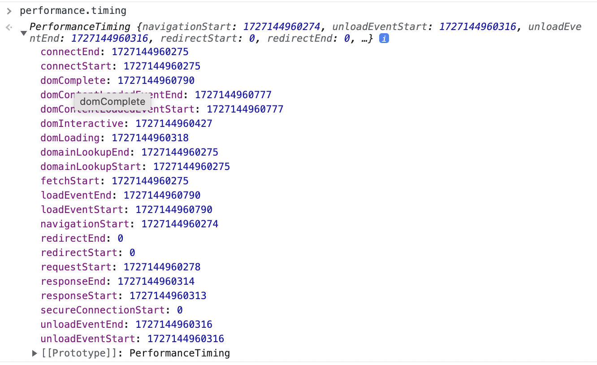
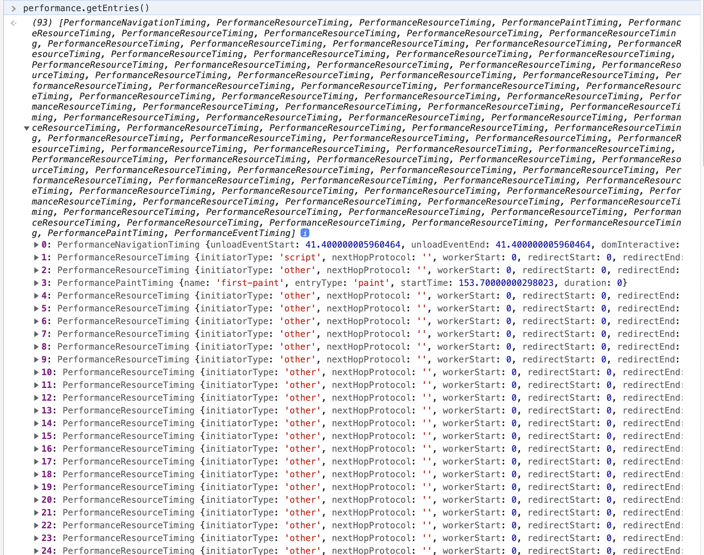

# 前端优化

前端性能优化主要是为了提升网站/页面响应的速度。下面，我从整体的角度上，对性能优化中两个大方向：网络过程和渲染过程进行介绍。
相关优化方向整理如下：

- 网络过程：
  - 减少请求数
  - 减少请求大小

- 渲染过程（减少渲染时间）
  - 1
  - 2

## 网络过程

> 参考文章，👉 [前端性能优化 24 条建议](https://zhuanlan.zhihu.com/p/651162833)

### 首屏加载

首屏加载是用户体验的关键环节。首屏加载时间，指的是**浏览器从相应用户输入网址，到首屏内容渲染完成的时间**；
此时整个网页不一定全部渲染完成，但需要展示当前视窗需要的内容；

**performance.timing** 是浏览器提供的一个对象，它包含了网页加载过程中各个关键阶段的时间戳数据，这些数据对于分析网页性能、识别加载瓶颈非常有用。



```javascript
# 控制台输入下面的内容
# domComplete 时间戳 记录了所有资源（包括图像、样式表、脚本等）加载完毕，DOM树构建完成，且所有 load 事件处理程序待触发的时间。

performance.timing.domComplete - performance.timing.navigationStart
```

当然，如果首屏存在重绘和重排，则还包含重绘时间、重排时间。

首屏加载时间 = 页面加载时间 - 网络请求时间 - 解析时间 - 渲染时间 - 重绘时间 - 重排时间

关于加载过程中，具体到各个资源的加载时间和其他详情，可以通过 performance.getEntries() 方法获取。



> 参考文章，👉 [首屏加载慢](https://blog.csdn.net/weixin_45678402/article/details/138162240)


### 图片资源

图片资源的加载是一个耗时的操作，需要等待图片资源加载完成后，才能进行后续的渲染操作。

> 参考文章，👉 [base64原理](https://juejin.cn/post/7392250499151511552)


#### 图片格式


### 视频资源

#### 视频格式/编码


## 渲染过程


> 参考文章，👉 [谈谈前端性能优化-面试版_2023-02-27](https://zhuanlan.zhihu.com/p/609699881)

