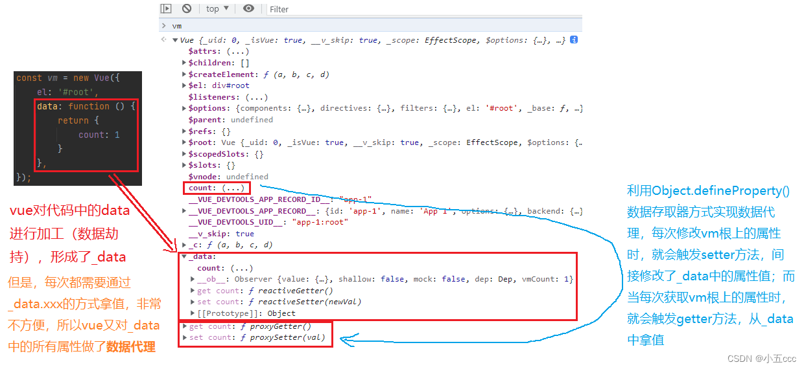
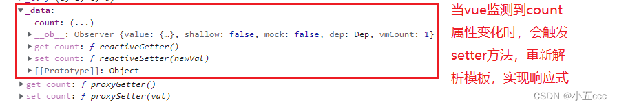
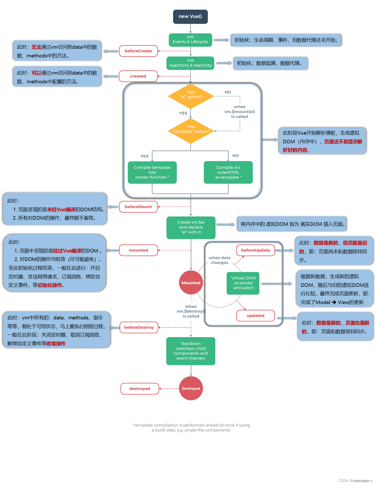
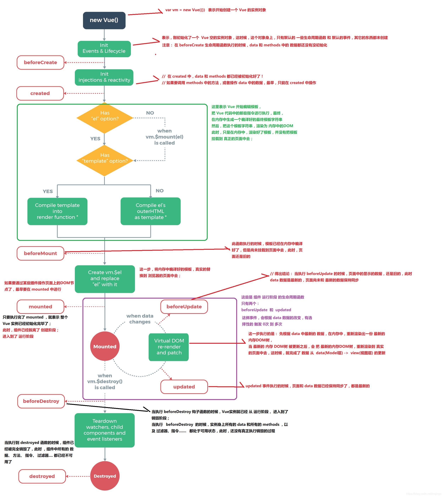
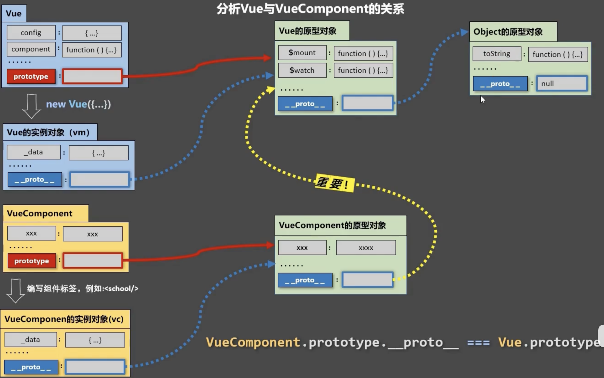

# Vue知识点

- [和 Vue 交个朋友](##和Vue交个朋友)
  - [陌生的Vue](###陌生的Vue)
  - [初识Vue](###初识Vue)
- [知识铺垫](##知识铺垫)
  - [MVVM模型](###MVVM模型)
  - [数据代理](###数据代理)
  - [数据劫持](###数据劫持)
- [学习 Vue 的基础语法](##学习Vue的基础语法)
  - [模板语法](###模板语法)
  - [数据绑定](###数据绑定)
  - [data与el的2种写法](###data与el的2种写法)
  - [事件处理](###事件处理)
    - [事件的基本使用](###事件的基本使用)
    - [事件修饰符](###事件修饰符)
    - [键盘事件](###键盘事件)
  - [计算属性](###计算属性)
  - [监视/侦听属性](###监视/侦听属性)
  - [绑定样式](###绑定样式)
  - [条件渲染](###条件渲染)
  - [列表渲染](###列表渲染)
  - [收集表单数据](###收集表单数据)
  - [过滤器](###过滤器)
  - [内置指令](###内置指令)
  - [自定义指令](###自定义指令)
  - [生命周期](###生命周期)
  - [非单文件组件](###非单文件组件)
  - [单文件组件](###单文件组件)
- [深入学习 Vue](##深入学习Vue)
  - [脚手架文件结构](###脚手架文件结构)
  - [关于不同版本的Vue](###关于不同版本的Vue)
  - [vue.config.js配置文件](###vue.config.js配置文件)
  - [ref属性](###ref属性)
  - [props配置项](###props配置项)
  - [mixin(混入)](###mixin(混入))
  - [插件](###插件)
  - [scoped样式](###scoped样式)
  - [总结TodoList案例](###总结TodoList案例)
  - [webStorage](###webStorage)
  - [全局事件总线（GlobalEventBus）](###全局事件总线（GlobalEventBus）)
  - [消息订阅与发布（pubsub](###消息订阅与发布（pubsub)
  - [nextTick](###nextTick)
  - [Vue封装的过度与动画](###Vue封装的过度与动画)
  - [vue脚手架配置代理](###vue脚手架配置代理)
  - [插槽](###插槽)
  - [Vuex](###Vuex)
  - [路由](###路由)


## 和Vue交个朋友
### 陌生的Vue

Vue 的特点：

1. 采用**组件化**模式，提高代码复用率、且让代码更好维护。

2. **声明式**编码，让编码人员无需直接操作 DOM，提高开发效率。
3. 使用**虛拟 DOM**+优秀的**Diff 算法**，尽量复用 DOM 节点。

> 分为生产版本和开发版本。生产版本没有警告这些，线上最好使用这个，体积小一点。

### 初识Vue

1. 想让 vue 工作，就必须创建一个 vue 实例，且要传入一个配置对象；

2. root 容器里的代码依然符合 html 规范，只不过混入了一些特殊的 vue 语法；
3. root 容器里的代码被称为【vue 模板】；
4. vue 实例和容器是一一对应的关系；
5. 真实开发中只有一个 vue 实例，并且会配合着组件一起使用；
6. {{xxx3}}中的 xxx 要写 js 表达式，且 xxx 可以自动读取到 data 中的所有属性：
7. -且 data 中的数据发生改变，那么模板中用到该数据的地方也会自动更新；

注意区分：js 表达式 和 js 代码（语句）

## 知识铺垫

### MVVM模型

该模型可以从三个部分来了解：

1. M：模型（Model），对应 data 中的数据，或者说是普通的 JS 对象

2. V：视图（View），模板，或者说是 DOM

3. VM：视图模型（ViewModel），Vue实例对象


### 数据代理

**定义**：通过一个对象代理对另一个对象中属性的操作（读/写）。

在单纯的学习 Javascript 的时候，应该就了解过 defineProperty()，简单说下用法，他在定义对象中的属性时，是这样用的：

**举个例子**：
```javascript
let obj = {
  name: 'John',
  sex: 'male'
}

// 在 obj 中新增 age 属性
Object.defineProperty(obj, 'age', {
  value:18,
  enumerable:true, //控制属性是否可以枚举，默认值是false
  writable:true, //控制属性是否可以被修改，默认值是false
  configurable:true //控制属性是否可以被删除，默认值是false
});

// 三个参数分别对应 对象变量 新增属性 新增属性的配置项，比如：值、枚举（默认false）、可写/修改（默认false）、可删除（默认false）
```

以上是些基础用法，但是和数据代理这个小标题，还没有多大的联系。以下，进行扩展：

想要实现改变一个变量原始值后，仍可利用该变量进行改动其他变量时，可以利用 get 指向的函数。

```javascript
let number = 18;
let obj = {
  name: 'John',
  sex: 'male'
}

//当有人读取obj的age属性时，get函数(getter)就会被调用，且返回值就是age的值
Object.defineProperty(obj, 'age', {
  get: function() {
    return number;
  }
});

number = 19;

// 此时 obj.age 变更为 19

// 以上的写法可以简写为如下：
get(){
  console.log('有人读取age属性了');
  return number;
},

//当有人修改obj的age属性时，set函数(setter)就会被调用，且会收到修改的具体值
set(value){
  console.log('有人修改了age属性，且值是', value);
  number = value; // 必须在这里修改 number 变量，然后在访问 obj.age 的时候会重新调用 get() 函数，返回的是 number，因此必须修改 number 才能真正修改完成
}

// 此时，完成了一个原始变量和对象之间属性的关联性
```

**数据代理在 Vue 中的应用**：

1. Vue 中的数据代理：
  
    通过 vm 对象来代理 data 对象中属性的操作（读/写）

    换句话说，Vue 将 data 中的对象又复制了一份到全局对象 vm 中，并使用了数据劫持。

    vue 对代码中的 data 进行加工(数据劫持)，形成了_data。但是，每次都需要通过data.xxx的方式拿值，非常不方便，所以vue又对 data中的所有属性做了数据代理

2. Vue中数据代理的好处：
  
    更加方便的操作data中的数据

3. 基本原理：
  
    通过Object.defineProperty()把data对象中所有属性添加到vm上。
    
    为每一个添加到vm上的属性，都指定一个getter/setter。
    
    在getter/setter内部去操作（读/写）data中对应的属性。



### 数据劫持

1. 数据劫持也可称作数据代理，字面上是劫持到某个属性的变化，去做其他的操作

2. 在vue中的数据劫持，实际上是劫持到vm上属性的变化，去重新解析模板，更新页面，实现响应式效果



## 学习Vue的基础语法

### 模板语法

Vue 模板语法有 2 大类：

1. 插值语法：
   
   功能：用于解析标签体内容。
   
   写法：{{xxx}}，xxx 是 js 表达式，且可以直接读取到 data 中的所有属性。

2. 指令语法：
   
   功能：用于解析标签（包括：标签属性、标签体内容、绑定事件.....）。
   
   举例：v-bind:href="xxx" 或 简写为 :href="xxx"，xxx 同样要写 js 表达式，
   且可以直接读取到 data 中的所有属性。
   
   备注：Vue 中有很多的指令，且形式都是：v-????，此处我们只是拿 v-bind 举个例子。

### 数据绑定

Vue中有2种数据绑定的方式：

1. 单向绑定(v-bind)：数据只能从data流向页面。

2. 双向绑定(v-model)：数据不仅能从data流向页面，还可以从页面流向data。

备注：

1. 双向绑定一般都应用在表单类元素上（如：input、select等）；

2. v-model:value 可以简写为 v-model，因为v-model默认收集的就是value值。因此，**没有 value 属性的元素不能使用 v-model 指令**，会报错。

```html
<!-- 普通写法 -->

<!-- 单向数据绑定： -->
<input type="text" v-bind:value="name"><br/>

<!-- 双向数据绑定： -->
<input type="text" v-model:value="name"><br/>


<!-- 简写 -->

<!-- 单向数据绑定： -->
<input type="text" :value="name"><br/>

<!-- 双向数据绑定： -->
<input type="text" v-model="name"><br/>
```

### data与el的2种写法

1. el有2种写法

    (1).new Vue时候配置el属性。

    (2).先创建Vue实例，随后再通过vm.$mount('#root')指定el的值。

2. data有2种写法

    (1).对象式

    (2).函数式

    如何选择：目前哪种写法都可以，以后学习到组件时，data必须使用函数式，否则会报错。

3. 一个重要的原则：

    由Vue管理的函数，一定不要写箭头函数，一旦写了箭头函数，this就不再是Vue实例了。

> 个人理解：
>
> 写成**普通的函数声明**，会由Vue()构造函数的实例对象来调用。因此，this 会指向 Vue实例对象。
>
> 写成**箭头函数**，this 则指向 window。
>
> 注意：
> 箭头函数的 this 指向在它定义时就已经确定了，永远指向它定义时的上层作用域中的 this，call、apply、bind 等方法永远也改变不了箭头函数 this 的指向。

### 事件处理

#### 事件的基本使用
    
  1. 使用v-on:xxx 或 @xxx 绑定事件，其中xxx是事件名；

  2. 事件的回调需要配置在 methods 对象中，最终会在 vm 上；
  3. methods 中配置的函数，不要用箭头函数！否则 this 就不是 vm 了，而是 window（之前已经提及这个问题，不理解就再去看看普通函数和箭头函数的区别，[链接](https://www.cnblogs.com/xl15/p/16743499.html)）；
  4. methods 中配置的函数，都是被 Vue 所管理的函数，this 的指向是 vm 或 组件实例对象；
  5. @click="demo" 和 @click="demo($event)" 效果一致，但后者可以传参；
  6. 上一条中 $event 是占位符：写在原生事件中可以拿到事件对象；写在自定义事件中，则是传递过来的参数数据。

#### 事件修饰符

> vue 官方讲述：
> 
> 在处理事件时调用 event.preventDefault() 或 event.stopPropagation() 是很常见的。尽管我们可以直接在方法内调用，但如果方法能更专注于数据逻辑而不用去处理 DOM 事件的细节会更好。
>
> 为解决这一问题，Vue 为 v-on 提供了事件修饰符。修饰符是用 . 表示的指令后缀，包含以下这些：

  1. prevent：阻止默认事件（常用）；

  2. stop：阻止事件冒泡（常用）；
  3. once：事件只触发一次（常用）；
  4. capture：使用事件的捕获模式；
  5. self：只有event.target是当前操作的元素时才触发事件（类似于解决冒泡）；
  6. passive：事件的默认行为立即执行，无需等待事件回调执行完毕（一般用于触摸事件的监听器，可以用来改善移动端设备的滚屏性能，即优先响应滚动）；

  > 事件修饰符，可以连着写，例如：@click.stop.prevent = 'demo()'
  >
  > 上面的例子中，首先执行 stop 冒泡，然后执行 prevent 阻止元素默认事件


> **事件流模型**
>
> 事件流是事件传播过程的抽象概念。在 DOM 中，事件流分为三个阶段：捕获阶段、目标阶段和冒泡阶段。
>
> 事件流的过程是从最外层的祖先节点开始，然后依次向下传播到目标节点。接着，在目标节点上触发事件，最后再沿着传播路径向上冒泡回去。

> **事件捕获**是一种事件处理的方式，它是在事件传播的过程中从最外层的祖先节点向目标节点依次传递，并在目标节点上触发事件。在捕获阶段，事件会从文档根节点依次向下传播到目标节点，直到到达目标节点为止。事件捕获是事件传播的第一阶段。

> **事件冒泡**是指事件从目标节点开始向祖先节点传播。当目标节点上的事件被触发时，事件会向父元素传递，一直传递到文档根节点为止。事件冒泡是事件传播的第二阶段。

> 事件捕获和事件冒泡是两种不同的事件处理机制，它们的区别在于事件传播的方向。需要注意的是，事件在捕获和冒泡阶段都可以被处理，而且先触发哪个阶段取决于监听的顺序以及使用的事件类型。

[详细了解事件流---捕获事件和冒泡事件](https://zhuanlan.zhihu.com/p/367597660)

了解一下**事件委托**，也称为事件代理。

在应用时其原理是，不是每一个子节点都单独设置事件监听器，而是把事件监听器设置在其父节点上，然后利用冒泡原理影响每一个子节点。此时，事件委托的作用：不用为每一个子节点都绑定一个点击事件，只操作了一次DOM，提高了程序的性能。

```javascript
 let ul = document.querySelector('ul')
 let lis = document.querySelectorAll('li');
 ​
 ul.addEventListener('click', function(e) {
     // e.target 找到当前点击的对象li
     // 排他思想
     for (let i = 0; i < lis.length; i++) {
         lis[i].style.color = ''
     }
     // 为其添加样式
     e.target.style.color = 'red'
 })
```

#### 键盘事件

1. Vue 给常用的一些按键起了别名：

  > 回车 => enter
  >
  > 删除 => delete (捕获“删除”delete和“退格”键)
  >
  > 退出 => esc
  >
  > 空格 => space
  >
  > 换行 => tab (特殊，必须配合keydown去使用。因为tab按键本身就会切换焦点，如果在keyup后才触发事件，并不能成功)
  >
  > 上 => up
  >
  > 下 => down
  >
  > 左 => left
  >
  > 右 => right

2. Vue未提供别名的按键，可以使用按键原始的key值去绑定，但注意要转为kebab-case（短横线命名，主要键盘事件名称为多个单词拼接时使用）

3. 系统修饰键（用法特殊）：ctrl、alt、shift、meta

      (1).配合keyup使用：按下修饰键的同时，再按下其他键，随后释放其他键，事件才被触发。
       
      (2).配合keydown使用：正常触发事件（按下就触发）。
  > 如同事件修饰符，系统修饰键后也可连着其他键。

4. 也可以使用keyCode去指定具体的按键（不推荐）

5. Vue.config.keyCodes.自定义键名 = 键码，可以去定制按键别名


### 计算属性

**关键词**：computed

> 每当Vue中变量的值发生改变时，就会重新解析一次模板，遇到函数调用，自然也会重新执行。

1. 定义：要用的属性不存在，要通过已有属性计算得来。

2. 原理：底层借助了Objcet.defineproperty方法提供的getter和setter。
3. get函数什么时候执行？
    + 初次读取时会执行一次。
    + 当依赖的数据发生改变时会被再次调用。
      
4. 优势：与methods实现相比，内部有缓存机制（复用），效率更高，调试方便（相比较于methods，computed中定义的变量有缓存）。
5. 注意：
    + 计算属性最终会出现在vm上，直接读取使用即可。
    + 如果计算属性要被修改，那必须写set函数去响应修改，且set中要引起计算时依赖的数据发生改变。

代码实例：
```javascript
data:{
  firstName:'张',
  lastName:'三',
},
computed:{
  //完整写法
  /* fullName:{
    get(){
      console.log('get被调用了')
      return this.firstName + '-' + this.lastName
    }
  } */
  //简写
  fullName(){
    console.log('get被调用了')
    return this.firstName + '-' + this.lastName
  }
}
```

### 监视/侦听属性

**关键词**：watch

1. 当被监视的属性变化时, 回调函数自动调用, 进行相关操作。这里说的回调函数也就是 handler

2. 监视的属性必须存在，才能进行监视！！

3. 监视的两种写法：
    + new Vue 时传入 watch 配置
    + 通过 vm.$watch 监视

代码示例：
```javascript
const vm = new Vue({
  el:'#root',
  data:{
    isHot:true,
  },
  computed:{
    info(){
      return this.isHot ? '炎热' : '凉爽'
    }
  },
  methods: {
    changeWeather(){
      this.isHot = !this.isHot
    }
  },
  /* watch:{
    isHot:{
      immediate:true, //初始化时让handler调用一下
      //handler什么时候调用？当isHot发生改变时。
      handler(newValue,oldValue){
        console.log('isHot被修改了',newValue,oldValue)
      }
    }
  } */
})

vm.$watch('isHot',{
  immediate: true, //初始化时让handler调用一下
  //handler什么时候调用？当isHot发生改变时。
  handler(newValue,oldValue){
    console.log('isHot被修改了', newValue, oldValue)
  }
})
```

**深度监视**

  + Vue 中的 watch 默认不监测对象内部值的改变（一层），也就是说他默认监测的是**对象变量名称所指向的地址**。
  + 配置 deep:true 可以监测对象内部值改变（多层）。

注意：
  + Vue 自身是可以监测对象内部值的改变，但 Vue 提供的 watch 默认不可以！
  + 使用 watch 时根据数据的具体结构，决定是否采用深度监视。


当需要*监视多级结构中某个属性的变化*时，可以直接就监测那个变量属性，或者开启深度监视。代码示例如下：
```javascript
//监视多级结构中某个属性的变化
/* 'numbers.a':{
  handler(){
    console.log('a被改变了')
  }
} */
//监视多级结构中所有属性的变化
numbers:{
  deep:true,
  handler(){
    console.log('numbers改变了')
  }
}
```

监视属性代码简写：
```javascript
const vm = new Vue({
  el:'#root',
  data:{
    isHot:true,
  },
  computed:{
    info(){
      return this.isHot ? '炎热' : '凉爽'
    }
  },
  methods: {
    changeWeather(){
      this.isHot = !this.isHot
    }
  },
  watch:{
    //正常写法
    /* isHot:{
      // immediate:true, //初始化时让handler调用一下
      // deep:true,//深度监视
      handler(newValue,oldValue){
        console.log('isHot被修改了',newValue,oldValue)
      }
    }, */
    //简写
    /* isHot(newValue,oldValue){
      console.log('isHot被修改了',newValue,oldValue,this)
    } */
  }
})

//正常写法
/* vm.$watch('isHot',{
  immediate:true, //初始化时让handler调用一下
  deep:true,//深度监视
  handler(newValue,oldValue){
    console.log('isHot被修改了',newValue,oldValue)
  }
}) */

//简写
/* vm.$watch('isHot',(newValue,oldValue)=>{
  console.log('isHot被修改了',newValue,oldValue,this)
}) */
```

比较 计算属性computed 与 侦听属性watch：

  1. computed能完成的功能，watch都可以完成。
  2. watch能完成的功能，computed不一定能完成，例如：watch可以进行异步操作。

两个重要的小原则：

  1. 所被Vue管理的函数，最好写成普通函数，这样this的指向才是vm 或 组件实例对象。
  2. 所有不被Vue所管理的函数（定时器的回调函数、ajax的回调函数等、Promise的回调函数），最好写成箭头函数，这样this的指向才是vm 或 组件实例对象。

> 就比如watch里面写setTimeout函数的时候，就必须用箭头函数。因为箭头函数没有this指向，此时this指向回指向函数作用域的上一级，也就是watch中写定时器函数的函数，这个函数是vue实例管理的。

### 绑定样式

1. class样式

  写法:class="xxx" xxx可以是字符串、对象、数组。

  + 字符串写法适用于：类名不确定，要动态获取。
  + 数组写法适用于：要绑定多个样式，个数不确定，名字也不确定。
  + 对象写法适用于：要绑定多个样式，个数确定，名字也确定，但不确定用不用。

2. style样式
  + :style="{fontSize: xxx}"其中xxx是动态值。
  + :style="[a,b]"其中a、b是样式对象。

### 条件渲染

#### v-if

写法：
  + v-if="表达式" 
  + v-else-if="表达式"
  + v-else="表达式"

适用于：切换频率较低的场景。

特点：不展示的DOM元素直接被移除。

注意：v-if可以和:v-else-if、v-else一起使用，但要求结构不能被“打断”。当写代码时，不想破坏原先的文档结构，可以使用template。

#### v-show

  写法：v-show="变量/表达式"

  适用于：切换频率较高的场景。

  特点：不展示的DOM元素未被移除，仅仅是使用样式隐藏掉。其实就是 v-show 的底层原理就是控制 display 属性，相应的元素节点是存在的。
  
> 备注：使用v-if的时，元素可能无法获取到，而使用v-show一定可以获取到。

[关于v-if和v-show的具体区别或面试题](https://blog.csdn.net/zg0601/article/details/123632608)

### 列表渲染

#### **v-for指令**:
  1. 用于展示列表数据
  2. 语法：v-for="(item, index) in xxx" :key="yyy"
  3. 可遍历：数组、对象、字符串（用的很少）、指定次数（用的很少）

#### 面试题：**react、vue中的key有什么作用**？（**key的内部原理**）
						
1. 虚拟DOM中key的作用：
  key是虚拟DOM对象的标识，当数据发生变化时，Vue会根据【新数据】生成【新的虚拟DOM】, 
  随后Vue进行【新虚拟DOM】与【旧虚拟DOM】的差异比较，比较规则如下：
        
2. 对比规则：

  + 旧虚拟DOM中找到了与新虚拟DOM相同的key：

    ①.若虚拟DOM中内容没变, 直接使用之前的真实DOM！
    
    ②.若虚拟DOM中内容变了, 则生成新的真实DOM，随后替换掉页面中之前的真实DOM。

  + 旧虚拟DOM中未找到与新虚拟DOM相同的key
        
    创建新的真实DOM，随后渲染到到页面。
            
3. 用index作为key可能会引发的问题：

  + 若对数据进行：逆序添加、逆序删除等破坏顺序操作:
          
    会产生没有必要的真实DOM更新 ==> 界面效果没问题, 但效率低。

  + 如果结构中还包含输入类的DOM：
    
    会产生错误DOM更新 ==> 界面有问题。

4. 开发中如何选择key?

  + 最好使用每条数据的唯一标识作为key, 比如id、手机号、身份证号、学号等唯一值。

  + 如果不存在对数据的逆序添加、逆序删除等破坏顺序操作，仅用于渲染列表用于展示，使用index作为key是没有问题的。

#### vue监测数据改变的原理

使用观察者模式：创建一个观察者的构造函数，然后创建一个监视的实例对象，监视data中每个属性的变化。

```javascript
let data = {
  name:'bert',
  address:'杭州',
}

//创建一个监视的实例对象，用于监视data中属性的变化
const obs = new Observer(data)		

//准备一个vm实例对象
let vm = {}
vm._data = data = obs

function Observer(obj){
  //汇总对象中所有的属性形成一个数组
  const keys = Object.keys(obj)
  //遍历
  keys.forEach((k)=>{
    Object.defineProperty(this, k, {
      get(){
        return obj[k]
      },
      set(val){
        console.log(`${k}被改了，我要去解析模板，生成虚拟DOM.....我要开始忙了`)
        obj[k] = val
      }
    })
  })
}
```

Vue监视数据的原理：
  1. vue会监视data中所有层次的数据。

  2. 如何监测对象中的数据？

    通过setter实现监视，且要在new Vue时就传入要监测的数据。

      (1).对象中后追加的属性，Vue默认不做响应式处理

      (2).如需给后添加的属性做响应式，请使用如下API：

              Vue.set(target，propertyName/index，value) 或 
              vm.$set(target，propertyName/index，value)

  3. 如何监测数组中的数据？

    通过包裹数组更新元素的方法实现，本质就是做了两件事：

      (1).调用原生对应的方法对数组进行更新。

      (2).重新解析模板，进而更新页面。

  4. 在Vue修改数组中的某个元素一定要用如下方法：

    1.使用这些API:push()、pop()、shift()、unshift()、splice()、sort()、reverse()

    2.Vue.set() 或 vm.$set()
  
  特别注意：Vue.set() 和 vm.$set() 不能给vm 或 vm的根数据对象 添加属性！！！


### 收集表单数据
```html
若：<input type="text"/>，则v-model收集的是value值，用户输入的就是value值。
```
```html
若：<input type="radio"/>，则v-model收集的是value值，且要给标签配置value值。
```
```html
若：<input type="checkbox"/>

  1. 没有配置input的value属性，那么收集的就是checked（勾选 or 未勾选，是布尔值）

  2. 配置input的value属性:

      (1)v-model的初始值是非数组，那么收集的就是checked（勾选 or 未勾选，是布尔值）

      (2)v-model的初始值是数组，那么收集的的就是value组成的数组
```

备注：v-model的三个修饰符：

        lazy：失去焦点再收集数据

        number：输入字符串转为有效的数字
        
        trim：输入首尾空格过滤

使用方法就是v-model.lazy="", v-model.number="", v-model.trim=""

### 过滤器

> Vue3中已经移除了过滤器

定义：对要显示的数据进行特定格式化后再显示（适用于一些简单逻辑的处理）。

语法：
  1. 注册过滤器：
  ```html
  Vue.filter(name,callback) 或 new Vue{filters:{}}
  <!-- 前者为全局过滤器   后者为局部（私有）过滤器 -->
  ```
  2. 使用过滤器：
  ```html
  {{ xxx | 过滤器名}}  或  v-bind:属性 = "xxx | 过滤器名"
  <!-- 注意了：v-model就不能使用这个过滤器 -->
  ```

备注：
  1. 过滤器也可以接收额外参数、多个过滤器也可以串联
  2. 并没有改变原本的数据, 是产生新的对应的数据

### 内置指令

已经讲过的一些指令：v-bind, v-model, v-on, v-if, v-else, v-show, v-for，还有一些其他指令没讲。

内置指令，也可以理解成框架中**预定义**的指令。

复习学过的指令：
  + v-bind	: 单向绑定解析表达式, 可简写为 :xxx
  + v-model	: 双向数据绑定
  + v-for  	: 遍历数组/对象/字符串
  + v-on   	: 绑定事件监听, 可简写为@
  + v-if 	 	: 条件渲染（动态控制节点是否**存在**）
  + v-else 	: 条件渲染（动态控制节点是否存在）
  + v-show 	: 条件渲染 (动态控制节点是否**展示**)

**v-text指令**：
  1. 作用：向其所在的节点中渲染文本内容。

  2. 与插值语法的区别：v-text会替换掉节点中的内容，{{xx}}则不会，插值语法的话还可以做一些字符串拼接等等工作。

**v-html指令**：
  1. 作用：向指定节点中渲染包含html结构的内容。
  2. 与插值语法的区别：

    (1).v-html会替换掉节点中所有的内容，{{xx}}则不会。

    (2).v-html可以识别html结构。
  3. 严重注意：v-html有安全性问题！！！！

    (1).在网站上动态渲染任意HTML是非常危险的，容易导致**XSS攻击**。

    (2).一定要在可信的内容上使用v-html，永不要用在用户提交的内容上！

**v-cloak指令**（没有值）：
  1. 本质是一个特殊属性，Vue实例创建完毕并接管容器后，会删掉v-cloak属性。

  2. 使用css配合v-cloak可以解决网速慢时页面展示出{{xxx}}的问题，或者页面闪现问题。比如，在网速慢，页面显示未经vue解析的插值语法等时，使用属性选择器[v-cloak]选中相应的所有元素，使用display:none。

**v-once指令**（没有值）：
  1. v-once所在节点在初次动态渲染后，就视为静态内容了。

  2. 以后数据的改变不会引起v-once所在结构的更新，可以用于优化性能。

### 自定义指令

需求1：定义一个v-big指令，和v-text功能类似，但会把绑定的数值放大10倍。

需求2：定义一个v-fbind指令，和v-bind功能类似，但可以让其所绑定的input元素默认获取焦点。

自定义指令总结：

  一、定义语法：

  (1).局部指令：

  ```html
    new Vue({															
      directives:{指令名:配置对象}      		
    })													
    或
    new Vue({
      directives{指令名:回调函数}
    })
  ```

    (2).全局指令：

    Vue.directive(指令名,配置对象) 或   Vue.directive(指令名,回调函数)

  二、配置对象中常用的3个回调：

  + bind：指令与元素成功绑定时调用。
  + inserted：指令所在元素被插入页面时调用。
  + update：指令所在模板结构被重新解析时调用。

  三、注意：
    1. 指令定义时不加v-，但使用时要加v-；
    2. 指令名如果是多个单词，要使用kebab-case命名方式，不要用camelCase命名。

### 生命周期

  1. 又名：生命周期回调函数、生命周期函数、生命周期钩子。
  2. 是什么：Vue在关键时刻帮我们调用的一些特殊名称的函数。
  3. 生命周期函数的名字不可更改，但函数的具体内容是程序员根据需求编写的。
  4. 生命周期函数中的this指向是vm 或 组件实例对象。

#### 生命周期过程

尚硅谷的讲解示图：


绘制更简单易懂的生命周期过程示图：


常用的生命周期钩子：

  1. mounted: 发送ajax请求、启动定时器、绑定自定义事件、订阅消息等【初始化操作】。
  2. beforeDestroy: 清除定时器、解绑自定义事件、取消订阅消息等【收尾工作】。

关于销毁Vue实例：

  1. 销毁后借助Vue开发者工具看不到任何信息。
  2. 销毁后自定义事件会失效，但原生DOM事件依然有效。
  3. 一般不会在beforeDestroy操作数据，因为即便操作数据，也不会再触发更新流程了。

### 非单文件组件

#### Vue中使用组件的三大步骤

> 一、定义组件(创建组件)
>
> 二、注册组件
>
> 三、使用组件(写组件标签)


一、如何定义一个组件？

  使用Vue.extend(options)创建，其中options和new Vue(options)时传入的那个options几乎一样，但也有点区别；

  区别如下：

  1. el不要写，为什么？ ——— 最终所有的组件都要经过一个vm的管理，由vm中的el决定服务哪个容器。
  2. data必须写成函数，为什么？ ———— 避免组件被复用时，数据存在引用关系。

  注意：使用template配置项可以配置组件结构。extend()相当于一个构造器，用于构造VueComponent构造函数。

二、如何注册组件？

  1. 局部注册：靠new Vue的时候传入components选项
  2. 全局注册：靠Vue.component('组件名',组件)

三、编写组件标签：

    <school></school>


#### 使用注意事项

1. 关于组件名:

  一个单词组成：

        第一种写法(首字母小写)：school

        第二种写法(首字母大写)：School

  多个单词组成：

        第一种写法(kebab-case命名)：my-school

        第二种写法(CamelCase命名)：MySchool (需要Vue脚手架支持)

  备注：

      (1). 组件名尽可能回避H
      TML中已有的元素名称，例如：h2、H2都不行。

      (2). 可以使用name配置项指定组件在开发者工具中呈现的名字。

2. 关于组件标签:

  第一种写法：<school></school>

  第二种写法：<school/>

  备注：不用使用脚手架时，<school/>会导致后续组件不能渲染。

3. 一个简写方式：

  const school = Vue.extend(options) 可简写为：const school = options

#### VueComponent：
  1. school组件本质是一个名为 VueComponent 的构造函数，且不是程序员定义的，是 Vue.extend 生成的。

  2. 我们只需要写<school/>或<school></school>，Vue解析时会帮我们创建school组件的实例对象，即Vue帮我们执行的：new VueComponent(options)。

  3. 特别注意：每次调用Vue.extend，返回的都是一个全新的VueComponent！！！！

  4. 关于this指向：

    (1). 组件配置中：
      
      data函数、methods中的函数、watch中的函数、computed中的函数 它们的this均是【VueComponent实例对象】。

    (2). new Vue(options)配置中：
      
      data函数、methods中的函数、watch中的函数、computed中的函数 它们的this均是【Vue实例对象】。

  5. VueComponent的实例对象，以后简称vc（也可称之为：组件实例对象）。  Vue的实例对象，以后简称vm。

#### VueComponent 和 Vue 的关系



1. 一个重要的内置关系：VueComponent.prototype.__proto__ === Vue.prototype
2. 为什么要有这个关系：让组件实例对象（vc）可以访问到 Vue原型上的属性、方法。

### 单文件组件

...

## 深入学习Vue

babel 是专门将 es6 转换成 es5 的。

### 脚手架文件结构

	├── node_modules 
	├── public
	│   ├── favicon.ico: 页签图标
	│   └── index.html: 主页面
	├── src
	│   ├── assets: 存放静态资源
	│   │   └── logo.png
	│   │── component: 存放组件
	│   │   └── HelloWorld.vue
	│   │── App.vue: 汇总所有组件
	│   │── main.js: 入口文件
	├── .gitignore: git版本管制忽略的配置
	├── babel.config.js: babel的配置文件
	├── package.json: 应用包配置文件 
	├── README.md: 应用描述文件
	├── package-lock.json：包版本控制文件

### 关于不同版本的Vue

1. vue.js与vue.runtime.xxx.js的区别：
    1. vue.js是完整版的Vue，包含：核心功能 + 模板解析器。
    2. vue.runtime.xxx.js是运行版的Vue，只包含：核心功能；没有模板解析器。
2. 因为vue.runtime.xxx.js没有模板解析器，所以不能使用template这个配置项，需要使用render函数接收到的createElement函数去指定具体内容。

### vue.config.js配置文件

1. 使用vue inspect > output.js可以查看到Vue脚手架的默认配置。
2. 使用vue.config.js可以对脚手架进行个性化定制，详情见：https://cli.vuejs.org/zh

### ref属性

1. 被用来给元素或子组件注册引用信息（id的替代者）
2. 应用在html标签上获取的是真实DOM元素，应用在组件标签上是组件实例对象（vc）
3. 使用方式：
    1. 打标识：```<h1 ref="xxx">.....</h1>``` 或 ```<School ref="xxx"></School>```
    2. 获取：```this.$refs.xxx```

### props配置项

1. 功能：让组件接收外部传过来的数据

2. 传递数据：```<Demo name="xxx"/>```

3. 接收数据：

    1. 第一种方式（只接收）：```props:['name'] ```

    2. 第二种方式（限制类型）：```props:{name:String}```

    3. 第三种方式（限制类型、限制必要性、指定默认值）：

        ```js
        props:{
        	name:{
        	type:String, //类型
        	required:true, //必要性
        	default:'老王' //默认值
        	}
        }
        ```

    > 备注：props是只读的，Vue底层会监测你对props的修改，如果进行了修改，就会发出警告，若业务需求确实需要修改，那么请复制props的内容到data中一份，然后去修改data中的数据。

### mixin(混入)

1. 功能：可以把多个组件共用的配置提取成一个混入对象

2. 使用方式：

    第一步定义混合：

    ```
    {
        data(){....},
        methods:{....}
        ....
    }
    ```

    第二步使用混入：
    
     利用export 和 import 引入之后

    ​	全局混入：```Vue.mixin(xxx)```
    ​	局部混入：```mixins:[xxx]	```
  
  > 注意：当定义发生冲突时，在优先级上，props > 自身定义的 > mixin。当然，生命周期钩子相关配置不在此列，mixin中定义的生命周期钩子配置和自身定义的生命周期钩子配置会合并，均执行。

### 插件

1. 功能：用于增强Vue

2. 本质：包含install方法的一个对象，install的第一个参数是Vue，第二个以后的参数是插件使用者传递的数据。

3. 定义插件：

    ```js
    对象.install = function (Vue, options) {
        // 1. 添加全局过滤器
        Vue.filter(....)
    
        // 2. 添加全局指令
        Vue.directive(....)
    
        // 3. 配置全局混入(合)
        Vue.mixin(....)
    
        // 4. 添加实例方法
        Vue.prototype.$myMethod = function () {...}
        Vue.prototype.$myProperty = xxxx
    }
    ```

    示例，在 plugins.js 文件夹中这样写：
    ```javascript
    export default {
      install(Vue,x,y,z){
        console.log(x,y,z)
        //全局过滤器
        Vue.filter('mySlice',function(value){
          return value.slice(0,4)
        })

        //定义全局指令
        Vue.directive('fbind',{
          //指令与元素成功绑定时（一上来）
          bind(element,binding){
            element.value = binding.value
          },
          //指令所在元素被插入页面时
          inserted(element,binding){
            element.focus()
          },
          //指令所在的模板被重新解析时
          update(element,binding){
            element.value = binding.value
          }
        })

        //定义混入
        Vue.mixin({
          data() {
            return {
              x:100,
              y:200
            }
          },
        })

        //给Vue原型上添加一个方法（vm和vc就都能用了）
        Vue.prototype.hello = ()=>{alert('你好啊')}
      }
    }
    ```

4. 使用插件：```Vue.use()```

    在 main.js 中这样使用：
    ```js
    //引入Vue
    import Vue from 'vue'
    //引入插件
    import plugins from './plugins'

    //应用（使用）插件
    Vue.use(plugins,1,2,3)
    ```

### scoped样式

1. 作用：让样式在局部生效，防止冲突。
2. 写法：```<style scoped>```

### 总结TodoList案例

1. 组件化编码流程：

    ​	(1). 拆分静态组件：组件要按照功能点拆分，命名不要与html元素冲突。

    ​	(2). 实现动态组件：考虑好数据的存放位置，数据是一个组件在用，还是一些组件在用：

    ​			1). 一个组件在用：放在组件自身即可。

    ​			2). 一些组件在用：放在他们共同的父组件上（<span style="color:red">状态提升</span>）。

    ​	(3). 实现交互：从绑定事件开始。

2. props适用于：

    ​	(1). 父组件 ==> 子组件 通信

    ​	(2). 子组件 ==> 父组件 通信（要求父先给子一个函数）

3. 使用v-model时要切记：v-model绑定的值不能是props传过来的值，因为props是不可以修改的！

4. props传过来的若是对象类型的值，修改对象中的属性时Vue不会报错，但不推荐这样做。

### webStorage

> 注意：localStorage 和 sessionStorage 统称为 webStorage。

1. 存储内容大小一般支持5MB左右（不同浏览器可能还不一样）

2. 浏览器端通过 Window.sessionStorage 和 Window.localStorage 属性来实现本地存储机制。

3. 相关API：

    1. ```xxxxxStorage.setItem('key', 'value');```
        				该方法接受一个键和值作为参数，会把键值对添加到存储中，如果键名存在，则更新其对应的值。

    2. ```xxxxxStorage.getItem('person');```

        ​		该方法接受一个键名作为参数，返回键名对应的值。

    3. ```xxxxxStorage.removeItem('key');```

        ​		该方法接受一个键名作为参数，并把该键名从存储中删除。

    4. ``` xxxxxStorage.clear()```

        ​		该方法会清空存储中的所有数据。

4. 备注：

    1. SessionStorage存储的内容会随着浏览器窗口关闭而消失。
    2. LocalStorage存储的内容，需要手动清除才会消失。
    3. ```xxxxxStorage.getItem(xxx)```如果xxx对应的value获取不到，那么getItem的返回值是null。
    4. ```JSON.parse(null)```的结果依然是null。

### 组件的自定义事件

1. 一种组件间通信的方式，适用于：<strong style="color:red">子组件 ===> 父组件</strong>

2. 使用场景：A是父组件，B是子组件，B想给A传数据，那么就要在A中给B绑定自定义事件（<span style="color:red">事件的回调在A中</span>）。

3. 绑定自定义事件：

    1. 第一种方式，在父组件中：```<Demo @atguigu="test"/>```  或 ```<Demo v-on:atguigu="test"/>```

    2. 第二种方式，在父组件中：

        ```js
        <Demo ref="demo"/>
        ......
        mounted(){
           this.$refs.xxx.$on('atguigu',this.test)
        }
        ```

    3. 若想让自定义事件只能触发一次，可以使用```once```修饰符，或```$once```方法。

4. 触发自定义事件：```this.$emit('atguigu',数据)```		

5. 解绑自定义事件```this.$off('atguigu')```

6. 组件上也可以绑定原生DOM事件，需要使用```native```修饰符。**注意：Vue3 中移除了 native，可以直接使用原生 DOM 事件了**

7. 注意：通过```this.$refs.xxx.$on('atguigu',回调)```绑定自定义事件时，回调<span style="color:red">要么配置在methods中</span>，<span style="color:red">要么用箭头函数</span>，否则this指向会出问题！
因为如果是普通函数， this 指向遵循被谁调用，就指向谁。写在 methods 中，则由于优先级问题，Vue 会保证这个函数指向 methods 所在的组件实例对象；亦或者是箭头函数，this并不会遵循**被谁调用就指向谁**这个原则。

### 全局事件总线（GlobalEventBus）

1. 一种组件间通信的方式，适用于<span style="color:red">任意组件间通信</span>。

2. 安装全局事件总线：

   ```js
   new Vue({
   	......
   	beforeCreate() {
   		Vue.prototype.$bus = this //安装全局事件总线，$bus就是当前应用的vm
   	},
       ......
   }) 
   ```

3. 使用事件总线：

   1. 接收数据：A组件想接收数据，则在A组件中给$bus绑定自定义事件，事件的<span style="color:red">回调留在A组件自身。</span>

      ```js
      methods(){
        demo(data){......}
      }
      ......
      mounted() {
        this.$bus.$on('xxxx',this.demo)
      }
      ```

   2. 提供数据：```this.$bus.$emit('xxxx',数据)```。触发事件并传递数据。

4. 最好在 beforeDestroy 钩子中，用 $off 去解绑<span style="color:red">当前组件所用到的</span>事件。

### 消息订阅与发布（pubsub）

1.   一种组件间通信的方式，适用于<span style="color:red">任意组件间通信</span>。

2. 使用步骤：

   1. 安装pubsub：```npm i pubsub-js```

   2. 引入: ```import pubsub from 'pubsub-js'```

   3. 接收数据：A组件想接收数据，则在A组件中订阅消息，订阅的<span style="color:red">回调留在A组件自身。</span>

      ```js
      methods(){
        demo(data){......}
      }
      ......
      mounted() {
        this.pid = pubsub.subscribe('xxx',this.demo) //订阅消息
      }
      ```

   4. 提供数据：```pubsub.publish('xxx',数据)```

   5. 最好在beforeDestroy钩子中，用```PubSub.unsubscribe(pid)```去<span style="color:red">取消订阅。</span>

   > 这里同样要注意：```pubsub.subscribe('xxx',函数)```中函数要么调用methods中定义好的函数，要么直接定义一个箭头函数。同样的，因为如果是普通函数，调用第三方库pubsub，this并没有指向，按道理是指向第三方库。写在 methods 中，则由于优先级问题，Vue 会保证这个函数指向 methods 所在的组件实例对象；亦或者是箭头函数，this并不会遵循**被谁调用就指向谁**这个原则。
	
### nextTick

1. 语法：```this.$nextTick(回调函数)```
2. 作用：在下一次 DOM 更新结束后执行其指定的回调。
3. 什么时候用：当改变数据后，要基于更新后的新DOM进行某些操作时，要在nextTick所指定的回调函数中执行。

> 举例：比如说，我要操作某个由条件渲染指令的DOM元素时，在没有渲染这个元素到页面上时，改变DOM元素的value数据后，立马执行在更新后的DOM元素上获取焦点，结果并不会成功。因为
此时模板并没有解析，元素也没有重新渲染，并不能拿到这个DOM元素并获取焦点。
>
> 这时就应该使用用 $nextTick() ，将 DOM元素获取焦点的语句作为回调函数。

### Vue封装的过度与动画

1. 作用：在插入、更新或移除 DOM元素时，在合适的时候给元素添加样式类名。

2. 写法：

   1. 准备好样式：

      - 元素进入的样式：
        1. v-enter：进入的起点
        2. v-enter-active：进入过程中
        3. v-enter-to：进入的终点
      - 元素离开的样式：
        1. v-leave：离开的起点
        2. v-leave-active：离开过程中
        3. v-leave-to：离开的终点

   2. 使用```<transition>```包裹要过度的元素，并配置name属性：

      ```vue
      <transition name="hello" appear>
      	<h1 v-show="isShow">你好啊！</h1>
      </transition>
      ```
      ```javascript
      // 如果元素初始渲染到页面上时，没有动画效果，则在 transition 标签上添加 appear 属性，可使页面初次渲染出这个元素时就包含动画效果。
      ```

      ```css
      hello-enter-active {
        animation: test 1s linear;
      }

      hello-leave-active {
        animation: test 1s linear reverse;
      }

      @keyframes test {
        from {
          transform: translateX(-100%);
        }
        to {
          transform: translateX(0px);
        }
      }
      ```

      然后，样式表中的 v-enter 等等就要写成 hello-enter 等。如果不配置 name 属性，则直接定义 v-enter 等的样式即可。     

   3. 备注：若有多个元素需要过度，则需要使用：```<transition-group>```，且每个元素都要指定```key```值。

   > 此外，我们还可以直接引入 [Animate.css 第三方库](https://animate.style/)，如下去使用。

   ```vue
    <transition-group 
			appear
			name="animate__animated animate__bounce" 
			enter-active-class="animate__swing"
			leave-active-class="animate__backOutUp"
		>
			<h1 v-show="!isShow" key="1">你好啊！</h1>
			<h1 v-show="isShow" key="2">Bert</h1>
		</transition-group>
   ```

### vue脚手架配置代理

#### 方法一

​	在vue.config.js中添加如下配置：

```js
devServer:{
  proxy:"http://localhost:5000"
}
```

说明：

1. 优点：配置简单，请求资源时直接发给前端（8080）即可。
2. 两个缺点：不能配置多个代理；不能灵活的控制请求是否走代理转发至服务器。
3. 工作方式：若按照上述配置代理，当请求了前端不存在的资源时，那么该请求会转发给服务器；如果前端存在相应的静态资源，该请求则不会转发至服务器。（优先匹配前端资源）

#### 方法二

​	编写vue.config.js配置具体代理规则：

```js
module.exports = {
	devServer: {
      proxy: {
      '/api1': {// 匹配所有以 '/api1'开头的请求路径
        target: 'http://localhost:5000',// 代理目标的基础路径
        changeOrigin: true,
        pathRewrite: {'^/api1': ''}
      },
      '/api2': {// 匹配所有以 '/api2'开头的请求路径
        target: 'http://localhost:5001',// 代理目标的基础路径
        changeOrigin: true,
        pathRewrite: {'^/api2': ''} // 这个是 vue.config.js 中的写法
        // rewrite: (path) => path.replace(/^\/api2/, '/') // 这个是 vite.config.js中的写法
      }
    }
  }
}
/*
   changeOrigin设置为true时，服务器收到的请求头中的host为：localhost:5000，相当于说谎了，请求头中Host是代理服务器（devServer）的请求主机域名+端口
   changeOrigin设置为false时，服务器收到的请求头中的host为：localhost:8080，相当于实话实说，不撒谎，请求头中Host是真实的请求主机域名+端口
   changeOrigin默认值为true
*/
```

说明：

1. 优点：可以配置多个代理，且可以灵活的控制请求是否走代理。
2. 缺点：配置略微繁琐，请求资源时必须加前缀。

### 插槽

1. 作用：让父组件可以向子组件指定位置插入html结构，也是一种组件间通信的方式，适用于 <strong style="color:red">父组件 ===> 子组件</strong> 。

2. 分类：默认插槽、具名插槽、作用域插槽

3. 使用方式：

   1. 默认插槽：

      ```vue
      父组件中：
              <Category>
                 <div>html结构1</div>
              </Category>
      子组件中：
              <template>
                  <div>
                     <!-- 定义插槽 -->
                     <slot>插槽默认内容...</slot>
                  </div>
              </template>
      ```

   2. 具名插槽：

      ```vue
      父组件中：
              <Category>
                  <template slot="center">
                    <div>html结构1</div>
                  </template>
      
                  <template v-slot:footer>
                     <div>html结构2</div>
                  </template>
              </Category>
      子组件中：
              <template>
                  <div>
                     <!-- 定义插槽 -->
                     <slot name="center">插槽默认内容...</slot>
                     <slot name="footer">插槽默认内容...</slot>
                  </div>
              </template>
      ```

   3. 作用域插槽：

      1. 理解：<span style="color:red">数据在组件的自身，但根据数据生成的结构需要组件的使用者来决定。</span>（games数据在Category组件中，但使用数据所遍历出来的结构由App组件决定）

      2. 具体编码：

         ```vue
         父组件中：
         		<Category>
         			<template scope="scopeData">
         				<!-- 生成的是ul列表 -->
         				<ul>
         					<li v-for="g in scopeData.games" :key="g">{{g}}</li>
         				</ul>
         			</template>
         		</Category>
         
         		<Category>
         			<template slot-scope="scopeData">
         				<!-- 生成的是h4标题 -->
         				<h4 v-for="g in scopeData.games" :key="g">{{g}}</h4>
         			</template>
         		</Category>
         子组件中：
                 <template>
                     <div>
                         <slot :games="games"></slot>
                     </div>
                 </template>
         		
                 <script>
                     export default {
                         name:'Category',
                         props:['title'],
                         //数据在子组件自身
                         data() {
                             return {
                                 games:['红色警戒','穿越火线','劲舞团','超级玛丽']
                             }
                         },
                     }
                 </script>
         ```
   ```
   
   ```

### Vuex

#### 1.概念

​		在Vue中实现集中式状态（数据）管理的一个Vue插件，对vue应用中多个组件的共享状态进行集中式的管理（读/写），也是一种组件间通信的方式，且适用于任意组件间通信。

#### 2.何时使用？

​		多个组件需要共享数据时

#### 3.搭建vuex环境

1. 创建文件：```src/store/index.js```

   ```js
   //引入Vue核心库
   import Vue from 'vue'
   //引入Vuex
   import Vuex from 'vuex'
   //应用Vuex插件
   Vue.use(Vuex)
   
   //准备actions对象——响应组件中用户的动作
   const actions = {}
   //准备mutations对象——修改state中的数据
   const mutations = {}
   //准备state对象——保存具体的数据
   const state = {}
   
   //创建并暴露store
   export default new Vuex.Store({
   	actions,
   	mutations,
   	state
   })
   ```

2. 在```main.js```中创建vm时传入```store```配置项

   ```js
   ......
   //引入store
   import store from './store'
   ......
   
   //创建vm
   new Vue({
   	el:'#app',
   	render: h => h(App),
   	store
   })
   ```

####    4.基本使用

1. 初始化数据、配置```actions```、配置```mutations```，操作文件```store.js```

   ```js
   //引入Vue核心库
   import Vue from 'vue'
   //引入Vuex
   import Vuex from 'vuex'
   //引用Vuex
   Vue.use(Vuex)
   
   const actions = {
       //响应组件中加的动作
   	jia(context,value){
   		// console.log('actions中的jia被调用了',miniStore,value)
   		context.commit('JIA',value)
   	},
   }
   
   const mutations = {
       //执行加
   	JIA(state,value){
   		// console.log('mutations中的JIA被调用了',state,value)
   		state.sum += value
   	}
   }
   
   //初始化数据
   const state = {
      sum:0
   }
   
   //创建并暴露store
   export default new Vuex.Store({
   	actions,
   	mutations,
   	state,
   })
   ```

2. 组件中读取vuex中的数据：```$store.state.sum```

3. 组件中修改vuex中的数据：```$store.dispatch('action中的方法名',数据)``` 或 ```$store.commit('mutations中的方法名',数据)```

   >  备注：若没有网络请求或其他业务逻辑，组件中也可以越过actions，即不写```dispatch```，直接编写```commit```

#### 5.getters的使用

1. 概念：当state中的数据需要经过加工后再使用时，可以使用getters加工。

2. 在```store.js```中追加```getters```配置

   ```js
   ......
   
   const getters = {
   	bigSum(state){
   		return state.sum * 10
   	}
   }
   
   //创建并暴露store
   export default new Vuex.Store({
   	......
   	getters
   })
   ```

3. 组件中读取数据：```$store.getters.bigSum```

#### 6.四个map方法的使用

1. <strong>mapState方法：</strong>用于帮助我们映射```state```中的数据为计算属性

   ```js
   computed: {
       //借助mapState生成计算属性：sum、school、subject（对象写法）
        ...mapState({sum:'sum',school:'school',subject:'subject'}),
            
       //借助mapState生成计算属性：sum、school、subject（数组写法）
       ...mapState(['sum','school','subject']),
   },
   ```

2. <strong>mapGetters方法：</strong>用于帮助我们映射```getters```中的数据为计算属性

   ```js
   computed: {
       //借助mapGetters生成计算属性：bigSum（对象写法）
       ...mapGetters({bigSum:'bigSum'}),
   
       //借助mapGetters生成计算属性：bigSum（数组写法）
       ...mapGetters(['bigSum'])
   },
   ```

3. <strong>mapActions方法：</strong>用于帮助我们生成与```actions```对话的方法，即：包含```$store.dispatch(xxx)```的函数

   ```js
   methods:{
       //靠mapActions生成：incrementOdd、incrementWait（对象形式）
       ...mapActions({incrementOdd:'jiaOdd',incrementWait:'jiaWait'})
   
       //靠mapActions生成：incrementOdd、incrementWait（数组形式）
       ...mapActions(['jiaOdd','jiaWait'])
   }
   ```

4. <strong>mapMutations方法：</strong>用于帮助我们生成与```mutations```对话的方法，即：包含```$store.commit(xxx)```的函数

   ```js
   methods:{
       //靠mapActions生成：increment、decrement（对象形式）
       ...mapMutations({increment:'JIA',decrement:'JIAN'}),
       
       //靠mapMutations生成：JIA、JIAN（对象形式）
       ...mapMutations(['JIA','JIAN']),
   }
   ```

> 备注：mapActions与mapMutations使用时，若需要传递参数需要：在模板中绑定事件时传递好参数，否则参数是事件对象。

#### 7.模块化+命名空间

1. 目的：让代码更好维护，让多种数据分类更加明确。

2. 修改```store.js```

   ```javascript
   const countAbout = {
     namespaced:true,//开启命名空间
     state:{x:1},
     mutations: { ... },
     actions: { ... },
     getters: {
       bigSum(state){
          return state.sum * 10
       }
     }
   }
   
   const personAbout = {
     namespaced:true,//开启命名空间
     state:{ ... },
     mutations: { ... },
     actions: { ... }
   }
   
   const store = new Vuex.Store({
     modules: {
       countAbout,
       personAbout
     }
   })
   ```

3. 开启命名空间后，组件中读取state数据：

   ```js
   //方式一：自己直接读取
   this.$store.state.personAbout.list
   //方式二：借助mapState读取：
   ...mapState('countAbout',['sum','school','subject']),
   ```

4. 开启命名空间后，组件中读取getters数据：

   ```js
   //方式一：自己直接读取
   this.$store.getters['personAbout/firstPersonName']
   //方式二：借助mapGetters读取：
   ...mapGetters('countAbout',['bigSum'])
   ```

5. 开启命名空间后，组件中调用dispatch

   ```js
   //方式一：自己直接dispatch
   this.$store.dispatch('personAbout/addPersonWang',person)
   //方式二：借助mapActions：
   ...mapActions('countAbout',{incrementOdd:'jiaOdd',incrementWait:'jiaWait'})
   ```

6. 开启命名空间后，组件中调用commit

   ```js
   //方式一：自己直接commit
   this.$store.commit('personAbout/ADD_PERSON',person)
   //方式二：借助mapMutations：
   ...mapMutations('countAbout',{increment:'JIA',decrement:'JIAN'}),
   ```

 ### 路由

1. 理解： 一个路由（route）就是一组映射关系（key - value），多个路由需要路由器（router）进行管理。
2. 前端路由：key是路径，value是组件。

#### 1.基本使用

1. 安装vue-router，命令：```npm i vue-router```

2. 应用插件：```Vue.use(VueRouter)```

3. 编写router配置项:

   ```js
   //引入VueRouter
   import VueRouter from 'vue-router'
   //引入Luyou 组件
   import About from '../components/About'
   import Home from '../components/Home'
   
   //创建router实例对象，去管理一组一组的路由规则
   const router = new VueRouter({
   	routes:[
   		{
   			path:'/about',
   			component:About
   		},
   		{
   			path:'/home',
   			component:Home
   		}
   	]
   })
   
   //暴露router
   export default router
   ```

4. 实现切换（active-class可配置高亮样式）

   ```vue
   <router-link active-class="active" to="/about">About</router-link>
   ```

5. 指定展示位置

   ```vue
   <router-view></router-view>
   ```

#### 2.几个注意点

1. 路由组件通常存放在```pages```文件夹，一般组件通常存放在```components```文件夹。
2. 通过切换，“隐藏”了的路由组件，默认是被销毁掉的，需要的时候再去挂载。
3. 每个组件都有自己的```$route```属性，里面存储着自己的路由信息。
4. 整个应用只有一个router，可以通过组件的```$router```属性获取到。

#### 3.多级路由（多级路由）

1. 配置路由规则，使用children配置项：

   ```js
   routes:[
   	{
   		path:'/about',
   		component:About,
   	},
   	{
   		path:'/home',
   		component:Home,
   		children:[ //通过children配置子级路由
   			{
   				path:'news', //此处一定不要写：/news
   				component:News
   			},
   			{
   				path:'message',//此处一定不要写：/message
   				component:Message
   			}
   		]
   	}
   ]
   ```

2. 跳转（要写完整路径）：

   ```vue
   <router-link to="/home/news">News</router-link>
   ```

#### 4.路由的query参数

1. 传递参数

   ```vue
   <!-- 跳转并携带query参数，to的字符串写法 -->
   <router-link :to="/home/message/detail?id=666&title=你好">跳转</router-link>
   				
   <!-- 跳转并携带query参数，to的对象写法 -->
   <router-link 
   	:to="{
   		path:'/home/message/detail',
   		query:{
   		   id:666,
               title:'你好'
   		}
   	}"
   >跳转</router-link>
   ```

2. 接收参数：

   ```js
   $route.query.id
   $route.query.title
   ```

#### 5.命名路由

1. 作用：可以简化路由的跳转。

2. 如何使用

   1. 给路由命名：

      ```js
      {
      	path:'/demo',
      	component:Demo,
      	children:[
      		{
      			path:'test',
      			component:Test,
      			children:[
      				{
                            name:'hello' //给路由命名
      					path:'welcome',
      					component:Hello,
      				}
      			]
      		}
      	]
      }
      ```

   2. 简化跳转：

      ```vue
      <!--简化前，需要写完整的路径 -->
      <router-link to="/demo/test/welcome">跳转</router-link>
      
      <!--简化后，直接通过名字跳转 -->
      <router-link :to="{name:'hello'}">跳转</router-link>
      
      <!--简化写法配合传递参数 -->
      <router-link 
      	:to="{
      		name:'hello',
      		query:{
      		   id:666,
                  title:'你好'
      		}
      	}"
      >跳转</router-link>
      ```

#### 6.路由的params参数

1. 配置路由，声明接收params参数

   ```js
   {
   	path:'/home',
   	component:Home,
   	children:[
   		{
   			path:'news',
   			component:News
   		},
   		{
   			component:Message,
   			children:[
   				{
   					name:'xiangqing',
   					path:'detail/:id/:title', //使用占位符声明接收params参数
   					component:Detail
   				}
   			]
   		}
   	]
   }
   ```

2. 传递参数

   ```vue
   <!-- 跳转并携带params参数，to的字符串写法 -->
   <router-link :to="/home/message/detail/666/你好">跳转</router-link>
   				
   <!-- 跳转并携带params参数，to的对象写法 -->
   <router-link 
   	:to="{
   		name:'xiangqing',
   		params:{
   		   id:666,
               title:'你好'
   		}
   	}"
   >跳转</router-link>
   ```

   > 特别注意：路由携带params参数时，若使用to的对象写法，则不能使用path配置项，必须使用name配置！

3. 接收参数：

   ```js
   $route.params.id
   $route.params.title
   ```

#### 7.路由的props配置

​	作用：让路由组件更方便的收到参数

```js
{
	name:'xiangqing',
	path:'detail/:id',
	component:Detail,

	//第一种写法：props值为对象，该对象中所有的key-value的组合最终都会通过props传给Detail组件
	// props:{a:900}

	//第二种写法：props值为布尔值，布尔值为true，则把路由收到的所有params参数通过props传给Detail组件
	// props:true
	
	//第三种写法：props值为函数，该函数返回的对象中每一组key-value都会通过props传给Detail组件
	props(route){
		return {
			id:route.query.id,
			title:route.query.title
		}
	}
}
```

#### 8.```<router-link>```的replace属性

1. 作用：控制路由跳转时操作浏览器历史记录的模式
2. 浏览器的历史记录有两种写入方式：分别为```push```和```replace```，```push```是追加历史记录，```replace```是替换当前记录。路由跳转时候默认为```push```
3. 如何开启```replace```模式：```<router-link replace .......>News</router-link>```

#### 9.编程式路由导航

1. 作用：不借助```<router-link> ```实现路由跳转，让路由跳转更加灵活

2. 具体编码：

   ```js
   //$router的两个API
   this.$router.push({
   	name:'xiangqing',
   		params:{
   			id:xxx,
   			title:xxx
   		}
   })
   
   this.$router.replace({
   	name:'xiangqing',
   		params:{
   			id:xxx,
   			title:xxx
   		}
   })
   this.$router.forward() //前进
   this.$router.back() //后退
   this.$router.go() //可前进也可后退
   ```

#### 10.缓存路由组件

1. 作用：让不展示的路由组件保持挂载，不被销毁。

2. 具体编码：

   ```vue
   <keep-alive include="News"> 
       <router-view></router-view>
   </keep-alive>
   ```

#### 11.两个新的生命周期钩子

1. 作用：路由组件所独有的两个钩子，用于捕获路由组件的激活状态。
2. 具体名字：
   1. ```activated```路由组件被激活时触发。
   2. ```deactivated```路由组件失活时触发。

#### 12.路由守卫

1. 作用：对路由进行权限控制

2. 分类：全局守卫、独享守卫、组件内守卫

3. 全局守卫:

   ```js
   //全局前置守卫：初始化时执行、每次路由切换前执行
   router.beforeEach((to,from,next)=>{
   	console.log('beforeEach',to,from)
   	if(to.meta.isAuth){ //判断当前路由是否需要进行权限控制
   		if(localStorage.getItem('school') === 'atguigu'){ //权限控制的具体规则
   			next() //放行
   		}else{
   			alert('暂无权限查看')
   			// next({name:'guanyu'})
   		}
   	}else{
   		next() //放行
   	}
   })
   
   //全局后置守卫：初始化时执行、每次路由切换后执行
   router.afterEach((to,from)=>{
   	console.log('afterEach',to,from)
   	if(to.meta.title){ 
   		document.title = to.meta.title //修改网页的title
   	}else{
   		document.title = 'vue_test'
   	}
   })
   ```

4. 独享守卫:

   ```js
   beforeEnter(to,from,next){
   	console.log('beforeEnter',to,from)
   	if(to.meta.isAuth){ //判断当前路由是否需要进行权限控制
   		if(localStorage.getItem('school') === 'atguigu'){
   			next()
   		}else{
   			alert('暂无权限查看')
   			// next({name:'guanyu'})
   		}
   	}else{
   		next()
   	}
   }
   ```

5. 组件内守卫：

   ```js
   //进入守卫：通过路由规则，进入该组件时被调用
   beforeRouteEnter (to, from, next) {
   },
   //离开守卫：通过路由规则，离开该组件时被调用
   beforeRouteLeave (to, from, next) {
   }
   ```

#### 13.路由器的两种工作模式


1. 对于一个url来说，什么是hash值？—— #及其后面的内容就是hash值。
2. hash值不会包含在 HTTP 请求中，即：hash值不会带给服务器。
3. hash模式：
   1. 地址中永远带着#号，不美观 。
   2. 若以后将地址通过第三方手机app分享，若app校验严格，则地址会被标记为不合法。
   3. 兼容性较好。
4. history模式：
   1. 地址干净，美观 。
   2. 兼容性和hash模式相比略差。
   3. 应用部署上线时需要后端人员支持，解决刷新页面服务端404的问题。
	 
	 