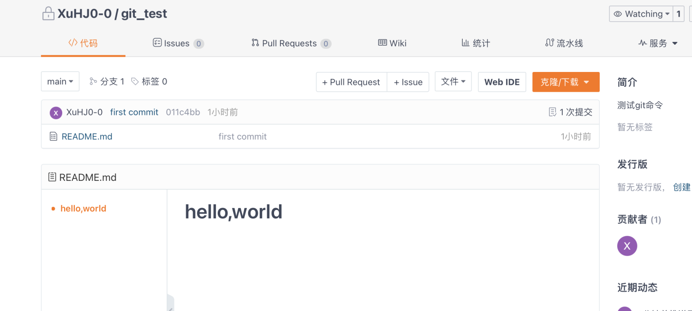

# Git基础

> 文中所讲“状态值”，为SHA-1值，即密码散列函数 安全散列算法1 生成的散列值，通常为40个十六进制数。

<a name="yoHyO"></a>
# git与svn介绍
<a name="reh2E"></a>
## 概念
学习之前，我们肯定要了解他是什么？他有什么兄弟姐妹？又有什么区别？Follow me !👇👇👇
:::info
Git  ——  免费开源的分布式版本控制系统，用于敏捷高效的处理任何项目版本管理。

常被提起的兄弟：SVN  ——  免费开源的集中式版本控制系统，其核心为服务器，所有开发者在开始新一天的工作之前必须从服务器获取代码，然后开发，最后解决冲突，提交。所有的版本信息都放在服务器上。如果脱离了服务器，开发者基本上可以说是无法工作的。<br />与git类似的还有Firefly；与SVN类似的还有 cvs，也是代码版本控制软件，C/S架构，还有 subversion 等等<br />这一窝八个，我们肯定学最有用且最流行的那个 —— Git
:::
<a name="azjti"></a>
## 相关开发流程
看完概念定义，可能还没懂，什么分布式、集中式😼......那就来看两张图（图片引自百度百科，仅作知识分享之用）<br />Git的经典开发流程：<br />


SVN的经典开发流程：<br />


<br />看官，您觉的这两张图对比下来最明显的区别是什么？
:::danger
博主认为：

- 从定义上来讲，是集中式与分布式的区别。使用**Git**的开发者之间需要解决代码冲突，然后由其中的一个开发者提交给主开发者，这里可以这样理解：一个开发者对应一个普通分支，而主开发者对应主分支，供线上访问的服务器部署的是主分支的代码，因此每个分支合并到主分支的时候，需要查看是否相互冲突等。一个项目一般对应一个远程仓库，因此git仅适用于代码管理；而**SVN**太依赖于服务器，不过适合企业内部多个并行项目的开发，适合项目管理。
- Git在开发者本地有着和远程仓库一样的版本库，因此有很多方便之处，比如离线开发（因为本地就有个版本库，对应暂存区，本地版本号，本地分支，本地仓库这些概念）；而svn则是每天早上先拉取最新代码，然后进行开发，在push代码，解决冲突，正如上一点说的，适合项目管理，但相比Git虽易于理解但并不方便。
:::
<a name="dWlZ3"></a>
## 优缺点
Git优点
> 适合分布式开发（指工作模式），强调个体
> 公共服务器压力和数据量都不会太大
> 速度快、灵活
> 任意两个开发者之间可以很容易的解决冲突
> 离线工作


Git缺点
:::danger
不符合常规思维<br />代码保密性差，一旦开发者把整个库克隆下来就可以完全公开所有代码和版本信息
:::

---

<a name="VmkRz"></a>
# Git关键概念

<br /><br />上面两张图中的几个词，释义如下：
:::info
工作区：Workspace，就是你本地的工作目录（或者说工作空间），这个概念的范畴很大，但是不包括 .git 版本库（隐藏目录）；vscode中其实也有工作区概念，不过两者其实并不算相同，vs code中的工作区是为了方便用户操作，解决同时操作多个文件夹问题的，可以在导航栏“文件”看到好几项关于工作区的操作，下面讲
:::
:::info
暂存区：Index / Stage，也叫待提交更新去，在 .git 隐藏目录里或者说在版本库里，对应 .git 文件夹下的index文件。这样去理解，暂存区存放的是，代码文件更改后保存想要提交到本地仓库，就先添加到暂存区
:::
:::info
仓库区/本地仓库：Local repo或者Repository，存放在本地的版本库，有着和远程仓库一样的版本库，暂存区的更新文件提交后会存储到本地仓库里
:::
:::info
远程仓库：Remote repo或者Remote，服务器上托管代码的仓库。在本地设备push后，提交至本地仓库里的更新才会提交到远程仓库。
:::
:::info
工作状态保存栈：Stash，用于保存/恢复WorkSpace中的临时状态
:::
其他概念：
:::info
分支：branch，在版本控制的过程中，使用多条分支同时推进多个任务或功能等。。一般来说，分支的分配时按照开发流程来分配给开发者，这里进阶篇细讲。
:::


---

<a name="SmO4Z"></a>
# 基础命令（先释义，后添加具体例子）
```shell
git clone 
git add 
git commit -m "注释"
git pull
git push
```
<a name="yEC9Z"></a>
### git config
> git使用时的一些全局设置，可以用环境变量去理解

```shell
# 全局配置
git config --global user.name "bert"
git config --global user.email "182xxxx8107@163.com"

# 局部配置
git config user.name "bert"
git config user.email "182xxxx8107@163.com"

# 这里你可能会有疑问，有全局配置为什么还要局部配置呢？
# 讲个场景例子，实验室多人共用一台服务器跑模型实验，这肯定不能全局配置哇；
# 只能在各自的工作目录下，局部配置自己的用户名和邮箱，这样相互之间就不会冲突。
# 另外，这里的账号对应不同的托管平台，你的账号名称可能也不一样
# 多讲一句，局部配置 会在 .git/config文件中显示，如下图
```

<a name="C7MDn"></a>
### git init
> 初始化版本库，生成 .git 文件
> 如果是从远程代码仓库克隆的代码，就不需要 git init 了，因为clone的代码包括仓库代码现有的版本库
> 那你可能疑惑了，那这个命令什么时候用？那当然是你在本地新建代码工作目录的时候，远程代码仓库还是空的没push过代码

<a name="LqdqI"></a>
### git clone xxx
> 通过克隆命令，拷贝一个完整的Git仓库（包括代码和版本信息）至本地设备上

下载某个仓库的代码，有三种方式

1. 不需要git clone命令，直接下载源代码的压缩包


2. ssh连接下载

通过在本地生成公私钥，然后把公钥给git服务器，授权他
```shell
git clone ssh://git@bit.zust.edu.cn:6901/huangjie/bitblock-vue3-vite.git

# 需要安装ssh-keygen(公私钥生成工具)生成公私钥
ssh-keygen -t rsa -C "mw" -f ~/.ssh/id_rsa
# 注意！！！！ 上面的 -f 表示文件名称参数 后面 是文件名，可以自定义
### 这种命令行可以当成函数看，一个道理

### 然后私钥文件放在本地不动，打开公钥文件，里面内容复制粘贴到 第三张图里 第二个箭头的文本input框
```


个人中心的 edit prfile ，下面图标错了<br />

上面提示就说，.pub公钥  不能放私钥<br />

3. https网址下载

通过gitlab的账号密码验证授权（其他仓库托管软件的话，github gitee 的话，就输入对应的账号密码）
```shell
git clone https://bit.zust.edu.cn:6905/gitlab/huangjie/bitblock-vue3-vite.git
```

<a name="fNXn6"></a>
### git clone -b xxx giturl
> xxx为分支名  giturl为指定文件所在的地址
> 下载指定分支的文件

<a name="D3Q3D"></a>
### git status
> 查看工作目录和暂存区的状态，哪些文件被更改了但是没添加到暂存区，哪些文件添加到暂存区了但还未提交

<a name="Te1xG"></a>
### git pull
> 拉取本地仓库所对应的远程仓库的所对应分支的最新代码

<a name="EHGs7"></a>
### git push
> 将本地仓库中的所有新的提交（commit）推送至对应远程仓库的对应分支下

<a name="IugOz"></a>
### git add xxx 
> xxx 文件名
> 把xxx添加至暂存区

<a name="IX5F8"></a>
### git add xxx xxx xxx
> xxx xxx xxx 为各不相同的文件名，文件名之间用空格隔开
> 一次性添加多个文件夹至暂存区

<a name="PRAk2"></a>
### cat xxx
> xxx 为文件名
> 查看xxx文件里所有的内容
> 这就是shell命令，但是git中会用到

<a name="UmJE6"></a>
### git commit -m "xxx"
> xxx 对应这次提交更改了啥，注释，做个简介，方便多人协同开发时别人知晓或者自己知晓啥的
> 提交暂存区内的文件至本地仓库

<a name="eyJeC"></a>
### git commit --amend -m"xxx"
> xxx 注释
> 合并提交到上一次的commit里 

<a name="ti0oo"></a>
### git commit --amend
> 进入到编辑里编写提交注释

<a name="uoCj5"></a>
### git status
> xxx 对应这次提交更改了啥，做个简介，方便多人协同开发时别人知晓或者自己知晓啥的
> 提交暂存区内的文件至本地仓库

<a name="JvkBz"></a>
### git diff
> 查看工作目录和暂存区的比较情况（有哪些改动），当我们把更新添加到暂存区中，diff就不会有任何输出了

<a name="XZBrw"></a>
### git diff xxx
> xxx 文件名
> 同上，不过是针对指定文件

<a name="WIyLE"></a>
### git diff HEAD~n
> 这里的 n 表示相比当前版本的 第 n 个版本
> 把工作目录中的状态跟本地仓库中的状态进行比较，查看改动

<a name="nA9pg"></a>
### git remote -v


<a name="SwBRa"></a>
### git log 
> 查看最近提交记录
> 想要在终端看到更之前的提交，一直按enter键 或者按空格键（大段大段的显示）。
> 中途退出查看，输入 q 即可（理解为quit，就跟 vi 或者 vim 编辑文本一样，退出输入 :q 然后enter）。


<a name="JwZMx"></a>
## 撤销更新（分工作目录、暂存区、本地仓库）
<a name="gEc6z"></a>
### git checkout -- xxx
> xxx 为文件名称
> 撤销（删除）xxx文件已做的更改，撤销后，不可找回

<a name="jOdr5"></a>
### git reset HEAD
> 把暂存区的更新移出到工作目录中
> 也可以指定文件 git reset HEAD filename

<a name="OowMS"></a>
### git reset --hard 版本号
> 从本底仓库中撤销并删除相应的更新
> 回退到指定版本 放弃工作区的所有修改，还原到指定版本的代码
> 当然，这个命令也可以恢复某个撤销并删除的更新，结合git reflog使用

回退到上一个版本：git reset --hard HEAD^<br />回退到上上一个版本：git reset --hard HEAD^^<br />回退前100个版本：git reset --hard HEAD~100<br />也就是说可以直接用 git reset --hard HEAD~数字 回退到前（数字）个版本

或者使用 gitlab里的版本号（手动copy前面那个，或者直接点后面复制按钮，分别对应下面两个）<br />git reset --hard 840cacf2<br />git reset --hard 840cacf25f9311faf1799a523c50f21302504bc3<br />
<a name="zlxWx"></a>
### git reset --soft
> 从本地仓库中撤销相应的更新，把这些更新的内容放到暂存区中

<a name="LjjwJ"></a>
### git reflog
> 查看这个本地仓库中所有分支的所有更新记录，包括已经撤销的更新

<a name="iHQf7"></a>
### git stash
> 把所有未提交的修改（包括暂存的和非暂存的）都保存起来，用于后续恢复当前工作目录

<a name="o7qq2"></a>
### git rm
> 删除


<a name="vxjfs"></a>
## 分支管理
<a name="UsQim"></a>
### git branch
> 查看当前版本库中有哪些分支
> 绿色，且分支名前有一个*的 表示当前代码仓库所在的分支


<a name="H6Hrg"></a>
### git branch xxx
> xxx 表示分支名
> 在本地仓库创建一个名字为xxx的分支

<a name="zoEDc"></a>
### git branch -d xxx
> xxx 表示分支名
> 在本地仓库删除一个分支

<a name="CZOiP"></a>
### git branch -m axx bxx
> axx表示旧的分支名
> bxx表示新的分支名
> 修改分支名axx为bxx

<a name="vNyUy"></a>
### git checkout xxx
> xxx为分支名
> 切换分支xxx为当前分支或者说直接切换到xxx分支

<a name="HdGwD"></a>
### git checkout -b xxx
> xxx为分支名
> 在本地快速创建xxx分支，然后切换至该分支

<a name="XXXTA"></a>
### git branch -d xxx
> xxx为分支名
> 删除某个分支

<a name="mPAa3"></a>
### git merge xxx
> xxx为其他分支名，需要合并到当前分支的分支名
> 合并分支。合并之前，两个分支的更新代码都需要提交至本地仓库，然后xxx分支合并至当前分支。


<a name="mPAa3"></a>
### git remote prune origin
> 修剪/刷新本地分支，删除远程仓库中已经删除的分支

---

<a name="Hb7FW"></a>
# 栗子
博主使用这些git命令来实际操作一下，并附上效果图。来吧～展示～👇👇👇

1、新建了个文件夹，test文件夹<br />

2、进入test文件夹下，执行 git init ，然后显示
>  Initialized empty Git repository in /Users/bert/Applications/frontend study/test/.git/

而且test文件夹下多了一个隐藏文件 .git ，是一个空的版本库，关于 .git 目录下的文件，博主会在进阶篇中细讲。<br />

3、在test目录下，使用文件树命令 tree .git，可以看到一共是8个目录，17个文件。其中保存版本和标签 refs 目录下的 heads 和 tags 均为空的文件夹。<br /><br />当你第一次 push 代码到仓库托管平台某分支的时候，这个目录就不会是空文件了，会和你用 git clone 去下载代码时一样。
> 注意： git init之后，直接输入git push，报错了，提示我们配置远程仓库链接然后才能push


4、我们在码云上新建个用于测试的仓库，仓库里无文件，无分支。他的初始化页面倒是提示我如何去全局设置、创建仓库等等。<br />

5、回到本地设备端，在test目录下创建README.md文件，并写入hello,world（一级标题）<br />然后利用git add 命令将README.md添加至暂存区，然后使用git commit命令（带有注释：first commit），将暂存区的文件提交到本地仓库。<br /><br />6、查看本地仓库的分支，只有一个基础的主分支，为main分支，且为当前分支<br /><br />7、使用 git push -u origin main ，将本地仓库中的更新push到远程仓库的origin/main分支下（输入代码托管平台的账号和密码）
> origin其实只是默认的远程版本库名称（也可以说是远程仓库或者远程服务器的别名），可以直接用远程仓库的url地址替代，开发者也可以定义为其他名称。也就是说这个名称默认为origin，然后这个名称既包含远程仓库url信息，又包括远程仓库在本地的缓存分支信息。


8、这里我们可以看到git_test仓库的main分支下已经有了第一次提交<br />

9、再回到本地设备上，使用 git branch 查看到本地仓库仅有main分支，且为当前分支；然后新建dev分支，再次查看，本地仓库多了一个分支，但是当前分支仍然是main分支<br /><br />10、切换到dev分支下，并查看<br /><br />但是这里注意，我们可以看到远程仓库中并没有dev分支，这说明，我们创建分支和切换分支的操作其实都是在本地版本库完成的<br />

11、这里我们如果直接git push ，因为本地版本库当前分支为 dev 分支，而远程仓库中并没有dev分支（这么说不严谨，应该说：本地仓库的dev分支并没有与远程仓库的某个分支建立关联），所以，代码push失败了。<br />因此，我们需要将两者建立关联，执行 git push --set-upstream origin dev ，其中origin 是远程仓库版本库名称，dev 是远程仓库中的分支，如果远程仓库中没有分支，则会新建该分支。git push 这个命令还有更粗暴的方式，直接 git push origin dev，两者效果其实一样的。<br /><br />这时，我们在远程仓库中可以看到已经有dev分支了<br /><br />但是！！！！！！！！！！！！！！！！！！见上图和下图，再回想我们刚刚的操作，有没有发现什么？？？<br /><br />和我一起来探索一下吧～，这次push前，我们没有git commit 啊，但是显示push了一个README.md文件，是很久之前commit至本地仓库 main分支的 ！！！接下来，我们再做个测试！

12、我们在README.md里添加一个二级标题，然后查看文件内容，确认添加成功。再检查当前分支为dev分支。<br /><br /><br /><br />13、我们将更改保存至暂存区，并提交至当前分支dev分支，然后再push至远程仓库dev分支。<br />
> 注意：这里多个.DS_Store隐藏文件，是苹果系统下文件夹自定义显示的元数据。


14、然后再切换到main分支，push代码但显示远程仓库已经是最新的代码了。那这是不是矛盾了？<br /><br />并不是，因为dev分支是在默认主分支main上创建的，创建时会自带主分支最新版本的文件，不信我们在创建一个login分支。<br /><br /><br />可以清楚的看到，这两分支下的文件是一模一样的。

---

<a name="pA9LF"></a>
## 相关链接
相关资源链接<br />[Git官网](https://git-scm.com)<br />[Git菜鸟教程](https://www.runoob.com/git/git-tutorial.html)<br />[SVN官网地址](https://subversion.apache.org/)<br />[SVN 源码（Github）](https://github.com/apache/subversion)<br />[SVN菜鸟教程](https://www.runoob.com/svn/svn-tutorial.html)
