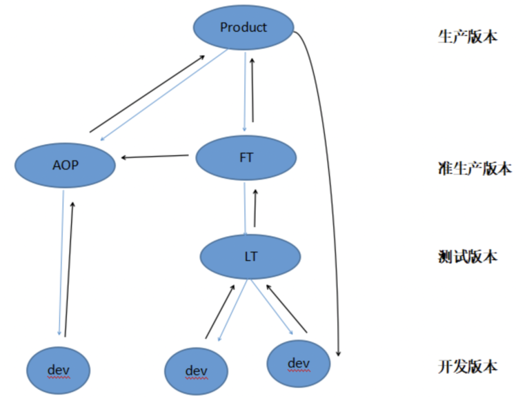
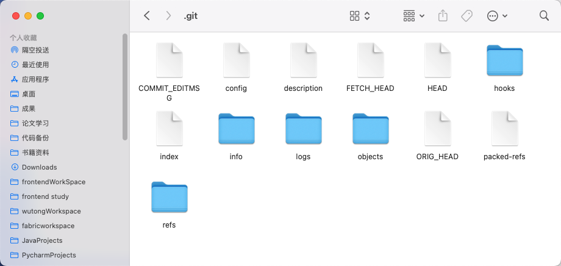
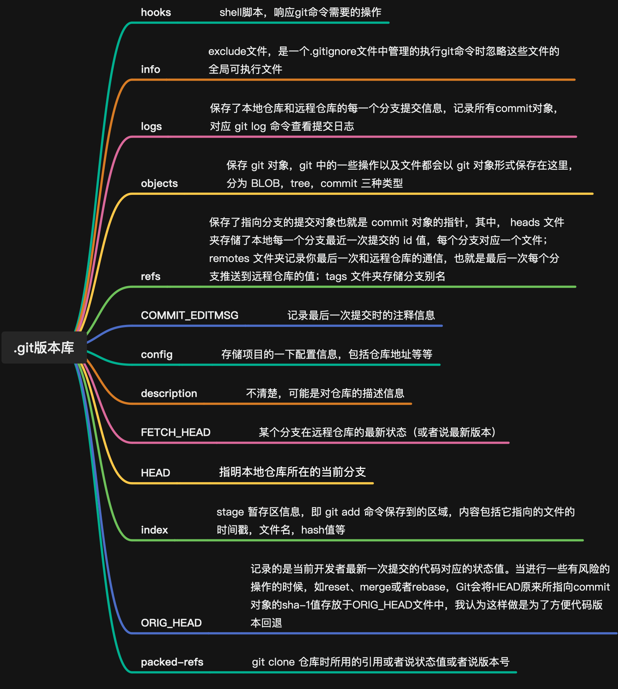

# Git进阶篇

## 分支详解

:::info
一个分支可以看成一个单链表，然后分支上的每次提交可以看成节点，因此分支上的每次提交都可以被追踪到。
:::

为什么要建立分支？用一张公司内一般会使用的开发流程图来说明： 

:::info
第一层，生产版本 Product 生产版本分支，经过完整测试，实实在在生产环境运行的代码版本，应该永远是最正确的。 第二层，准生产版本 AOP 紧急分支，用于每次上线完成，程序遇到阻断性异常，需要紧急上线，开发测试的分支。 FT 功能测试分支，用于联调测试结束，打包部署在一个准生产环境功能测试。        第三层，测试版本  	LT 联调测试分支（分布式开发中多人协作），用于开发人员代码编写完成，首次在测试环境进行来联调测试。 第四层，开发版本 dev 分支，开发人员clone代码的仓库分支，用于日常开发，单元测试等等。
:::

在公司里，正常的上线流程是 开发——测试——准生产环境测试——部署生产。假如我们当前处于测试阶段，突然生产环境遇到一个阻断性Bug，这时我们肯定无条件的优先去解决生产问题。但是开发人员已经基于上个版本又新开发了一部分功能并且部署测试，因此不能直接回滚掉这部分代码，但如果直接在现有代码基础上解决生产环境的Bug，又可能会导致夹带本次改造的代码部署生产，因此需要一个和生产环境一样的版本库，即准生产版本（AOP/FT），因为FT开发人员没有权限建立分支开发测试，这里就要用到AOP紧急上线分支。这样既不用回滚掉新开发的代码，又可以迅速解决生产环境bug。

## 本地版本库详解

下图为我对 bitblock-vue3-vite 目录下 .git 目录下文件的截屏  对这级目录中的文件与文件夹，释义如下： 

## 使用规范
在团队中，我们提交代码时一般会给 commit message 添加上前缀，大概有以下几种：

- docs：文档相关的更改，例如更新文档、添加注释等。
- style：代码样式更改，例如调整缩进、空格、格式化代码等。
- refactor：代码重构，没有添加新功能或修复错误。
- test：测试相关的更改，例如添加或更新测试用例。
- perf：性能优化相关的更改。
- build：构建系统或外部依赖项更改，例如升级构建工具、添加库等。
- chore：与构建过程或辅助工具相关的更改，例如更新依赖、构建脚本等。
- ci：与 CI (持续集成) 相关的更改，例如添加 Travis CI 配置文件、更新 GitHub Actions 等。
- revert：撤销以前的提交。
- feat：新功能的添加。
- fix：修复错误或缺陷。