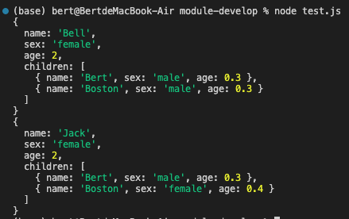
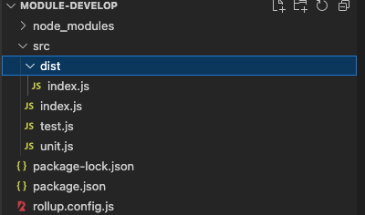
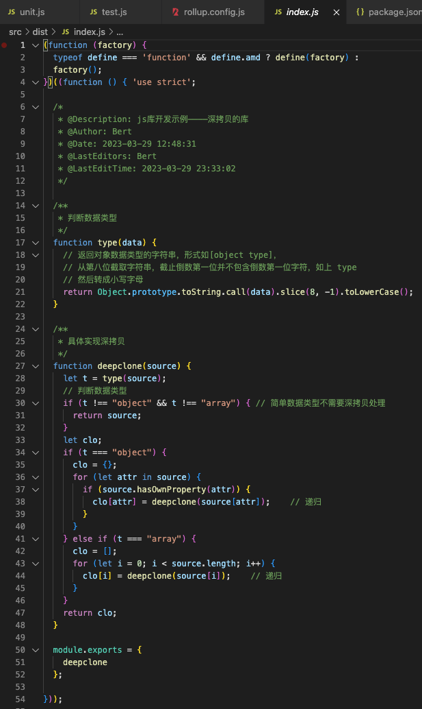
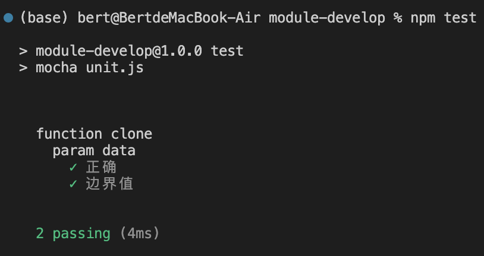
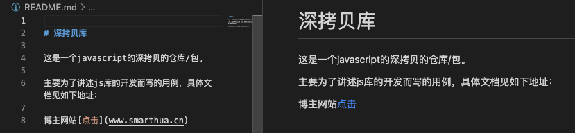
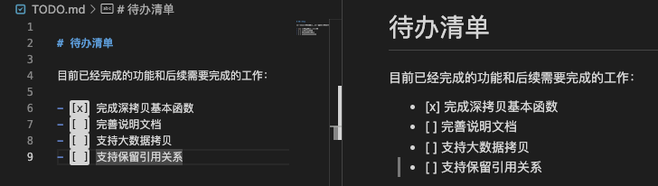
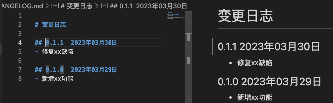
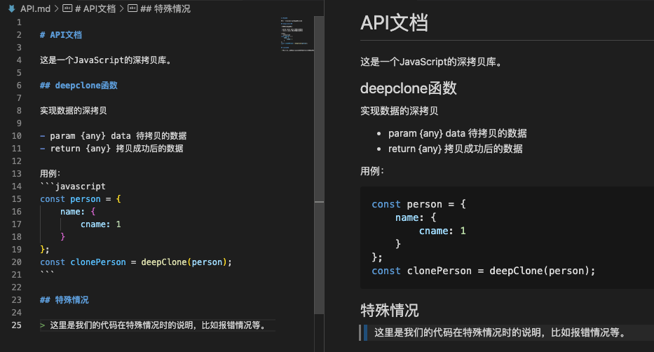

# js 库开发流程

> 题外话，为什么要做深拷贝呢？

> 在 JS 中，数据类型分为基本数据类型和引用数据类型两种，对于基本数据类型来说，它的值直接存储在栈内存中，而对于引用类型来说，它在栈内存中仅仅存储了一个引用，而真正的数据存储在堆内存中。

> 在将一个变量赋予给另一个变量时， 基础类型变量赋予的就是变量值，而引用数据类型只是将在堆栈中的引用赋予给了其他变量，他们所指向的是堆内存中同一个数据。对于引用类型这种情况而言，这就存在一种问题，改变了其中一个变量的值时，也就是改变了堆内存中数据，那么指向他的其他变量的值也就都改变了。

> 因此，我们希望在改变新的引用数据类型变量（数组或对象）的时候，不改变其原引用数据变量（原数组或原对象）的值，那么我们就需要在将原变量（引用数据类型）的值赋予其他变量时，使用深拷贝。

## 常用实现

日常中，我们需要通过一些库函数如 lodash 的_.cloneDeep或者使用JSON.parse(JSON.stringify(obj))来实现。

## 深拷贝代码实现

有了目的当然是先去实现他啊，深拷贝的代码如下（代码理解请参考注释）：

```javascript
/*
 * @Description: js库开发示例————深拷贝的库
 * @Author: Bert
 * @Date: 2023-03-29 12:48:31
 * @LastEditors: Bert
 * @LastEditTime: 2023-03-29 17:04:45
 */

/**
 * 判断数据类型
 */
function type(data) {
  // 返回对象数据类型的字符串，形式如[object type]，
  // 从第八位截取字符串，截止倒数第一位并不包含倒数第一位字符，如上 type
  // 然后转成小写字母
  return Object.prototype.toString.call(data).slice(8, -1).toLowerCase();
}

/**
 * 具体实现深拷贝
 */
function deepclone(source) {
  let t = type(source);
  // 判断数据类型
  if (t !== "object" && t !== "array") {
    // 简单数据类型不需要深拷贝处理
    return source;
  }
  let clo;
  if (t === "object") {
    clo = {};
    for (let attr in source) {
      if (source.hasOwnProperty(attr)) {
        clo[attr] = deepclone(source[attr]); // 递归
      }
    }
  } else if (t === "array") {
    clo = [];
    for (let i = 0; i < source.length; i++) {
      clo[i] = deepclone(source[i]); // 递归
    }
  }
  return clo;
}

module.exports = {
  deepclone,
};
```

完成之后，写个简单的测试代码:

```javascript
const { deepclone } = require("./index.js");

let cat = {
  name: "Bell",
  sex: "female",
  age: 2,
  children: [
    { name: "Bert", sex: "male", age: 0.3 },
    { name: "Boston", sex: "male", age: 0.3 },
  ],
};

let cat2 = deepclone(cat);

cat2.name = "Jack";
cat2.children[1].sex = "female";
cat2.children[1].age = 0.4;

console.log(cat);
console.log(cat2);
```

测试通过，效果如下：



我们可以看见，可以实现我们需要的效果，并没有改变原变量 cat 的值。

## 构建

这一步主要是将以上写的代码依据一定的规则（规范）封装成一个或多个块（文件），并组合在一起。（内部数据与实现是私有的, 只是向外部暴露一些接口(方法)与外部其它模块通信）。

### 模块规范

这里就不得不得展开讲讲模块化的一些规范了。模块规范主要分为三部分：模块引用、模块定义、模块标识。同时，模块规范很好地解决变量污染问题，每个模块具有独立空间，互不干扰，命名空间等方案与之相比相形见绌。模块规范支持引入和导出功能，这样可以顺畅地连接各个模块，实现彼此间的依赖关系。现有的主流 javascript 模块规范有 UMD、ESM、AMD、CMD 和 Common JS。

#### UMD

严格上说，UMD 不能算是一种模块规范，因为它没有模块定义和调用，这是 AMD 和 CommonJS 的结合体，保证模块可以被 AMD 和 commonjs 调用，模块的加载不影响它后面语句的运行。所有依赖这个模块的语句，都定义在一个回调函数中，等到加载完成之后，这个回调函数才会运行。

#### AMD

最古老的模块化系统，典型代表是 requirejs。异步模块定义（缩写为 Asynchronous Module Definition），采用异步方式加载模块，且可以并行加载多个模块。

#### CMD

CMD (Common Module Definition), 是 seajs 推崇的规范，CMD 则是依赖就近，与 AMD 一样，也是采用特定的 define()函数来定义，用 require 方式来引用模块。专门用于浏览器端，借鉴了 Commonjs 的规范与 AMD 规范。

> CMD 与 AMD 区别
>
> - AMD 和 CMD 最大的区别是对依赖模块的执行时机处理不同，而不是加载的时机或者方式不同，二者皆为异步加载模块。
> - AMD 依赖前置，js 可以方便知道依赖模块是谁，立即加载；
> - CMD 依赖就近，需要使用把模块变为字符串解析一遍才知道依赖了那些模块，这也是很多人诟病 CMD 的一点，牺牲性能来带来开发的便利性，实际上解析模块用的时间短到可以忽略。

#### Common JS

服务端模块规范，适用于 Node 环境和其他打包工具。因为他是同步加载模块，所以更适用于服务器端（不适合浏览器环境，存在阻塞加载）。可以这样理解，将所有服务器需要的模所有块一起存储在服务器本地，这样可以节省硬盘读取时间等等，加快了访问或其他操作的速度等；而如果是浏览器也使用这种同步加载，那么只能等待依赖包加载完成后才能执行具体的逻辑代码，这明显加长了等待时间，因此需要使用异步加载，也就是 AMD 规范。

#### ESM

2015 年，ES6 规范将模块化纳入 JavaScript 标准，关键字有 import，export，default，as，from。ESM 是浏览器和服务器通用的模块解决方案，但是我们在 Node 环境中仍然常用 CJS（Common JS）。

> CJS 与 ESM 区别
>
> - CJS 模块输出的是一个值的拷贝（模块内值和引用值之间改变时互不影响），而 ESM 模块输出的是值的只读引用，当改变模块内值时，引用值也改变。
> - CJS 模块是运行时加载，且加载的是整个模块，也就是说将所有的接口全部加载进来；而 ESM 模块是编译时输出接口，可以单独加载其中的某个接口。

### 打包体系

分为传统体系、Node.js 体系和工具化体系，我们常用的当然应该是工程化体系，其模块规范为 ESM+CJS，相应的工具为 Webpack、Rollup 等（模块化比较复杂时，我们一般使用 Rollup 将小模块打包，然后用 Webpack 将整体打包）。

### 具体打包

这里的打包，我们使用 Rollup。Rollup 是一个模块打包器，支持 ES6 模块，支持 Tree-shaking（摇树优化），但不支持 webpack 的 code-splitting、模块热更新等，这意味着它更适合用来做类库项目的打包器而不是应用程序项目的打包器，应用程序项目的打包器我们一般使用 webpack 等。

> 这里先挖个坑，Rollup 的底层原理等知识我们下一篇再学。

#### Rollup 安装

将 Rollup 作为开发依赖进行安装：

```shell
npm install rollup --include=dev # 或者如下
yarn add rollup --dev
```

然后在 node_modules 中找到 rollup 包，进入 dist/bin/下，找到 rollup，在终端执行 node rollup，效果如下：

```shell
(base) bert@BertdeMacBook-Air bin % node rollup

rollup version 3.20.2
=====================================

Usage: rollup [options] <entry file>

Basic options:

-c, --config <filename>     Use this config file (if argument is used but value
                              is unspecified, defaults to rollup.config.js)
-d, --dir <dirname>         Directory for chunks (if absent, prints to stdout)
-e, --external <ids>        Comma-separate list of module IDs to exclude
-f, --format <format>       Type of output (amd, cjs, es, iife, umd, system)
-g, --globals <pairs>       Comma-separate list of `moduleID:Global` pairs
-h, --help                  Show this help message
-i, --input <filename>      Input (alternative to <entry file>)
-m, --sourcemap             Generate sourcemap (`-m inline` for inline map)
-n, --name <name>           Name for UMD export
-o, --file <output>         Single output file (if absent, prints to stdout)
-p, --plugin <plugin>       Use the plugin specified (may be repeated)
-v, --version               Show version number
-w, --watch                 Watch files in bundle and rebuild on changes
# 这里略去一部分

Examples:

# use settings in config file
rollup -c

# in config file, process.env.INCLUDE_DEPS === 'true'
# and process.env.BUILD === 'production'
rollup -c --environment INCLUDE_DEPS,BUILD:production

# create CommonJS bundle.js from src/main.js
rollup --format=cjs --file=bundle.js -- src/main.js

# create self-executing IIFE using `window.jQuery`
# and `window._` as external globals
rollup -f iife --globals jquery:jQuery,lodash:_ \
  -i src/app.js -o build/app.js -m build/app.js.map

Notes:

* When piping to stdout, only inline sourcemaps are permitted

For more information visit https://rollupjs.org
```

表明下载无误，这里已经可以直接使用 rollup 了，比如下面的命令：

```shell
# 对应三个参数分别为：需要打包的文件目录、打包输出格式（采用umd）、打包后输出的文件名
node rollup ../src/index.js --format umd --file dist/deepclone.js
```

我们选择用配置文件的方式去配置打包过程中的各项参数。首先在项目的根目录下，新建 rollup.config.js 配置文件，执行 rollup 命令时需要加上--config，表明读取配置文件再打包，因为他默认是不读取配置文件的。

配置文件中这样来写：

```javascript
module.exports = {
  input: "../../src/index.js", // 这里和output中的file，博主解释下：
  output: {
    // 我是在node—modules中的.bin目录下执行的rollup命令，所以
    file: "../../src/dist/index.js", // 配置文件中的目录路径等都是
    format: "umd", // 相对node-modules/.bin/的，大家别被我搞迷糊了
    name: "deepclone",
  },
};
```

终端执行效果如下：

```shell
(base) bert@BertdeMacBook-Air .bin % node rollup -c ../../rollup.config.js

../../src/index.js → dist/index.js...
created dist/index.js in 20ms
```

并且新增文件目录如下：



打包后的代码如下：



## 测试

到目前为止，我们的代码已经被封装成了基础库，但是这远没有结束，我们还需要去保证代码的质量，因此需要对他做多维度的单元测试。

> 单元测试分为测试驱动开发（TDD）和行为驱动开发（BDD）。
> TDD 开发方式：两顶帽子 ———— 第一顶：实现功能，然后测试辅助快速实现功能；第二顶：重构代码（在实现功能之后），测试保护下删除冗余代码。以此提高代码质量。
> BDD 开发方式：开发、qa 和非技术人员或商业参与者之间有效协作，重点是通过与利益相关者的讨论，对预期软件行为有清醒认知。

我们这里采用 BDD 开发方式，依赖库采用：

```shell
  "expect.js": "^0.3.1",
  "mocha": "^3.5.3",
```

测试流程这里就不细讲了，包含设计测试用例、验证测试覆盖率、浏览器环境测试、自动化测试。
在经过对函数的参数（我们这里是单参数）进行分析后，设计具体的测试用例，编写测试代码如下：

```javascript
/*
 * @Description: 单元测试
 * @Author: Bert
 * @Date: 2023-03-29 21:15:39
 * @LastEditors: Bert
 * @LastEditTime: 2023-03-29 23:47:54
 */
var { describe, it } = require("mocha");
var expect = require("expect.js");
var deepclone = require("./src/index.js").deepclone;

describe("function clone", function () {
  describe("param data", function () {
    it("正确", function () {
      // 基本数据类型
      expect(deepclone("abc")).to.equal("abc");

      // 数组
      var arr = [1, 2, 3];
      var cloneArray = deepclone(arr);
      expect(cloneArray.toString()).to.equal(arr.toString());
      cloneArray[0] = 4;
      expect(cloneArray.toString()).not.to.equal(arr);

      // 对象
      var obj = { cat: { name: "Bob", age: "2" } };
      var cloneObj = deepclone(obj);
      expect(JSON.stringify(cloneObj)).to.equal(JSON.stringify(obj));
      cloneObj.cat.name = "Bert";
      expect(JSON.stringify(cloneObj)).not.to.equal(JSON.stringify(obj));
    });

    // 无错误测试用例

    // 边界值为 undefined null
    it("边界值", function () {
      expect(deepclone(1)).not.to.equal(undefined);
      expect(deepclone(undefined)).to.equal(undefined);
      expect(deepclone(null)).to.equal(null);
    });
  });
});
```

测试结果如下：



接下来还应该去验证我们测试的覆盖率，包括对文件、语句、函数、行等等（可以使用覆盖率收集工具 nyc，是覆盖率工具 istanbul 的命令行版本）；
那么截止到这里，我们已经在 node 环境中测试完成了；
然后我们需要用浏览器的环境进行测试，包括模拟浏览器环境（可以使用 jsdom-global）和用真实的浏览器环境；
测试的最后一步就是自动化测试，可以使用 puppeteer 启动 Chrome Headless 测试。

当然，我们也就可以使用 Jest 测试框架进行单元测试，这里附上他的官网地址：

Jest 官方网站[点击跳转](https://www.jestjs.cn/docs/getting-started)

UI 自动化测试框架，使用 Cypress，官网地址：

Cypress 官方网站[点击跳转](https://docs.cypress.io/guides/getting-started/installing-cypress)

## 开源

### 协议

代码完成和测试通过后，自然应该考虑公开源代码了。我们可以把代码发布到 github 上或者把打包后的代码发布到 npm 上。

但是！！！

代码公开我们需要引入相应的协议，目前几种开源协议：MIT、BSD、Apache，我们自己的开源库的话大多数情况下也是采用 MIT 协议。

### 文档

接着，我们需要一些说明文档的，说明我们的代码功能、后续工作、变更日志、API 接口。

README.md 文档：



TODO.md 文档：



CHANGELOG.md 文档：



API.md 文档：



当然，内容较少时，我们完全也可以放在同一个文档，README.md 里。

### 发布

在准备好协议和说明文档后，

- 我们可以把源代码直接上传到 Github 上，然后去推广；
- 也可以按照 npm 官方文档，发布到 npm 上，操作请看官方文档地址[查看](https://docs.npmjs.com/creating-and-publishing-unscoped-public-packages)。

### 统计

我们时常会关心自己的库或代码是否有更多的小伙伴发现并引用，因此需要统计：

- Github 直接看 star 数量即可；
- npm 上的统计，仅看官方提供的统计视图，npm 下载其实并不准确，因为国内的一些小伙伴用的可能是淘宝镜像啊，所以我们也可以自定义统计，也就是用 npm 提供的钩子。

npm 提供的钩子有 pre 和 post 两种，对应各个命令后，如下：

- prepublish，postpublish
- preinstall，postinstall
- preuninstall，postuninstall
- preversion，postversion
- pretest，posttest
- prestop，poststop
- prestart，poststart
- prerestart，postrestart

那我们这里统计的话一般就是用 preinstall 或者 postinstall 啦～
使用方式就是在 package.json 的 script 部分定义 preinstall 和 postinstall，然后 install 时会按照 preinstall、instal、postinstall 的顺序执行。
比如：

```javascript
{   // 在package.json中定义postinstall对应的命令，
  "scripts": {
    "postinstall": "node postinstall.js"
  }
}
```

命令中对应的 postinstall.js 文件如下：

```javascript
// postinstall.js文件
const axios = require('axios').default;

axios.get('/install/count').then({function ({
  console.log(response);
  });
});
```

## 维护

在有了一个基础库之后，我们日常还需要花时间去维护我们的库。涉及到的东西有：Issue（求助类 help wanted、故障类 bug、建议类 enhancement）、贡献代码（包含库开发人员和非库开发人员 Fork+PR）。

我们还需要将构建过程自动化，使其经过编译、发布和自动化测试验证是否存在错误等等，另外注意仓库分支的处理。

## 其他需要注意的

为了提供一个较好的 js 库，我们需要注意一些方面，比如：

1、函数编写

- 函数命名需要简洁意赅，见名知意。
- 函数参数尽量少一些，尽量不超过三个，参数较多时，可以使用 options 模式。

2、代码健壮性

- 参数防御，对于用户可能会输入预料之外的参数有防御性措施。
- 副作用处理，
- 异常捕获，需要给用户明确的提示。

3、浏览器兼容
参考自己开发的库的定位，去做相应的兼容即可。

## 安全防护

学习中……
