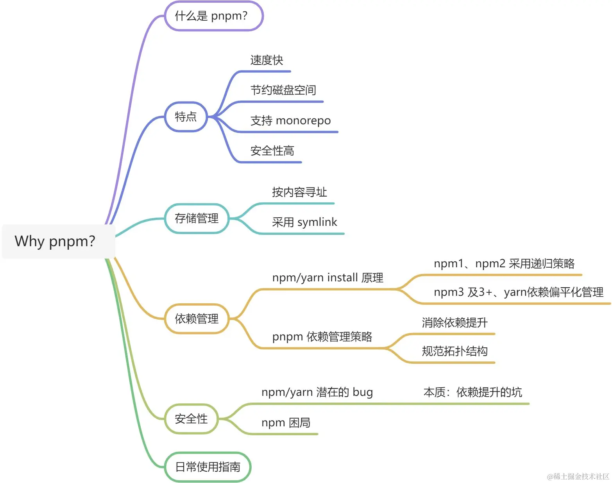
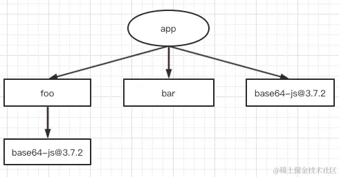
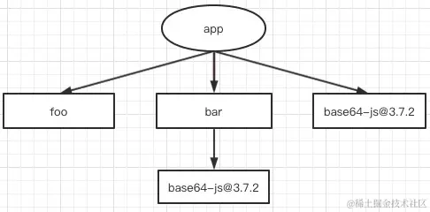
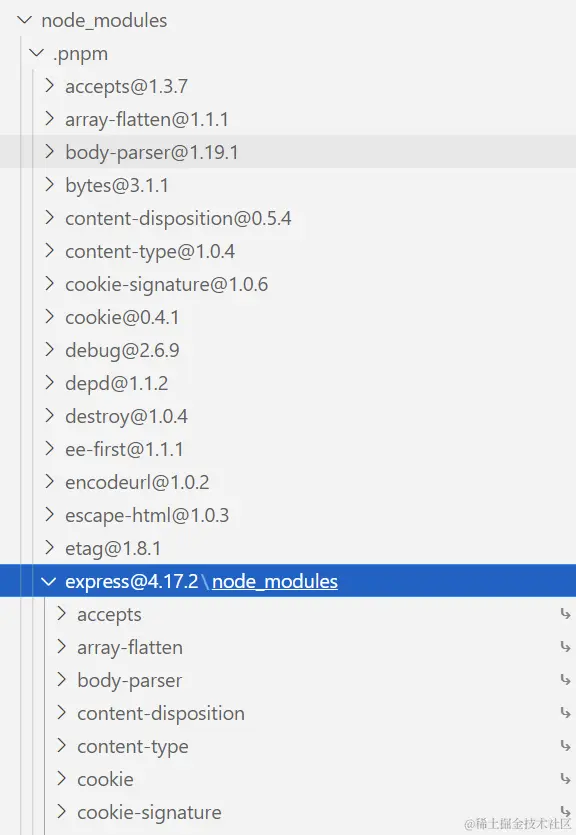
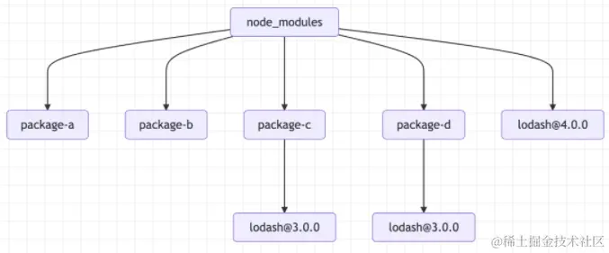

> 粗浅理解，文中若有错误，欢迎您的批评指正！

# pnpm

pnpm 是由 npm/yarn 衍生而来，但是却解决了 npm/yarn 内部潜在的 bug，并且极大地优化了性能，扩展使用场景。下面是思维导图：



## 什么是 pnpm？

pnpm 的官方文档是这样说的：

Fast, disk space efficient package manager

因此，pnpm 本质上是一个包管理工具，这一点上是跟 npm/yarn 没有区别的。那么它的优势在于：

- 包安装速度极快
- 磁盘空间利用非常有效

## 使用

安装 pnpm

```shell
npm i -g pnpm
```

具体使用命令与 npm 使用方法一致。

```shell
pnpm install xxx
pnpm add xxx
```

## 特点

### 速度快

pnpm 安装包的速度究竟有多快？在绝大数场景下，pnpm 安装包的速度会比 npm/yarn 快 2-3 倍。

### 高效利用磁盘空间

pnpm 内部使用**基于内容寻址**的文件系统来存储磁盘上所有的文件，这个文件系统出色的地方在于：

- 不会重复安装同一个包，用 npm/yarn 的时候，如果有 100 个项目都依赖于 loadhash，那么 loadhash 很有可能就被安装 100 次，磁盘就有 100 个地方写入了这部分代码。但是在使用 pnpm 只会安装一次，磁盘中只有一个地方写入，后面都会使用 hardlink（硬链接）。
- 即使一个包的不同版本，pnpm 也会极大程度地复用之前版本的代码。举个例子，比如 lodash 有 100 个文件，更新版本之后多了一个文件，那么磁盘当中并不会重新写入 101 个文件，而是保留原来的 100 个文件的 hardlink，仅仅写入那一个新增的文件。

### 支持 monorepo

随着前端工程的日益复杂，越来越多的项目开始使用 monorepo。
之前对于多个项目的管理，我们一般都是使用多个 git 仓库，但 monorepo 的宗旨就是用一个 git 仓库来管理多个子项目，所有的子项目都存放在根目录的 packages 目录下，那么一个子项目就代表一个 package。

> 如果你之前没接触过 monorepo 的概念，建议仔细看看[这篇文章](https://link.juejin.cn/?target=https%3A%2F%2Fwww.perforce.com%2Fblog%2Fvcs%2Fwhat-monorepo)以及开源的 monorepo 管理工具[lerna](https://link.juejin.cn/?target=https%3A%2F%2Fgithub.com%2Flerna%2Flerna%23readme)，项目目录结构可以参考一下[babel 仓库](https://link.juejin.cn/?target=https%3A%2F%2Fgithub.com%2Fbabel%2Fbabel)。

pnpm 与 npm/yarn 另外一个很大的不同就是支持了 monorepo，体现在各个子命令的功能上，比如在根目录下 pnpm add A -r, 那么所有的 package 中都会被添加 A 这个依赖，当然也支持 --filter 字段来对 package 进行过滤。

### 安全性高

之前使用 npm/yarn 的时候，由于 node_module 的扁平结构，如果 A 依赖 B，B 依赖于 C，那么 A 是直接可以使用 C 的，但是问题是 A 当中并没有声明 C 这个依赖，因此会出现非法访问的情况。

## 依赖管理相关原理

### npm/yarn install 原理

主要分为两个部分，首先，执行 npm/yarn install 之后，包是如何到达项目 node_modules 当中。其次，node_modules 内部是如何管理依赖。

执行命令后，首先会构建依赖树，然后针对每个节点下的包，会经历下面四个步骤：

1. 将依赖包的版本区间解析为某个具体的版本号；
2. 下载对应版本依赖的 tar 包到本地离线镜像；
3. 将依赖从离线镜像解压到本地缓存；
4. 将依赖从缓存拷贝到当前目录的 node_modules 目录。

也就是经历 解析，下载，解压，拷贝 四个过程之后，我们所需要的包会到达项目的 node_modules 目录中。

那么，这些依赖在 node_modules 内部是什么样的目录结构呢，换句话说，项目的依赖树是什么样的呢？

在 npm1、npm2 中呈现出的是嵌套结构，比如下面这样：

```shell
    node_modules
    └─ foo
       ├─ index.js
       ├─ package.json
       └─ node_modules
          └─ bar
             ├─ index.js
             └─ package.json
```

接着，从 npm3 开始，包括 yarn，都着手通过 扁平依赖 的方式来解决这个问题。相信大家都有这样的体验，我明明安装个 express，为什么 node_modules 里面多了这么多东西？

```shell
    node_modules
    ├─ foo
    |  ├─ index.js
    |  └─ package.json
    └─ bar
       ├─ index.js
       └─ package.json
```

所有的依赖都被拍平到 node_modules 目录下，不再有很深层次的嵌套关系。这样在安装新的包时，根据 node require 机制，会不停往上级的 node_modules 当中去找，如果找到相同版本的包就不会重新安装，解决了大量包安装的问题，而且层级也不会太深。

但是存在以下问题：

- 依赖结构的不确定性
- 扁平化算法本身的复杂性很高，耗时较长。
- 项目中仍然可以非法访问没有声明过的依赖包。

> 其中，对于第一点不确定性的问题：

> 假如现在项目中依赖两个包 foo 和 bar，这两个包的依赖是怎样的？npm/yarn install 的时候，通过扁平化处理之后，究竟是这样：
> 
>
> 还是这样：
>
> 
>
> 答案是：都有可能！取决于 foo 和 bar 在`package.json`中的位置，如果 bar 声明在前面，那么就是前面的结构，否则就是后面的结构。

> 这就是为什么产生依赖结构不确定性问题，也就是 lock 文件诞生的原因，无论是和 `package.json` 还是 `yarn.lock`，都是为了保证 install 之后能产生确定的`node\_modules 结构`。

> 尽管如此，npm/yarn 本身还是存在扁平化算法和 package 非法访问的问题，影响性能和安全。

<!-- ### pnpm 依赖管理

pnpm 开创了一套新的依赖管理机制，现在就让我们去一探究竟。

还是以安装 express 为例，我们新建一个目录，执行：

```shell
pnpm init -y
```

我们再去看看 node_modules:

```shell
    .pnpm
    .modules.yaml
    express
```

我们直接可以看到了 express，但是值得注意的是，这里仅仅是一个 软链接，不信你打开看看，里面并没有 node_modules 目录，如果是真正的文件位置，那么根据 mode 的包加载机制，它是找不到依赖的。那么它真正的位置在哪儿呢？？

我们继续在 .pnpm 当中寻找：

```shell
    ▾ node_modules
      ▾ .pnpm
        ▸ accepts@1.3.7
        ▸ array-flatten@1.1.1
        ...
        ▾ express@4.17.1
          ▾ node_modules
            ▸ accepts
            ▸ array-flatten
            ▸ body-parser
            ▸ content-disposition
            ...
            ▸ etag
            ▾ express
              ▸ lib
                History.md
                index.js
                LICENSE
                package.json
                Readme.md
```

好家伙！竟然在`.pnpm/express\@4.17.1/node_modules/express`下面找到了!



好像也都是一样的规律，都是<package-name>@version/node_modules/<package-name>这种目录结构。并且 express 的依赖都在`.pnpm/express\@4.17.2/node_modules`下面，这些依赖也全都是**软链接**。

再看看.pnpm，.pnpm 目录下虽然呈现的是扁平的目录结构，但仔细想想，顺着软链接慢慢展开，其实就是嵌套的结构

```shell
    ▾ node_modules
      ▾ .pnpm
        ▸ accepts@1.3.7
        ▸ array-flatten@1.1.1
        ...
        ▾ express@4.17.1
          ▾ node_modules
            ▸ accepts  -> ../accepts@1.3.7/node_modules/accepts
            ▸ array-flatten -> ../array-flatten@1.1.1/node_modules/array-flatten
            ...
            ▾ express
              ▸ lib
                History.md
                index.js
                LICENSE
                package.json
                Readme.md
```

将包本身和依赖放在同一个 node_module 下面，与原生 Node 完全兼容，又能将 package 与相关的依赖很好的组织到一起，设计十分精妙。 -->

<!-- ## 其他

### pnpm 的安全性

pnpm 这种依赖管理的方式也很巧妙地规避了非法访问依赖的问题，也就是只要一个包未在 package.json 中声明依赖，那么在项目中是无法访问的。

### package-lock.json

其实用一句话概括很简单，就是锁定安装时包的版本号，并且需要上传到 git 上，以保证其他人在 npm install 时大家的依赖能保证一致的。

### 硬链接和软链接

假如，我们有一个文件，称为 hello

通过 ln -s 创建一个软链接，通过 ln 可以创建一个硬链接。

```shell
    ln -s hello hello-soft
    ln hello hello-hard

    ls -lh
    total 768
    45459612 -rw-r--r--  2 xiange  staff   153K 11 19 17:56 hello
    45459612 -rw-r--r--  2 xiange  staff   153K 11 19 17:56 hello-hard
    45463415 lrwxr-xr-x  1 xiange  staff     5B 11 19 19:40 hello-soft -> hello
```

<p>他们的区别有以下几点：</p>
1、软链接可以理解为指向源文件的指针，它是一个单独的文件，仅仅只有几个字节，它拥有独立的inode。

2、硬链接与原文件同时指向一个内存地址，它与源文件共享存储数据，它俩拥有相同的 inode。

> 注：inode 是存储文件元信息的区域，也叫索引节点或 i 节点。

### pnpm 为何节省空间

pnpm 依赖项将存储在一个 全局 内容可寻址的仓库中，具体项目中使用依赖采用硬链接方式，而不是进行复制。对于每一个模块的每个版本只保留一个副本。

- 如果你用到某个依赖项的不同版本，那么只会将有差异的文件添加到仓库
- 所有的文件都会存储到硬盘上的同一个位置。当多个包被安装时，所有的文件会从同一个位置创建硬链接，不会占用额外的磁盘空间。这允许跨项目共享同一版本的依赖。

可以发现：

- 内容寻址存储在 C:\Users\Administrator.pnpm-store\v3
- 虚拟目录存储在 node_modules/.pnpm

**因此，node_modules 目录下的文件全部被软链到了虚拟存储路径下 .pnpm。.pnpm/ 以平铺的形式储存着所有的包（格式：.pnpm/<name>@<version>/node_modules/<name>。.pnpm 目录下的包会硬链到全局仓库中(/Users/Bert/.pnpm-store/v3)。**

它解决了 npm/yarn 平铺 node_modules 带来的依赖项重复的问题 (doppelgangers)。

假设存在依赖

```shell
    .
    ├── package-a
    │   └── lodash@4.0.0
    ├── package-b
    │   └── lodash@4.0.0
    ├── package-c
    │   └── lodash@3.0.0
    └── package-d
        └── lodash@3.0.0
```

那么不可避免地在 npm 或者 yarn 中，**lodash\@3.0.0**会被多次安装，无疑造成了空间的浪费与诸多问题。

```shell
    ./node_modules/package-a
    ./node_modules/package-b
    ./node_modules/package-c
    ./node_modules/package-c/node_mdoules/lodash
    ./node_modules/package-d
    ./node_modules/package-d/node_mdoules/lodash
```

这是一个较为常见的场景，在平时项目中有些库相同版本甚至会安装七八次，如**postcss**、**ansi-styles**、**ansi-regex**、**braces**等，你们可以去你们的**yarn.lock**/**package-lock.json**中搜索一下。

而在 pnpm 中，它改变了 npm/yarn 的目录结构，采用软链接的方式，避免了**doppelgangers**问题更加节省空间。

它最终生成的**node_modules**如下所示，从中也可以看出它解决了幽灵依赖的问题。

 -->
