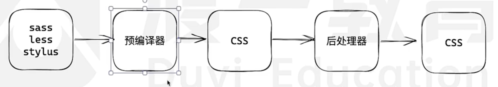
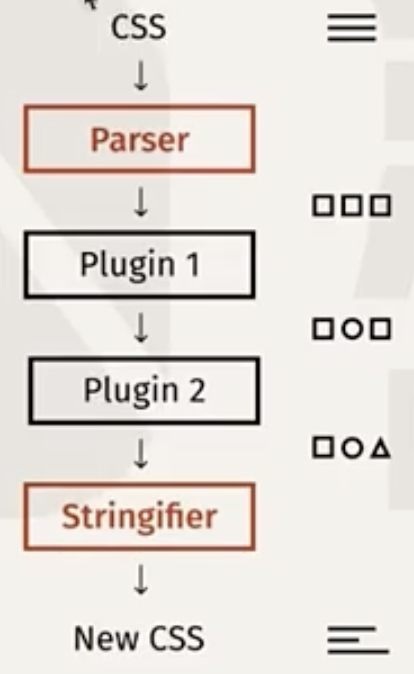
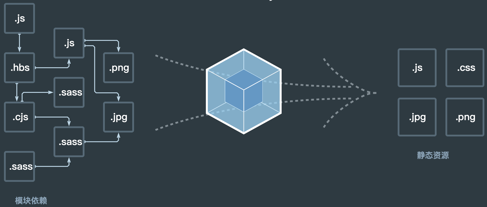
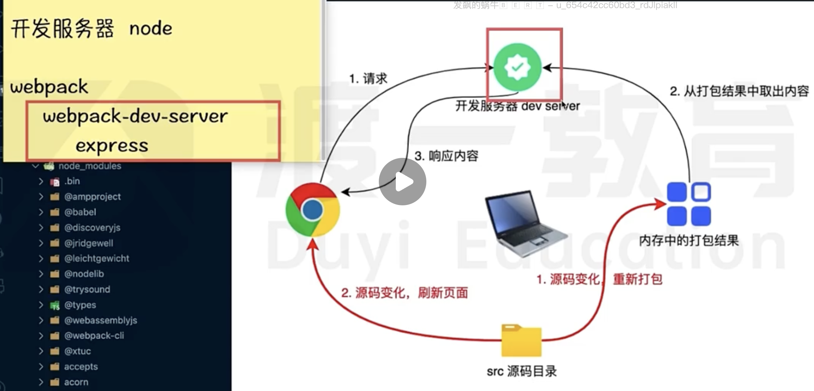
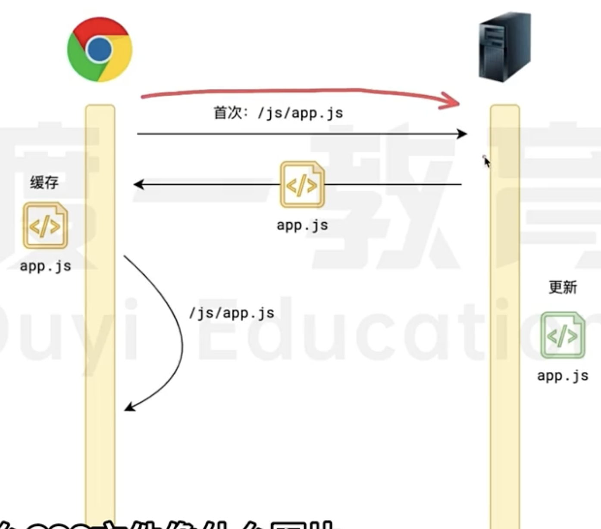

# 浅讲前端工程化

## 模块化和包管理

### 模块化

模块化是为了解决文件集合在**分解时存在的全局污染**和**聚合时存在的依赖混乱**等问题。

而模块化标准则是用于去解决这些问题，现有的一些模块化标准有：
+ CommonJS，简称CJS
+ AMD
+ CMD
+ UMD
+ Ecmascript Module，简称ESM

尽管方案不同，但是他们的目标是一致的，都是为了在分解时隐藏内部实现，避免全局污染；在聚合时，明确表达依赖关系，避免依赖混乱。
前四个标准为民间社区研发的标准，ESM为官方标准。由于历史原因，CJS现在依旧用的很多，而其他三个社区标准则渐渐没入历史长河中。ESM标准用的也很多，很多使用CJS的库也正往ESM转。

#### UMD

严格上说，UMD 不能算是一种模块规范，因为它没有模块定义和调用，这是 AMD 和 CommonJS 的结合体，保证模块可以被 AMD 和 commonjs 调用，模块的加载不影响它后面语句的运行。所有依赖这个模块的语句，都定义在一个回调函数中，等到加载完成之后，这个回调函数才会运行。

#### AMD

最古老的模块化系统，典型代表是 requirejs。异步模块定义（缩写为 Asynchronous Module Definition），采用异步方式加载模块，且可以并行加载多个模块。

#### CMD

CMD (Common Module Definition), 是 seajs 推崇的规范，CMD 则是依赖就近，与 AMD 一样，也是采用特定的 define()函数来定义，用 require 方式来引用模块。专门用于浏览器端，借鉴了 Commonjs 的规范与 AMD 规范。

> CMD 与 AMD 区别
>
> - AMD 和 CMD 最大的区别是对依赖模块的执行时机处理不同，而不是加载的时机或者方式不同，二者皆为异步加载模块。
> - AMD 依赖前置，js 可以方便知道依赖模块是谁，立即加载；
> - CMD 依赖就近，需要使用把模块变为字符串解析一遍才知道依赖了那些模块，这也是很多人诟病 CMD 的一点，牺牲性能来带来开发的便利性，实际上解析模块用的时间短到可以忽略。

#### Common JS

服务端模块规范，适用于 Node 环境和其他打包工具。因为他是同步加载模块，所以更适用于服务器端（不适合浏览器环境，存在阻塞加载）。可以这样理解，将所有服务器需要的模所有块一起存储在服务器本地，这样可以节省硬盘读取时间等等，加快了访问或其他操作的速度等；而如果是浏览器也使用这种同步加载，那么只能等待依赖包加载完成后才能执行具体的逻辑代码，这明显加长了等待时间，因此需要使用异步加载，也就是 AMD 规范。

#### ESM

2015 年，ES6 规范将模块化纳入 JavaScript 标准，关键字有 import，export，default，as，from。ESM 是浏览器和服务器通用的模块解决方案，但是我们在 Node 环境中仍然常用 CJS（Common JS）。

> CJS 与 ESM 区别 重点！！！！！！
>
> 前者 社区标准  后者 官方标准
>
> CJS 模块输出的是一个值的拷贝（模块内值和引用值之间改变时互不影响），而 ESM 模块输出的是值的只读引用，当改变模块内值时，引用值也改变。
>
> CJS 模块是**运行时**加载，且加载的是整个模块，也就是说将所有的接口全部加载进来，运行过后才能确定依赖关系；而 ESM 模块是**编译时**输出接口，可以单独加载其中的某个接口，不用运行代码，在编译时就能确定依赖关系。

### 包管理

包：package，一系列模块的集合。

主要工具就是npm，其他的一些都是在此基础上发展的，去弥补npm中的不足。

npm（包的属性、registry、cli）

其他：pnpm、yarn、cnpm、bower（浏览器）

## JS工具链

语言问题：

1. 兼容性

存在两类问题：
  + API兼容：ployfill（垫片），最核心的就是core-js，但是它并不能解决100%的问题，比如说一些跟环境有关的问题，比如浏览器中的一些原生能力。
  + 语法兼容：语法转换器 syntax transformer（runtime，也就是运行时支持各种语法）。每个语法都需要一个工具，而不是一个工具解决了所有语法关键词的兼容问题。

2. 语法增强

    比如TypeScript，使用tsc（转换工具）转换成js

因此，需要一个工具来将上面的这些工具串起来：**代码集成转换工具**，目前应用最多的是 babel，它会将你的代码转换成抽象语法树AST，然后在转换成代码。但是在转换成代码的过程中，你可以使用一系列插件去影响转换结果。

@babel/core、@babel/cli、@babel/preset-env（预设了一堆插件）

## CSS工具链

CSS语言存在的问题
1. 语法缺失（循环、判断、拼接）
2. 功能缺失（颜色函数、数学函数、自定义函数）

sass/less/styls ---- css预编译器 ---- CSS语言 ---- 厂商前缀（autoprefixer）、代码压缩（cssnano）、代码剪枝（purgecss）、类名冲突（css module），这些工具称为后处理器 ---- CSS

这一部分有个工具postcss，是将后处理器的这些工具进行集成。他的定位和使用逻辑基本和babel类似。

如图：先将css代码parser解析成抽象语法树，然后经过一系列的插件对抽象语法树进行修改，然后再将修改后的AST转成css文本。

## 构建工具和脚手架

针对的三个点：
1. 哪种工程更适合开发和维护

原则：一切皆为模块

2. 哪种工程更适合运行时

传统工程结构

3. 如何转换（打包）webpack、rollup、esbuilder、Rspack等等

参考webpack原理图：

以一个文件为入口，去寻找他的依赖关系，深度遍历，找到所有依赖关系，然后进行合并， 然后转换等等。

> 1. 入口entry
>
> 不运行语句，而是当成一个字符串，转成AST
>
> 然后两个步骤：识别导入语句；模块查找
>
>2. 开发服务器 webpack server
>
>其中，源码变化，刷新页面，这样的过程涉及到 webscoket 和 HMR 热更新。
>
>3. 文件指纹 哈希
>
> 浏览器首次访问服务器某个资源后，服务器会给他，由浏览器缓存起来。如果不使用文件指纹，当这个资源更新后，浏览器并不知道，再次请求直接就命中缓存。
>
> 而如果资源名称中使用了文件指纹（也就是命名带有哈希值），那么就无法命中缓存，会再次向服务器发起请求这个新的资源。

补充：

+ css module 解决类名冲突，但是类名都被弄成不太可读的惟一性很强的那种字符串，在编译后修改源代码中类名对应的元素，那么就可以借助 style，它包含了源代码类型和处理过后类名的一一对应关系。

+ 源码地图 利于调试，在webpack.config.js中的 devtool:"source-map" 开启后，可以在浏览器页面的检查下的source下，找到源代码（Authored下面，其实是源代码和编译后的代码deployed下面 存在一一对应关系），然后打断点调试。

不用文件指纹的请求：
