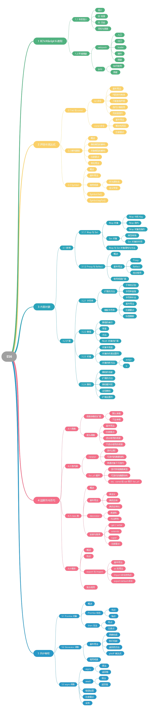
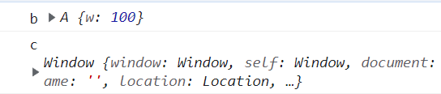
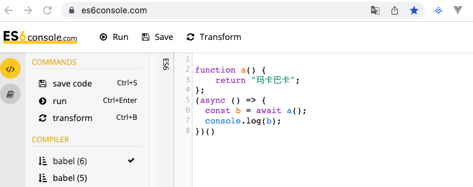
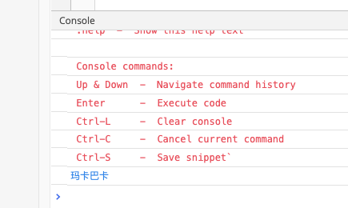

# ES6语法

<a name="mhF0B"></a>
## 什么是ES6+
2015 年 6 月正式发布了ECMAScript 6.0语法正式发布了, 简称"ES6", 他是对原有javascript语法的扩充, 每年都有新的语法扩充进来, 在本文中，这里把后续新增的语法统称"ES6+"语法。
<a name="YAo45"></a>
## 知识点思维导图
思维导图图片来自菜鸟教程，仅作知识分享之用，无其他用处。

这里我们主要学习ES6+中新增的语法：
1. 声明与表达式（let与const、解构赋值、Symbol）
2. 内置对象（新增Map与Set、Proxy与Reflect；扩展字符串、数值、对象、数组）
3. 运算符与语句（函数扩展与箭头函数、迭代器的两种迭代循环、class类、模块的引包导包与复合）
4. 异步编程（Promise对象、Generator函数、异步编程）


<a name="fCnqo"></a>
## let
定义变量, 区别于"var", 他所声明的变量只在"let"所在的代码块内有效, 总之一句话: "var"就不要用了, 都替换成"let".
```javascript
{
  let a = 10;
  var b = 1;
}

a // ReferenceError: a is not defined.
b // 1
```
<a name="dEqhU"></a>
## const
定义常量, 定义后的变量不可修改
```javascript
const PI = 3.1415;
PI // 3.1415

PI = 3;
// TypeError: Assignment to constant variable.
```
<a name="JSxgR"></a>
## 数组解构赋值
```javascript
let [a, b, c] = [1, 2, 3];

// 等价
let a = 1;
let b = 2;
let c = 3;
```
<a name="b6gfq"></a>
## 对象的解构赋值
```javascript
let { foo, bar } = { foo: 'aaa', bar: 'bbb' };
foo // "aaa"
bar // "bbb"

let { x, y, ...z } = { x: 1, y: 2, a: 3, b: 4 };
x // 1
y // 2
z // { a: 3, b: 4 }
```
<a name="SRbSa"></a>
## 函数参数的解构赋值
```javascript
function add([x, y]){
  
  return x + y;
}
add([1, 2]); // 3
```
```javascript
function move({x, y} = { x: 0, y: 0 }) {
  return [x, y];
}
move({x: 3, y: 8}); // [3, 8]
```
<a name="tjWNb"></a>
## 模板字符串
字符串中可以优雅的插入变量.
```javascript
const a = '你好';
const b = `${a} Vue`;
// b == '你好vue'
```
<a name="UB2g6"></a>
## 函数参数默认值
```javascript
function add(a,b=1){
	return a+b;
}

add(3) // 4
```
<a name="QOvWW"></a>
## 箭头函数
```javascript
function a(){
	return '你好'
}

const a = function(){
	return '你好';
}

// 箭头函数
const a = ()=>{
	return '你好';
}

// 还可以更简单
const a = ()=>'你好'
```
箭头函数内部是没有自己的`this`的, 其`this`的值指向外层的作用域:
```javascript
function A(){
    this.w = 100

    const b = ()=>{
        console.log('b',this)
    }

    function c (){
        console.log('c',this)
    }
    
    b();
    c();
}
new A()
```

<a name="iGHPa"></a>
## 数组的扩展运算符
```javascript
// 等价于 console.log(1,2,3);
console.log(...[1, 2, 3]);

// 合并数组
const a = [1,2,3];
const b = [...a,4,5]; // [1,2,3,4,5]
```

<a name="uAiTu"></a>
## 对象属性的简洁表示法
```javascript
const a = 1;

const obj = {a: a};
// 简写
const obj = {a};  // {a: 1}
```
<a name="ENfiL"></a>
## 对象方法的简洁表示法
```javascript
const obj = {
  say:function (){
  	return '你好!';
  }
}; 
// 简写,可以省略":function"
const obj = {
  say (){
  	return '你好!';
  }
};
```

<a name="JLZGi"></a>
## 对象属性名表达式
对象的属性名可以支持变量.
```javascript
const a = 'abc';
let obj = {};
obj[`${a}123`] = 1;
console.log(obj) // {abc123:1};
```

<a name="U9KYR"></a>
## 链判断运算符(?)
实现对"**?**"左边的表达式是否为null或者undefined的判断, 如果是立即停止判断, 返回undefined或null.
```javascript
const firstName = (message
  && message.body
  && message.body.user
  && message.body.user.firstName) ｜｜ “default”;

// 简写
const fristName = message?.body?.user?.firstName ｜｜ “default”;
```

```javascript
const foo = {
  value: {
    a: "12345"
  }
}

const a = foo.value?foo.value.a:"6789"
// 简写
const a = foo.value?.a:"6789"

console.log(a)

// 结果12345
// 如果foo空对象即undefined，结果6789
// 如果foo.value为undefined，结果undefined
```

```javascript
let test = {
  say() {
    console.info(“Hello,world!”)
  }
}
// 判断对象是否有这样一个函数，如果有就执行，没有就返回undefined
test.say?.()
// 结果 Hello,world!

test.read?.()
// 结果 undefined

// 这里其实还有更复杂的形式和使用方式，熟悉理解之后能大大简化你的代码
```
<a name="AMrJJ"></a>
## Null判断运算符(??)
>  注意注意（🥸🥸🥸敲黑板～）：运算符?? 有一个运算优先级问题，它与 && 和 || 的优先级孰高孰低。现在的规则是，如果多个逻辑运算符一起使用，必须用括号表明优先级，否则会报错。

```javascript
console.log(0 ?? 1); // 0
console.log(false ?? 1); // false

console.log(undefined ?? 1); // 1
console.log(null ?? 1); // 1
```
只有"??"左侧的值是null或undefined才返回"??"右侧的值.
<a name="EFFdn"></a>
## Promise
Promise 是异步编程的一种解决方案，比传统的解决方案"回调函数和事件"更合理.<br />在这里大概了解下即可, 主要是为了讲解后面的"**async/await**", 因为在开发中我们使用的第三方插件很多都是封装成Promise格式的, 初期需要自己封装的需求很少.

```javascript
// 封装代码成Promise格式
const promiseA = ()=> new Promise(function(resolve, reject) {
  
  // === 你的代码 ===
  setTimeout(()=>{
    if(0.5 < Math.random()){
    	resolve('成功');
    } else {
    	reject('失败');
    }
	},200);
  // === 你的代码 ===
  
});

// 执行
promiseA().then(value=>{
	// '成功' == value
  console.log(value);
}).catch(error=>{
	// '失败' == error
  console.log(error);
});
```
<a name="ghrmN"></a>
## async/await

字面意思：async "异步"简写，理解为申明一个function是异步的；await可以认为是 async wait，理解为等待一个异步方法执行完成。
> async函数（包括 语句和表达式），执行成功，通过Promise.resolve（）封装，返回一个Promise对象，在最外层没有使用await获取返回值时，其返回值需要用 then()链 来处理这个Promise对象
> 
> 没有await 运算符时，async函数会立即执行，返回Promise对象，并不会阻塞后面的语句
> 
> await 是在等待一个返回值（不仅仅是async函数完成后返回的Promise对象，还有任意表达式的结果）。敲黑板了～🫣 如果他等的不是Promise对象时，那么await表达式的运算结果就是他等到的东西，比如下面这个截图，await 函数等待了一个字符串格式的返回结果





> 如果await等到的是一个 Promise 对象，那就忙起来了，它会阻塞后面的代码，等着 Promise 对象 resolve，然后得到 resolve 的值，作为 await 表达式的运算结果

执行Promise函数"更优雅". 用上面封装"promiseA函数"为例:
```javascript
function funA(){
  promiseA().then(value=>{
    console.log(value);
  }).catch(error=>{
    console.log(error);
  });
}

// 改写, 需要用try/catch来捕获"reject"触发的异常
async function funA(){
  try{
    const value = await promiseA();
    console.log(value);
  } catch(error){
    console.log(error);
  }
}

```
> 敲黑板了🧐 await只能出现在async函数中，可以这么去理解：await阻塞等待Promise对象resolve或者reject，因此必须写在异步函数里

<a name="dqPeE"></a>
## export
导出模块
```javascript
// xyz.js
export const a = 1;
export let x =123;
export function abc(){
}
export default {
  b:'2',
  c:3
};
```
<a name="ElF0W"></a>
## import 
导入模块
```javascript
import {a,x,abc},dd from './xyz.js';
dd // {b:'2',c:3}
```
<a name="QXSpf"></a>
## 更多
```javascript
(async () => {
    console.log(await asyncFunction());
})();
```
```javascript
(async function () {
    console.log(await asyncFunction());
})();
```
```javascript
const myFunction = async (a, b, c) => {
   // Code here
}

//等同于

async function myFunction (a, b, c) => {
   // Code here
}
```
在这里我只是给大家讲解了几个常用的语法, 更多请参考[阮一峰老师的教程](https://es6.ruanyifeng.com/#docs/let)

