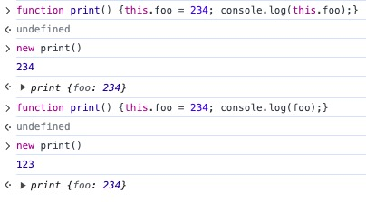

# javascript

> 写在前面：事实上，JavaScript 分为三个部分 ECMAScript、DOM、BOM，而本文讲述的重点是 ECMAScript。
>
> 关于另外两个部分，点击我的其他博客：[DOM](./dom.md)和[BOM](./window.md)。

* [如何在 HTML 中引入 JS](##如何在html中引入js)
* [数据类型](##数据类型)
* [逻辑运算符](##逻辑运算符)
* [类型转换](##类型转换)
* [JS 运行三部曲](##js运行三部曲)
* [作用域和作用域链](##作用域和作用域链)
* [闭包](##闭包)
* [立即执行函数](##立即执行函数)
* [对象（包括构造函数和包装类）](##对象)
* [原型](##原型)
* [原型链](##原型链)
* [JS 中小数点的精度问题](##JS中小数点的精度问题)
* [call / apply / bind](##call/apply/bind)
* [继承（extend）（四种形式/写法）](##继承（extend）)
* [命名空间](##命名空间)
* [枚举（扩展：hasOwnProperty、in、instanceof以及判断数据类型的方法）](##枚举)
* [this](##this)
* [arguments（arguments.callee、func.caller）](##arguments)
* [浅拷贝和深拷贝](##浅拷贝和深拷贝)
* [数组](##数组)
* [类数组](##类数组)
* [try{} catch(e) {}](##try{}catch(e){})


## 如何在 html 中引入 js

```html
<script type="text/javascript">
  本文件中写;
</script>
<script type="text/javascript" src="location">
  引入外部js文件
</script>
```

## 数据类型

**原始值**
Number String Boolean undefined null

null: 代表空，只是一个值，占位符 undefined：未定义

**引用值**
array Object function ...date RegExp

_相关知识点_：

null 和 undefined 的区别：
变量定义和赋值时的内存分配

具体回答：

+ undefined是表示变量声明过但并未赋过值，它是所有未赋值变量默认值；null表示一个变量将来可能指向一个对象，一般用于主动释放指向对象的引用。

1. null与undefined的异同点是什么呢？

共同点：都是原始类型，保存在栈中变量本地

不同点：

（1）undefined——表示变量声明过但并未赋过值。

它是所有未赋值变量默认值。

例如：var a; 

a自动被赋值为undefined

（2）null——表示一个变量将来可能指向一个对象。

一般用于主动释放指向对象的引用。

2. 何时使用null?

当使用完一个比较大的对象时，需要对其进行释放内存时，设置为null

3. 定义

（1）undefined：是所有没有赋值变量的默认值，自动赋值

（2）null：主动释放一个变量引用的对象，表示一个变量不再指向任何对象地址

4. 延伸——垃圾回收站

它是专门释放对象内存的一个程序。

（1）在底层，后台伴随当前程序同时运行；引擎会定时自动调用垃圾回收期；

（2）总有一个对象不再被任何变量引用时，才释放。

> nul == undefined 结果为 true

```javascript
var a = 123;
var b = 234;

// 交换a b:
// 方法1:
var c = a;
a = b;
b = c;

// 方法2:
a = a + b;
b = a - c;
a = a - b;
```

```javascript
var a = 123;
console.log(a++); // 先执行语句，再执行a++
console.log(++a); // 与上相反
```

```javascript
// 下面两个其实都是number类型
var num = 1 / 0; // Infinity 正无穷
var num = 0 / 0; // NaN Not a number
```

```javascript
NaN == NaN; // 结果为false，特例
```

undefined, null, NaN, "", 0, false 转换为 boolean 值都是 false

```javascript
// 实现一个函数判断传入参数是否为 NaN
function myIsNaN() {
  var ret = Number(num);
  ret += "";
  if (ret == "NaN") {
    return true;
  } else {
    return false;
  }
}
```

## **逻辑运算符**：

&& 返回的是表达式的值，找到第一个 false 就返回
比如 1 && 2 返回 2
0 && 2 返回 0
1 && 1 + 2 返回 3

|| 或运算符 找到第一个 true 就返回

> 短路语句（基于上方的 &&）
> 公司里一般这样写，拿到后端返回的 data 并执行函数
> data && fn(data);

查看变量类型：typeof();

typeof的返回值类型为字符串类型，返回值有：
>+ undefined: 如果这个值未定义
>+ boolean: 如果这个值是布尔值
>+ string: 如果这个值是字符串
>+ number: 如果这个值是数值
>+ object: 如果这个值是对象或者 null
>+ function: 如果这个值是函数
>+ symbol: 如果这个值是 symbol

## **类型转换**:

**显式类型转换**:

1. Number(mix)
   var num = Number('123'); 字符串转为数字类型 看起来不是数字的就不能转成数字，undefined 只能转成 NaN

2. parseInt(string, radix); radix 是基底的意思
   var num = parseInt("1233"); 转成整型 123.9 转成 123 true、false 转成 NaN
   var num = parseInt("12", 16); 将 12 看成 16 进制转换成 10 进制 非 16 进制的数转换成 NaN
   var num = parseInt("100px"); 会取出 100(识别到最后一个数字，然后返回)

3. parseFloat(string)

toString(radix) 注意：undefined 和 null 不能用 toString()
var demo = 123; var num = demo.toString();

4. String(mix)

5. Boolean()

这里的 parseInt() 和 toString() 可以结合使用去解决进制之间的转换

**隐式类型转换**（底层都是调用的显示类型转换）

isNaN : 实现原理： Number() ---》 NaN 先将传入的参数经由 Number()转成数字，再去判断 NaN
++/-- +/- （一元正负）

- -\*/%
  &&||!
  大于 小于 不小于 不大于
  == !=

> var num = 123.4545678;
> num.toFixed(2); 保留 2 位小数

> 函数、变量 声明：小驼峰原则

## js运行三部曲

1. 语义分析/语法分析：通篇扫描，看看语句 符号是否完整

2. 预编译： 发生在函数执行的前一刻，发生在函数体内和全局预编译环节...

_预编译前置学习了解_
imply global 暗示全局变量：任何变量，如果未经声明就赋值，此变量就为全局对象所有。

```javascript
a = 10; // window.a
console.log(a);
```

一切声明的全局变量，全是 window 的属性。 window 就是全局的域

```javascript
var b = 10; // window.b
console.log(b);
```

```javascript
var a = (b = 10); // 这个语句执行过程其实是: 先将10赋值给b; 再声明a; 最后将10赋值给a。
```

_预编译四部曲（过程）_

当发生在函数体预编译时：

**1. 创建 AO 对象（Activation Object 执行期上下文）**

**2. 找形参和变量声明，将变量和形参名作为 AO 属性名，值为 undefined**

**3. 将实参值和形参统一**

**4. 在函数体里面找函数声明，值赋予函数体**

**！！！变量声明提升！！！就体现在上述的过程中，如第二个步骤，找到变量声明**

**！！！函数声明提升！！！就体现在上述的过程中第四个步骤**

**！！！注意！！！语句执行过程中，如果 AO 中没有需要的属性名，则找 GO 负责：比如， c = 234; 这个语句执行到 GO 里，而不是 AO 里**

这个预编译四部曲其实可以直接总结成两个步骤：

```markdown
创建执行上下文有两个阶段：创建阶段和执行阶段
1）创建阶段
（1）this 绑定

    在全局执行上下文中，this指向全局对象（window对象）。
    在函数执行上下文中，this指向取决于函数如何调用。如果它被一个引用对象调用，那么 this 会被设置成那个对象，否则 this 的值被设置为全局对象或者 undefined

（2）创建词法环境组件

    词法环境是一种有标识符——变量映射的数据结构，标识符是指变量/函数名，变量是对实际对象或原始数据的引用。
    词法环境的内部有两个组件：加粗样式：环境记录器:用来储存变量个函数声明的实际位置外部环境的引用：可以访问父级作用域

（3）创建变量环境组件

    变量环境也是一个词法环境，其环境记录器持有变量声明语句在执行上下文中创建的绑定关系。

2）执行阶段
此阶段会完成对变量的分配，最后执行完代码。

简单来说执行上下文就是指：

    在执行一点JS代码之前，需要先解析代码。解析的时候会先创建一个全局执行上下文环境，先把代码中即将执行的变量、函数声明都拿出来，变量先赋值为undefined，函数先声明好可使用。这一步执行完了，才开始正式的执行程序。

    在一个函数执行之前，也会创建一个函数执行上下文环境，跟全局执行上下文类似，不过函数执行上下文会多出 arguments 和函数的参数。
```

> - 全局上下文：变量定义，函数声明，this
> - 函数上下文：变量定义，函数声明，this，arguments

```javascript
function fn(a) {
  console.log(a);

  var a = 123;

  console.log(a);

  function a() {}

  console.log(a);

  var b = function () {};

  console.log(b);

  function d() {}
}
fn(1);
```

这个代码中 AO 对象创建为：

```javascript
AO {
    a : function a () {},
    b : undefined, // 注意区分 函数声明 和 函数表达式
    d: function () {}
}
```

打印结果:

```javascript
function a() {}
123
123
function () {}
```

当发生在全局预编译环节时：
创建 **GO 对象（Global Object）**

> 注意：先有 GO，再有 AO；这句话，下面提到的执行上下文栈会解释。

> 在函数内执行时，如果某个 AO 中没有当前需要的变量，那么就去 GO 当中去寻找；如果有，就优先使用 AO 中的变量（优先用自己的）。

3. 解释执行：读一行执行一行，边读边执行

## **作用域和作用域链**

对象有属性和方法，函数也是一种特殊对象。

```javascript
function test() {}
// 比如属性 test.name test.prototype
// test.[[scope]] 隐式属性
```

**每个 js 函数都是一个对象，其中有属性可以让我们访问，但也有些不可以，这些属性仅供 js 引擎存取，[[scope]]就是其中一个。**

**[[scope]]指的就是我们所说的作用域，其中存储了运行期上下文的集合。**

**作用域链：[[scope]]中所存储的执行器上下文对象的集合，这个集合呈链式链接，我们把这种链式链接叫做作用域链。**

**运行期上下文：当函数执行的前一刻，会创建一个成为*执行期上下文*的内部对象。**
**一个执行期上下文定义了一盒函数执行是的化境，函数每次执行时对应的执行上下文都是独一无二的，**
**所以多次调用一个函数会导致创建多个执行上下文，当函数执行完毕，他所产生的执行上下文被销毁。**

> **执行上下文**是 JavaScript 中的一个重要概念，它是一段代码被执行时的环境。它包含了当前执行环境中的所有信息，如变量、函数声明、参数（arguments）、作用域链，以及 this 等信息。
>
> 在 JavaScript 中，执行上下文主要有两种类型：全局执行上下文和函数执行上下文，还有一个 eval 函数执行上下文。

> **全局执行上下文**
>
> 全局执行上下文是为运行存在于函数之外的任何代码而创建的，即整个 JavaScript 程序的执行环境就是一个全局执行上下文。每当一个函数被调用时，就会创建一个新的函数执行上下文，这个函数执行上下文包含了这个函数自身的局部变量、参数等执行环境信息。此外，使用 eval() 函数也会创建一个新的执行上下文。

> **函数执行上下文**
>
> 函数执行上下文是指在调用一个函数时，函数内部的变量和参数的取值范围。当一个函数被调用时，就会为该函数创建一个新的执行上下文，函数的上下文可以有任意多个。
>
> 在 JavaScript 中，函数执行上下文通常包括以下内容：
>
> 1. 函数内部声明的变量（局部变量）：这些变量只在函数内部有效，函数外部无法访问。
>
> 2. 函数参数：当调用函数时传递的实参，它们会被赋值给形参。
> 3. 全局变量：在函数外部声明的变量，可以在函数内部直接访问。
> 4. 内置对象：如 Math、Array 等，它们提供了一些内置的方法和属性。
> 5. 其他执行上下文相关的信息，如调用栈、作用域链等。

> **eval 函数执行上下文**
>
> eval() 函数用于执行一个字符串表达式，并返回表达式的值。
>
> 执行在 eval() 函数中的代码会有属于他自己的执行上下文，它的执行上下文通常是当前的全局和局部变量，不过 eval 函数不常使用。

**执行上下文栈**

JavaScript 引擎使用执行上下文栈来管理执行上下文

当 JavaScript 执行代码时，首先遇到全局代码，会创建一个全局执行上下文并且压入执行栈中，每当遇到一个函数调用，就会为该函数创建一个新的执行上下文并压入栈顶，引擎会执行位于执行上下文栈顶的函数，当函数执行完成之后，执行上下文从栈中弹出，继续执行下一个上下文。当所有的代码都执行完毕之后，从栈中弹出全局执行上下文。

**_代码执行过程中，变量的访问需要遵循作用域链。_**
**如何查找变量：从作用域链的顶端依次向下查找。当在某个函数体内查找变量时，就从该函数的作用域链顶端依次向下进行查找。**

```javascript
function a () {
    function b () {
        var b = 234;
    }
    var a = 123;
    b();
    console.log(a);
};
var glob = 100;
a();

// 个人理解————作用域链这块分为两个步骤：作用域链定义，即[[scope]]初始定义；代码执行，形成完整的作用域链。
// 当执行到 a(); 时，也就是 a 定义，创建一个 a.[[scope]] 即 a 函数的作用域链，其中是
0: GO {
    this: window,
    window: (object),
    document: (object),
    glob: 100,
    a: (function)
}

// 当开始执行 a(); 时，a.[[scope]] 中就变成了这样:
0: AO {
    this: window,
    arguments: [],  // 注意：这个 arguments 是类数组
    a: 123,
    b: (function)
},
1: GO {
    this: window,
    window: (object),
    document: (object),
    glob: 100,
    a: (function)
}

// 当创建 b() 函数时，b.[[scope]] 首先会“继承” 包含 AO 和 GO 的 a.[[scope]]，生成自己的 b.[[scope]]；然后，执行 b(); 时，在 b.[[scope]] 的基础上，再创建一个 属于 b 函数的 AO 对象，放到作用域链的最顶端，即这个索引为0的对象：
0: AO {
    this: window,
    arguments: [],
    b: 234
},
1: AO {
    this: window,
    arguments: [],
    a: 123,
    b: (function)
},
2: GO {
    this: window,
    window: (object),
    document: (object),
    glob: 100,
    a: (function)
}
```

> 有个小问题：b() 作用域链中的 a() 函数的 AO 对象和 a() 的作用域链中自己的 AO() 对象是同一个对象吗？也就是问， b() 中作用域链中指向的是不是就是 a() 的 AO 对象，是引用而不是重新创建了一个？

> 确实就是**引用**。个人理解：当函数执行前一刻，才会创建他对应的 AO 对象。执行 b() 时，会创建一个 b() 的 AO 对象，而 a() 已经执行过了，因此不会再创建 a() 对应的 AO 对象了。因此， b() 作用域链中的 a() 的 AO 对象其实就是引用。

继续以 b() 为例，当其执行完毕时，其作用域链会回归到初始定义的时刻，也就是销毁自己的 AO 对象的引用，回到 a() 的作用域链的样子。

再次举例：

```javascript
function a() {
  function b() {
    function c() {}
    c();
  }
  b();
}
a();
```

```javascript
a defined a.[[scope]] -- > 0 : GO
a doing   a.[[scope]] -- > 0 : aAO
                           1 : GO

b defined b.[[scope]] -- > 0 : aAO
                           1 : GO
b doing   b.[[scope]] -- > 0 : bAO
                           1 : aAO
                           2 : GO

c defined c.[[scope]] -- > 0 : bAO
                           1 : aAO
                           2 : GO
c doing   c.[[scope]] -- > 0 : cAO
                           1 : bAO
                           2 : aAO
                           3 : GO
```

较为特殊的一个例子：

```javascript
function a() {
  function b() {
    var bbb = 234;
    console.log(bbb);
  }

  var aaa = 123;
  return b;
}
var glob = 100;
var demo = a();
demo();
```

上述代码执行时，作用域链变化过程如下：

```javascript
// 执行 var demo = a(); 时，创建 a 的作用域链
a defined a.[[scope]] -- > 0 : GO
a doing   a.[[scope]] -- > 0 : aAO
                           1 : GO
// return b; 时，创建 b 的作用域链
b defined b.[[scope]] -- > 0 : aAO
                           1 : GO

// var demo = a(); 执行完成之后，销毁 a 作用域链中的 a 的 AO 对象，即引用，但是 b 的作用域链中仍然保存着
a done    a.[[scope]] -- >
                           1 : GO
b defined b.[[scope]] -- > 0 : aAO
                           1 : GO

// 执行 demo(); 时
b doing   b.[[scope]] -- > 0 : bAO
                           1 : aAO
                           2 : GO

// demo(); 执行完成后
b done    b.[[scope]] -- > 0 : aAO
                           1 : GO

// 这个过程就是 闭包
```

## **闭包**

当内部函数被保存到外部时，将会生成闭包。闭包会导致原有作用域链不释放，造成内存泄漏。

内存泄露：反向理解，内存被占用就像泄漏了一样越来越少。

```javascript
function a() {
  var num = 100;
  function b() {
    num++;
    console.log(num);
  }
  return b;
}

var demo = a();
console.log(demo);
demo();
demo();

// 打印结果
// [Function: b]
// 101
// 102
```

**闭包的作用**

1. 实现公有变量。例如：函数累加器

2. 可以做缓存（存储结构）。

3. 可以实现封装，属性私有化。

4. 模块化开发，防止污染全局变量。

上述第 3 点中讲述的私有化属性，第 4 点中的模块化开发，以下面代码为例讲述：

```javascript
var prepareWife = "meiyou";
function Person(name, wife) {
  var prepareWife = "zhang";
  this.name = name;
  this.wife = wife;

  this.divorce = function () {
    this.wife = prepare.wife;
  };

  this.changePrepareWife = function (target) {
    prepareWife = target;
  };

  this.sayPrepareWife = function () {
    console.log(preparewife);
  };
}

var person = new Person("liu", "John");
```

_对应第 3 点：_ 上述代码中，函数体内的 prepareWife 就是一个私有属性，不能通过 person.prepareWife 来调用和查看，只能通过指定（提供）的方法 person.sayPrepareWife() 来查看。

_对应第 4 点：_ 函数外部，也就是全局中的 var prepareWife = "meiyou" 并不会受到函数体内其他函数等的影响，也就是全局变量不会受到污染。

## 立即执行函数

JS 中提供的一个可以立即销毁：立即执行函数。
定义：此类函数没有声明，在一次执行过后即释放。适合做初始化工作。

> 立即执行完这个函数并释放后，就会自动忽略函数名。

针对初始化功能的函数，写法如下：

```javascript
// 官方的第一种写法：
(function (e) {
  console.log(e);
})(1);
// 或者
(function a() {})();
// 除了初始化页面的函数，其他的大概都需要接收返回值
var num = (function (e) {
  var d = e + 1;
  return d;
})(1);

// 官方的第二种写法：
(function (e) {
  console.log(e);
})(1);

// 但是W3C建议使用第一种
```

```javascript
// 函数声明
function test () {
    var a = 123;
};

// 函数声明后面不能直接加执行符号
// 比如：
function test () {
    var a = 123;
}();
// 执行结果：语法分析中报错
function test (b, c) {
    var a = 123;
}(1, 2);
// 解释器会这样理解
function test (b, c) {
    var a = 123;
}

(1, 2);
// 执行结果：啥也没有

// 只有表达式才能被执行符号执行
var test = function () {
    var a = 123;
    console.log(a);
}();
// 执行结果：打印了123

// + 号 - 号 ! 号都可以让函数变成表达式，则可以立即执行，比如：
+function () {
    var a = 123;
    console.log(a);
}();
```

```javascript
function test() {
  var arr = [];
  for (var i = 0; i < 10; i++) {
    arr[i] = function () {
      console.log(i);
    };
  }
  return arr;
}

var myArr = test();
for (var j = 0; j < 10; j++) {
  myArr[j]();
}

// 打印结果：十个10
// 原因：每一个无名function都引用了test函数的上下文，共用同一个i。当循环结束时，i 为10。因此，最终循环执行函数打印结果都是 10。
```

同样是上面这个例子，想要将打印结果变成每次循环的 i，即 0123456789，可以使用立即执行函数。
如下：

```javascript
function test() {
  var arr = [];
  for (var i = 0; i < 10; i++) {
    (function (j) {
      arr[j] = function () {
        console.log(j);
      };
    })(i);
  }
  return arr;
}

var myArr = test();
for (var j = 0; j < 10; j++) {
  myArr[j]();
}

// 打印结果：0 1 2 3 4 5 6 7 8 9
// 原因：每一个无名function引用的是立即执行函数的执行上下文，而立即执行函数的执行上下文中的形参 j 所对应的值不一样，是不同的 i。
```

```javascript
var x = 1;
if (function f() {}) {
  // 这行是立即执行函数，所以 f 未定义
  x += typeof f; // 未定义变量的typeof 执行结果是 “undefined”
}
console.log(x);
// if 的判断条件里，(function f() {}) 立即执行函数执行完成后，立即销毁。
// 因此，后面的表达式执行时，并不能查找到变量 f。
// 输出结果：1undefined
```

## 对象

### 对象的创建/构造方法

```javascript
// 对象创建方法
// 1.
var obj = {}; // plainObject 对象字面量/对象直接量

// 2. 构造函数
//  1) 系统自带的构造函数 Object()
var obj = new Object();
//  2) 自定义：自定义构造函数（注意：构造函数命名需要使用大驼峰命名规则）
function Person() {
  this.name = "John";
}
var pseron1 = new Person();
// 构造函数 Person(){} 在使用 new 时，
// 会首先在构造函数体内 隐式创建 var this = {};
// 那么在预编译时 也就会创建一个包含 this 属性的 AO 对象
// AO {
//    this : {
//        name: "John"
//    }
// }
// 当构造函数 函数体内快执行完时，会隐式的有个 return this;
// 因此，可以这样写：
console.log(new Person().name);
```

**构造函数内部原理**

同上述注释，其实分为三段：

1. 在函数体最前面隐式的加上 this = {};

2. 执行函数体内语句，例如：this.xxx = xxx;

3. 隐式的返回 this

在执行过程中，可以通过 new.target 判断该函数是否被作为构造函数调用。

**包装类**

> 前置知识：原始值只是个体，不是对象，因此没有属性和方法。

new Number();
new String();
new Boolean();

> 练习：求字符串的字节长度。
>
> 语法：stringObject.charCodeAt(index)
>
> charCodeAt() 方法可以返回指定位置的字符的 Unicode 编码。
>
> 这个返回值范围是 0-65535 之间的整数。
>
> （当返回值是 <=255 时，为英文。当返回值 >255 时为中文。）
>
> Unicode 编码前 255 位和 AscaII（255 位）一样

## 原型

prototype = {}

1. **定义**：原型是 function 对象的一个属性，他定义了构造函数制造出的对象的公共祖先。
   通过该构造函数产生的对象，可以继承该原型的属性和方法。原型也是对象。

2. 利用原型特点和概念，可以提取共有属性。

3. 对象如何查看原型 ---> 隐式属性 \_\_proto\_\_ (隐式命名规则)

> 注意：prototype实在函数对象上，\_\_proto\_\_ 是在这个函数创建实例对象上！！！
> 而实例对象的 \_\_proto\_\_ 指向自己缔造者的实例对象，也就是缔造者prototype指向的原型。

   在使用 new 调用构造函数时，也就是创建一个新对象时，三段式的第一步：

```javascript
// 前提：有一个构造函数
function Person() {
  // 在构造函数体内，会先隐式执行下面过程
  var this = {
    __proto__: Person.prototype,
  };
}

// 当在创建的对象中寻找某个属性对象的值时，如果创建的对象中没有，
// 则会通过 __proto__ 指向的原型中去寻找。
// 需要注意的是：__proto__ 指向哪个原型，这是可以被修改的
// 例如：
var obj = {
  name: "sunny",
};
var person = new Person();
person.__proto__ = obj;
```

```javascript
// 小知识
Person.prototype.name = "sunny";
function Person() {
  //   var this = {
  //     __proto__: Person.prototype,
  //   };
}

var person = new Person();

Person.prototype = {
  name: "cherry",
};
// 此时，执行 person.name 为“sunny”
// 为什么？
// 因为 var person = new Person(); 使得 person 中 __proto__ 属性所指向的原型仍然是 sunny 原型
// 而最后的原型赋值 cherry 对象语句，则是给 Person 中的原型属性重新引用赋值，
// 但不会影响之前创建的对象中 __proto__ 属性所指向的原型，
// 相当于某个人的前任换成现任了，但是他前任欠的钱还是应该去找前任。

Person.prototype.name = "majack";
// 但是如果是上面这个改法，person 中 __proto__ 属性所指向的原型中 name 则会改成 majack
// 因为这仅改动了之前原型中的某个属性，而不是改动了整个原型对象（并没有新创建一个引用）。
// 相当于说，仅换了前任的名字，但是人没换成现任。
```

> 构造函数定义后，自带 prototype 。
> 对象中 \_\_proto\_\_ 属性指向构造函数原型时，则是在 new 调用时创建。

4. 对象如何查看对象的构造函数 ---> constructor

```javascript
Person.prototype.name = "sunny";
function Person() {
  //   var this = {
  //     __proto__: Person.prototype,
  //   };
}

var person = new Person();

// 查看对象的构造函数
console.log(person.constructor);
```

## 原型链

绝大多数对象最终都会继承自 Object.prototype。

```javascript
Grand.prototype.lastName = "Grand1";
function Grand() {
  //   var this = {
  //     __proto__: Grand.prototype,
  //   };
}
var grand = new Grand();

Father.prototype = grand;
function Father() {
  //   var this = {
  //     __proto__: Father.prototype,
  //   };
  this.nextName = "father1";
}
var father = new Father();

Son.prototype.name = father;
function Son() {
  //   var this = {
  //     __proto__: Son.prototype,
  //   };
  this.name = "son1";
}
var son = new Son();

// 查看对象的构造函数
console.log(son.name); // 结果：son1
console.log(son.nextName); // 结果：father1
console.log(son.lastName); // 结果：Grand1
// 在新创建的对象中找不到某个属性的时候，他就会往他的原型中去找
// 从视觉上，你可能觉得：走到 Grand 的原型时，是不是就结束了？
// 事实并非如此，Grand的原型是 Object.prototype，他是所有对象的最终原型
Grand.prototype.__proto__ = Object.prototype;

console.log(Object.prototype);
// 返回结果：Object{...} 但是其中并没有 __proto__ 属性
console.log(Object.prototype.__proto__);
// 返回结果：null
```

Object.create(指定原型)
可以创建一个自己指定原型的对象，但是不怎么好使。因此。“绝大多数对象最终都会继承自 Object.prototype”这句话中说的是 绝大多数对象。

```javascript
var num = 123;
// num.toString(); --> new Number(num).toString();
Number.prototype.toString = function () {};
// number类型（number包装类）变量使用的转字符串方法函数 是重写过的相同函数名称的函数
// 这个方法重写，可以用 截断 实现
// 同样的，如下 也都重写了：
Array.prototype.toString;
Boolean.prototype.toString;
String.prototype.toString;

// 其原型链上所指的是对象的原型
Number.prototype.__proto__ = Object.prototype;
```
## JS中小数点的精度问题
>
> javascript 的浮点数运算就是采用了 IEEE 754 的标准，具体采用的是 **双精度（64 位）浮点运算规则**。
>
> 其组成：符号位、阶码（含阶符）、尾数
>
> 也就是浮点数的实际值等于符号位（sign）乘以指数偏移值（exponent）再乘以分数值。
>
> 可正常计算的范围： 小数点前 16 位，小数点后 16 位
>
> sign：最高有效位被指定为正负的符号位，0 表示正数，1 表示负数。
>
> exponent：指数偏移值，等于指数值加上某个固定的值。固定值为：2^e - 1，其中 e 为存储指数的长度，比如 32 位的是 8，64 位的为 11。
>
> fraction: 尾数，可以理解为小数点部分或者是有效数字，超出的部分自动进一舍零。
>
> **解决方案：**
>
> 1. 使用 toFixed() 转成有效位小数（但是还有问题）
>
> 2. 化整数运算
>
> 3. 转成字符串
>
> 4. 直接使用第三方库 big.js
>
> **其他常用数学函数：**
>
> Math.floor() 向上取整
>
> Math.ceil() 向下取整
>
> Math.random() 取个随机数

## call/apply/bind

call、apply 和 bind 都是 JavaScript 中 Function 对象的原型方法，它们的作用主要是改变函数的执行上下文（即 this 的值）以及传递参数。

#### **call**

**根本作用/功能就是改变 this 指向，引申出来的功能就是 借用别人的函数实现自己的功能。**

> 调用 call 的对象，必须是个函数 Function。

```javascript
Function.call(obj,[param1[,param2[,…[,paramN]]]])
```

> call 的第一个参数，是一个对象。 Function 的调用者，将会指向这个对象。如果不传，则默认为全局对象 window。

> 第二个参数开始，可以接收任意个参数。每个参数会映射到相应位置的 Function 的参数上。但是如果将所有的参数作为数组传入，它们会作为一个整体映射到 Function 对应的第一个参数上，之后参数都为空。

举例：

```javascript
function Person(name, age) {
  // this == obj
  this.name = name;
  this.age = age;
}

var person = new Person("xu", 26);

// 相当于借用别人的工厂创建 xu 这个属于我的或者我想要的人
var xu = {};
Person.call(xu, "xu", 26);
```

再拓展一点：我的需求能够完全覆盖别人实现的需求

```javascript
function Person(name, age) {
  this.name = name;
  this.age = age;
}

function Student(name, age, sex, tel) {
  // var this = {name : undefined, age : undefined}
  Person.call(this, name, age); // 借用别人的工厂函数实现自己的封装
  this.sex = sex;
  this.tel = tel;
}

var student = new Student("xu", 26, "male", 18262638107);
```

#### **apply**

基本同 call 类似。

> - 它的调用者必须是函数 Function，并且只接收两个参数，第一个参数的规则与 call 一致。
> - 第二个参数，必须是数组或者类数组，它们会被转换成类数组，传入 Function 中，并且会被映射到 Function 对应的参数上。**这也是 call 和 apply 之间，很重要的一个区别。**

重复一下上面的话，区别在于：

> - call 需要把实参按照形参的个数传进去。如果传入数组，这个数组只会被作为一个形参的值。
> - apply 需要传入的实参值是一个数组，即 arguments。

#### 面试题：JS 的 call 和 apply 方法是做什么的，两者有什么区别？

    改变 this 指向；传参列表不同。

#### **bind**

在 MDN 上的解释是：bind() 方法创建一个新的函数，在调用时设置 this 关键字为提供的值。并在调用新函数时，将给定参数列表作为原函数的参数序列的前若干项。

**练习题**

```javascript
function print() {
  var marty = {
    name: "marty",
    printName: function () {
      console.log(this.name);
    },
  };
  var test1 = { name: "test1" };
  var test2 = { name: "test2" };
  var test3 = { name: "test3" };
  test3.printName = marty.printName;
  var printName2 = marty.printName.bind({ name: 123 });
  marty.printName.call(test1);
  marty.printName.apply(test2);
  marty.printName();
  printName2();
  test3.printName();
}
print();
// 执行结果：
test1;
test2;
marty;
123;
test3;
```

## 继承（extend）

1. 传统形式：原型链

过多的继承了一些没有用的属性

2. 借用构造函数：比如 call、apply，但是实际上并没有继承，只是借用一下

   > - 不能继承借用构造函数的原型
   > - 每次构造函数都要多走一个函数（即增加了一个函数调用）

3. 共享原型/公有原型
   > - 不能随便改动自己的原型（因为改了，共享的原型也会改动）

```javascript
function Father() {}
fuction son() {}

// 实现共享原型的这种继承
function inherit(Target, Origin) {
    Target.prototype = Origin.prototype; // 其实就是复制了一下原型对象的引用
}

// 调用实现 Son 和 Father 共享 Father 的原型
inherit(Son, Father);

//  因为 Son 只是复制了一下 Father 原型对象的引用，所以修改 Son 的原型中的值时，Father 原型对象的值也会修改
Son.prototype.sex = "male";
var son = new Son();
var father = new Father();
```

4. 圣杯模式

其实，相当于在上面的**共享原型**上加了一个中间层，接着如上的代码：

```javascript
// 中间层 函数
function F() {}

// F 构造函数和 Father 构造函数依然是共享同一个原型
F.prototype = Father.prototype;
// 或者
inherit(F, Father);

// 然后 修改 Son 的原型
Son.prototype = new F();
```

完善上面代码块中的代码，实现三个点：

> - Son 能够共享 Father 的原型，但修改原型中数据时，不会影响原来的原型 Father.prototype
> - Son 的构造函数 constructor 能够指向自身
> - Son 能够找到自己的超类

```javascript
// 圣杯模式（代表永恒）
function inherit(Target, Origin) {
    function F() {};
    F.prototype = Origin.prototype;
    Target.prototype = new F();     // 加了一个中间层函数，实现上述中的第1点
    Target.prototype.constructor = Target;  // 构造函数指向自身，实现上述中的第2点
    Target.prototype.uber = Origin.prototype; // 给Target的原型加了一个属性，超类，用来找到自己的原型，实现上述中的第3点
}
Father.prototype.sex = "male";
function Father() {}
fuction son() {}

inherit(Son, Father);
var son = new Son();
var father = new Father();

console.log(son.sex);   // male
console.log(father.sex);    // male

Son.prototype.name = "bert";
console.log(son.name);   // bert
console.log(father.name);    // undefined
```

```javascript
// 圣杯模式 还有以下这种写法 建议写这种写法
var inherit = (function () {    // 立即执行函数
    var F = function () {}; // F 形成闭包，形成私有化变量
    return funtion (Target, Origin) {   // 闭包
        F.prototype = Origin.prototype;
        Target.prototype = new F();
        Target.prototype.constructor = Target;
        Target.prototype.uber = Origin.prototype;
    }
}())
```

## 命名空间

管理变量，防止污染全局，适用于模块化开发

```javascript
// 老办法：命名空间
var namespace = {
  department1: {
    bert: {
      name: "yang",
      sex: "male",
    },
    john: {
      name: "ang",
    },
  },
  department2: {
    zhangsan: {},
    lisi: {},
  },
};

// 使用时
var bert = namespace.department1.bert;
console.log(bert.name);
```

新方法就是使用**闭包**，对应上面说的闭包对应的第 4 点应用：**模块化开发，防止污染全局变量**。

> 实现方法的连续调用，直接在函数体内连续调用，比如：

```javascript
var person = {
  eat: function () {
    console.log("吃饭");
    return this;
  },
  drink: function () {
    console.log("喝汤");
    return this;
  },
};

person.eat().drink().eat(); // 连续调用
```

## 枚举

数组枚举：拿到数组的长度 length，然后 for 循环或者 while 循环

对象枚举：for in 循环

```javascript
var person = {
  name: "John",
  sex: "male",
  grade: 2023,
  __proto__: {
    lastName: "Bert",
  },
};

// 循环
for (var key in person) {
  console.log(key + " " + person[key] + " " + typeof key);
}

// 但是上面的循环，会将原型中的属性也取出来
// 因此，需要调用 hasOwnProperty()，判断是否为自身的属性，返回布尔值
for (var key in person) {
  if (person.hasOwnProperty(key)) {
    // 过滤原型中的属性
    console.log(key + " " + person[key] + " " + typeof key);
  }
}
```

> 注意：
>
> 在底层，person.name 会被先转换成 person['name'] ，然后执行
>
> 因此，如果上面的代码块中，person[key] 如果写成 person.key ，打印的结果就肯定是 undefined
>
> 因为 person.key 会转换成 person['key']，而 person 对象中并没有 key 属性

**比较 hasOwnProperty、in、instanceof**

- hasOwnProperty 会过滤掉原型中的属性，返回布尔值；写法 person.hasOwnProperty("name") 返回 true。
- in 则不会区分自身属性和原型中的属性，返回布尔值；写法 "name" in person 返回 true。
- instanceof 看 A 对象的原型链上 有没有 B 的原型；使用时写法与 in 有些类似：A instanceof B 意为 A 对象 是不是 B 构造函数 构造出来的。

**区分对象和数组的方法**

```javascript
var obj = {};
console.log(obj.constructor);   // 方法一
ƒ Object() { [native code] }    // 方法一 结果
obj instanceof array;    // 方法二
false // 方法二 结果
Object.prototype.toString.call({});     // 方法三
'[object Object]'       // 方法三结果

var arr = [];
console.log(arr.constructor);   // 方法一
ƒ Array() { [native code] }     // 方法一 结果
arr instanceof array;    // 方法二
true // 方法二 结果
Object.prototype.toString.call([]);     // 方法三
'[object Array]'        // 方法三结果
```

## this

1. 函数预编译过程 this ————> window

2. 全局作用域里 this ————> window
3. call/apply 可以改变函数运行时 this 指向
4. obj.func(); func() 里面的 this 指向 obj

```javascript
function test(c) {
  // var this = Object.create(test.prototype);
  // {
  //   __proto__ : test.prototype
  // }

  var a = 123;
  function b() {}
}

AO {
  arguments : [1],
  this : window,
  c : 1,
  a : undefined,
  b :function () {}
}

test(1);  // 执行前 进行预编译，产生AO
new test();   // 当将函数作为构造函数使用时，则相当于在函数体内首先执行 var this ... 上面的注释，
// 替换掉之前 this 指向的 window ，也相当于直接创建 { __proto__ ... }
```

考察 this 的使用：



函数体内的 foo 前并没有带有 this，因此还是会去找函数外部或者说全局 window 对象里有没有。

## arguments

1. arguments.callee

作用：指向函数引用。

举例：

```javascript
function test () {
  console.log(arguments.callee);
}
test();
//结果为
ƒ test () {console.log(arguments.callee)}

function test () {
  console.log(arguments.callee == test);
}
test();
//结果为
true
```

从上面代码块中的两个例子可以看出，arguments.callee 就是指向函数自身的一个引用。

但是，你可能会觉得这个用法并没有多大作用，以下就讲一个在立即执行函数中的作用。

```javascript
// 利用 arguments.callee 调用自身函数，因为自身这个立即执行函数没有定义函数名，
// 所有可以在函数体内使用 arguments.callee
var num = (function (n) {
  if (n == 1) {
    return 1;
  }
  return n * arguments.callee(n - 1);
})(10);
```

和这个知识点经常一起考的，就是下面的 func.caller。

2. func.caller

指向被调用的函数环境的函数。

```javascript
// 比如这里，指向的是 test() {}
function test() {
  demo();
}

function demo() {
  console.log(demo.caller);
}

test();
```

> 注意：这两个知识点经常连着考。
>
> 但是在实际应用中，这两个知识点用的很少，且**加了 'use strict' 之后，这两个知识点都被限制不可用**。

## 浅拷贝和深拷贝

两者区别主要体现在引用值上。浅拷贝的话，改变拷贝的引用对象上的值时，原引用对象上的值也会改变；但是深拷贝不会。

> 在实现深拷贝过程中，需要判断 被拷贝变量的类型时，推荐使用 toString()，万无一失，而 constructor() 和 instanceof 两种方法仍然有一些小 bug。

```javascript
// 使用 toString
function deepClone(t) {
  if (!(t instanceof Array) && !(t instanceof Object)) {
    return t;
  }

  let res;
  if (t instanceof Array) {
    res = [];
    for (var i = 0; i < t.length; i++) {
      res[i] = deepClone(t[i]);
    }
  } else if (t instanceof Object) {
    res = {};
    for (var key in t) {
      if (t.hasOwnProperty(key)) {
        res[key] = deepClone(t[key]);
      }
    }
  }
  return res;
}
```

```javascript
// 使用 toString
function deepClone(origin, target) {
  var target = target || {},
    toStr = Object.prototype.toString,
    arrStr = "[object Array]";

  for (var prop in origin) {
    if (origin.hasOwnProperty(prop)) {
      if (origin[prop] !== "null" && typeof origin[prop] == "object") {
        // if (toStr.call(origin[prop]) == arrStr) {
        //   target[prop] = [];
        // } else {
        //   target[prop] = {};
        // }
        // 上述代码，利用三目运算符简化
        target[prop] = toStr.call(origin[prop]) == arrStr ? [] : {};
        deepClone(origin[prop], target[prop]);
      } else {
        target[prop] = origin[top];
      }
    }
  }
  return target;
}
```

## 三目运算符

形式：
条件判断？是 : 否 并且会返回值

例题：
```javascript
var num = 1 > 0 ? ("10" > "9" ? 1 : 0) : 2;
// 先执行括号里面的三目运算符
// "10" > "9" 两个字符串比较，则是逐位比较 ASCII 值
// 比如，先比较 "1" 和 "9"，则是比较 1 和 9 ，为 false，再比较 "0" 和 "9"，同样为false
// 因此，上述 num 为 0

var num = 1 > 0 ? ("10" > 9 ? 1 : 0) : 2;
// 字符串与数字比较，则将字符串隐式转换成数字
// 因此，上述 num 为 1
```

## 数组

+ 数组的定义
  >+ new Array(length/content);
  >+ 字面量
+ 数组的读和写
  >+ arr[num] // 不可以溢出读 但是也不会报错，结果为 undefined
  >+ arr[num] = xxx; // 可以溢出写

**数组常用的方法，以下讲的都是 es3.0的方法，也是最基础最重要的方法**
+ 改变原数组（**可以改变原数组的就这7个方法，不论是es3、es5、es6**）
  >+ push, pop, shift, unshift, sort, reverse
  >+ splice
+ 不改变原数组
  >+ concat, join ----> split, toString, slice

**push 方法**：从数组最后一位后面开始添加元素

```javascript
arr = []
[]

arr.push(1)
1

arr
[1]

arr.push(2,3,4)
4

arr
(4) [1, 2, 3, 4]

arr.push([2,3,4])
5

arr
(5) [1, 2, 3, 4, Array(3)]
```

复现 push
```javascript
Array.prototype.push = function () {  // 覆盖原生的 push 方法
  for (var i = 0; i < arguments.length; i++) {
    this[this.length] = arguments[i];
  }
  return this.length;
}
```

**pop 方法**：从数组的最后一位开始删除元素，并返回该元素。

**unshift 方法**：从数组的第一个元素之前开始添加元素，并返回该数组的长度。

**shift 方法**：从数组的第一个元素开始删除元素，并返回该元素。

**sort 方法**：给数组元素排序，默认使用**ASCII码排序**和**升序**，并返回排序后的数组。
降序的话就 arr.sort().reverse()

```javascript
// 按照ASCII码排序，并不是我们一般想要的。因此，它提供了一个接口，供开发者任意定制排序方法
arr.sort(function (a, b) { 
  return a - b; 
});

// 返回正数，后面的数在前，也就是降序
// 返回负数，前面的数在前，也就是升序

// 拓展练习：将以下给定的一个有序的数组，按照乱序返回
var arr = [1, 2, 3, 4, 5, 6, 7];

// 解题：利用 Math.random()
arr.sort(function () {
  return Math.random() - 0.5;
});

// 拓展练习：利用字节长度排序（英文字符1字节，中文字符2字节）
function retBytes(str) {
  var num = str.length;
  for (var i = 0; i < str.length; i++) {
    if (str.charCodeAt(i) > 255) {
      num ++;
    }
  }
  return num;
}

var arr = ["安妮", "abc", "ai尼", "浙江高校"];

arr.sort(function (a, b) {
  return retBytes(a) - retBytes(b);
});
```
> 注意！！！
> 
> sort方法使用的是**冒泡排序算法**
>
> 1. 必须写两个形参
> 
> 2. 看返回值：返回值为负，升序；返回值为正，降序；为0，不动。

**splice 方法**：切片。
arr.splice(从第几位开始, 截取多少的长度, 在切口处添加新的数据)，
返回截取的元素。

```javascript
// 控制台
var arr = [0, 2, 3];
arr
(3) [0, 2, 3]
arr.splice(1) // 从索引1开始截取，一直截取到最后一个元素，并返回截取的元素
(2) [2, 3]
arr
[0]

// 讲一个利用splice添加元素的写法
var arr = [1, 2, 3, 5];
arr.splice(3, 0, 4);  // 表示在第3位，不切除元素，直接添加一个元素 4 。
// 即是用元素 4 直接替代索引为 3 的元素，之前的元素后移
console.log(arr);
// [1, 2, 3, 4, 5]

var arr = [1, 2, 3, 4];
arr.splice(-1, 1);  // 表示从数组的倒数第一位（即末尾），截取一个元素
[4]
console.log(arr);
[1, 2, 3]

// splice 的核心过程复现
Array.prototype.splice = function (pos, len, target) {
  // 先做越界判断
  ...
  // 再判断正负
  pos += pos > 0 ? 0 : this.length;
  ...
}
```

**concat 方法**：合并数组。

```javascript
// 合并数组用法
var arr = [1, 2, 3];
var arr1 = [4, 5];

arr.contact(arr1);
// 结果
[1, 2, 3, 4, 5]
```

**join 方法**：将数组的所有元素连接成一个字符串。传入参数则是数组元素连接成字符串时，中间需要添加的元素。

**split 方法**：与 join 方法可逆，将字符串按照什么符号（传入的参数）分割成一个数组。

**toString 方法**：数组转成字符串

**slice 方法**：截取字符串，从已有的数组中返回选定的元素，返回形式是一个截取出的数组。

```javascript
// slice 截取，传入两个参数
// slice(从该位开始截取，截取到该位)
var arr = [1, 2, 3];
var newArr = arr.slice(1，2);  // 从索引 1 开始截取，至索引 2 结束，但是不包括 2
// 结果
[2]

var arr = [1, 2, 3];
var newArr = arr.slice(0);  // 从索引 0 开始截取，一直到最后
// 结果
[1, 2, 3]

var arr = [1, 2, 3];
var newArr = arr.slice(-2);  // 从倒数第2位开始截取，一直到最后
// 结果
[2, 3]

// 空截
var arr = [1, 2, 3];
var newArr = arr.slice();  // 全部截取
// 结果
[1, 2, 3]
```

> **所有函数方法大总结**
>
> push()：在数组末尾添加一个或多个元素，并返回新的长度。
>
> pop()：从数组末尾移除最后一个元素，并返回该元素的值。
> 
> unshift()：在数组开头添加一个或多个元素，并返回新的长度。
> 
> shift()：从数组开头移除第一个元素，并返回该元素的值。
> 
> concat()：用于合并两个或多个数组。
> 
> slice()：从已有的数组中返回选定的元素。
> 
> splice()：向/从数组中添加/删除项目，然后返回被删除的项目。
> 
> join()：将数组的所有元素连接成一个字符串。
> 
> indexOf()：返回指定元素在数组中首次出现的位置。
> 
> lastIndexOf()：返回指定元素在数组中最后出现的位置。
> 
> forEach()：对数组的每个元素执行提供的函数。
> 
> map()：创建一个新数组，其结果是该数组中的每个元素调用一个提供的函数后返回的结果。
> 
> filter()：创建一个新数组，包含通过所提供函数实现的测试的所有元素。
> 
> reduce()：对数组中的每个元素执行一个提供的函数，将其结果汇总为单个返回值。
> 
> every()：检测数组中的所有元素是否都符合指定条件。
> 
> some()：检测数组中的某些元素是否符合指定条件。
> 
> find()：返回数组中满足提供的测试函数的第一个元素的值。
> 
> findIndex()：返回数组中满足提供的测试函数的第一个元素的索引。
> 
> reverse()：颠倒数组中元素的顺序。
> 
> sort()：对数组元素进行排序。
> 
> flat()：将嵌套的数组扁平化为一维数组。
> 
> flatMap()：首先使用映射函数映射每个元素，然后将结果压缩成一个新数组。
> 
> reduceRight()：从数组的末尾开始，对数组中的每个元素执行一个提供的函数，将其结果汇总为单个返回值。
> 
> isArray()：确定一个值是否为数组类型。
> 
> includes()：判断数组是否包含某个特定元素。
> 
> fill()：用静态值填充一个数组中从起始索引到终止索引内的全部元素。
> 
> copyWithin()：将数组的一部分拷贝到同一数组中的另一个位置，并覆盖原始数据。
> 
> keys()：返回一个包含数组中每个索引键的新 Array Iterator 对象。
> 
> values()：返回一个包含数组中每个值的新 Array Iterator 对象。
> 
> entries()：返回一个包含数组中每个索引键值对的新 Array Iterator 对象。


## 类数组

1. 可以利用属性名模拟数组的特性。

2. 可以动态的增长 length 属性。

3. 如果强行让类数组调用 push 方法，则会根据 length 属性值的位置进行属性的扩充。

函数的 arguments 就是类数组，他没有数组的方法。

**一个对象成为一个类数组，需要什么条件？**

属性要为索引（数字）属性；必须要有 length 属性；最好加上 push 方法。就比如：
```javascript
var obj = {
  "0" : 'a',
  "1" : 'b',
  "2" : 'c',
  "length" : 3,
  "push" : Array.prototype.push
}
```

还有个例题，**阿里某一年笔试题**：
```javascript
var obj = {
  "2" : 'b',
  "3" : 'c',
  "length" : 2,
  "push" : Array.prototype.push
}

obj.push('d');
obj.push('e');

// obj 实际上变动为
obj = {
  "2" : 'd',
  "3" : 'e',
  "length" : 4,
  "push" : Array.prototype.push
}

// 原因主要是数组中 push 方法的实现
Array.prototype.push = function (target) {
  obj[obj.length] =  target;
  obj.length ++;
}
```

> 类数组的好处：可以将数组和对象的一些特性拼到一起。
> 也存在问题：并不是所有的数组方法都可以使用，除非自己给这个类数组添加方法，就如上面的 obj 中添加 push 方法。


## 阶段复习

Object.create(prototype, defineProperty) 中第一个参数是，创建的对象指向的原型对象；第二个参数，则是对象中属性的可配置性（可读、可写等）。

**注意**：一旦经历了 var 的操作，所得出的属性，window，这种属性叫做不可配置的属性。不可配置的属性 delete不掉。


## try{}catch(e){}

