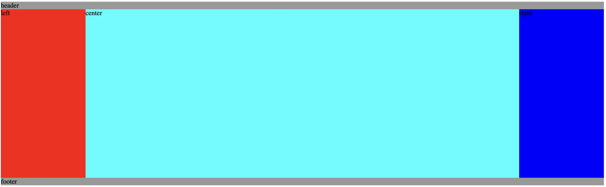
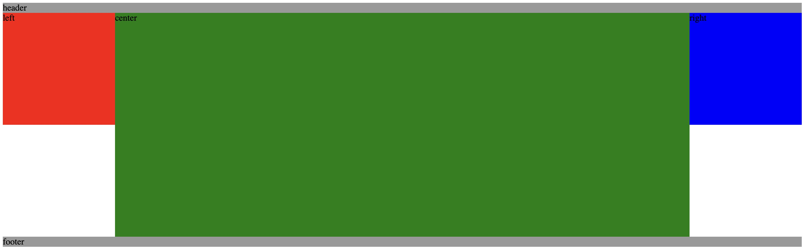

# 两栏、三栏、双飞翼、圣杯三种布局的实现

## 两栏布局

- 实现方式一：后面的那个元素使用绝对定位

```html
<!DOCTYPE html>
<html lang="en">
  <head>
    <meta charset="UTF-8" />
    <title>两栏布局</title>
  </head>
  <body>
    <div class="left">我的</div>
    <div class="right">首页</div>
  </body>
  <style>
    div[class="left"],
    div[class="right"] {
      width: 50%;
      text-align: center;
    }

    .left {
      position: absolute;
      left: 50%;
    }
  </style>
</html>
```

效果如图：


- 实现方式二：使用 float

```html
<!DOCTYPE html>
<html lang="en">
  <head>
    <meta charset="UTF-8" />
    <title>两栏布局</title>
  </head>
  <body>
    <div class="left">我的</div>
    <div class="right">首页</div>
  </body>
  <style>
    div[class="left"],
    div[class="right"] {
      width: 50%;
      text-align: center;
    }

    .left {
      background: aqua;
      float: right;
    }

    .right {
      overflow: hidden;
      background: aquamarine;
    }
  </style>
</html>
```

效果如图：


## 三栏布局

三栏布局的实现方式其实和上述两栏布局类似，要么定位，要么浮动。这里暂略，以后补充。

其中，最常用的就是圣杯布局和双飞翼布局，两者都是我们需要日常掌握的重要布局方式。他们的功能相同，都是为了实现一个两侧宽度固定，中间宽度自适应的三栏布局。（需要注意下：中间先加载渲染）

另外需要注意的是，两者实现方法略有差异，但都遵循了以下要点：

> - 两侧宽度固定，中间宽度自适应
> - 中间部分在 DOM 结构上优先，以便先行渲染
> - 允许三列中的任意一列成为最高列
> - 只需要使用一个额外的 div 外层标签

## 圣杯布局

+ 分别为三列设置宽度与浮动，同时对footer设置清除浮动；
+ 通过**负外边距结合相对定位**的方法把left模块移到原来预留的位置上
+ 通过**负外边距**把right模块放置到右边位置上

```html
<!DOCTYPE html>
<html lang="en">
  <head>
    <meta charset="UTF-8" />
    <title>圣杯布局实现</title>
  </head>
  <body>
    <div id="header">header</div>
    <div class="container">
      <div class="center column">center</div>
      <div class="left column">left</div>
      <div class="right column">right</div>
    </div>
    <div id="footer">footer</div>
  </body>

  <style>
    * {
      margin: 0px;
      padding: 0px;
    }
    #header,
    #footer {
      background: #999;
    }
    .container {
      height: 400px;
      padding: 0px 200px;
    }
    .center {
      height: 400px;
      width: 100%;
      background-color: aqua;
    }
    .left {
      height: 400px;
      width: 200px;
      margin-left: -100%;
      position: relative;
      right: 200px;
      background-color: red;
    }

    .right {
      height: 400px;
      width: 200px;
      margin-right: -100%;
      background-color: blue;
    }

    .container .column {
      float: left;
    }
    #footer {
        clear: both;
    }
  </style>
</html>
```

效果如图：



## 双飞翼布局

+ 首先，设置各列的宽度与浮动，并且为左右两列预留出空间，以及为 footer 设置浮动清除.
+ 其次，利用**左外边距**分别将left和right部分放到预定位置

```html
<!DOCTYPE html>
<html lang="en">
  <head>
    <meta charset="UTF-8" />
    <title>双飞翼布局实现</title>
  </head>
<body>
    <div id="header">header</div>
    <div class="container column">
      <div class="center">center</div>
    </div>
    <div class="left column">left</div>
    <div class="right column">right</div>
    <div id="footer">footer</div>
  </body>

  <style>
    * {
      margin: 0px;
      padding: 0px;
    }
    #header,
    #footer {
      background: #999;
    }
    .container {
      width: 100%;
    }
    .center {
      height: 400px;
      margin: 0 200px;
      background-color: green;
    }
    .left {
      height: 200px;
      width: 200px;
      margin-left: -100%;
      background-color: red;
    }
    .right {
      height: 200px;
      width: 200px;
      margin-left: -200px;
      background-color: blue;
    }
    .column {
      float: left;
    }
    #footer {
        clear: both;
    }
  </style>
</html>
```

效果如图：


