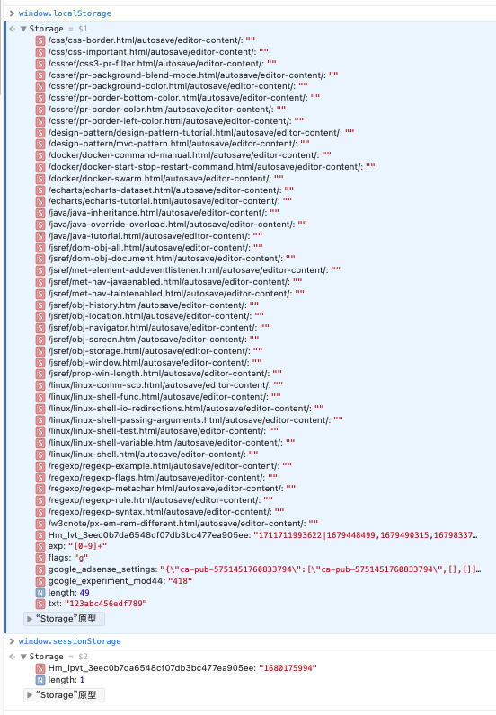

# 浏览器对象

* [Window对象](#Window对象)
* [Navigator对象](#Navigator对象)
* [Screen对象](#Screen对象)
* [History对象](#History对象)
* [Location对象](#Location对象)
* [存储对象](#存储对象)

## Window对象
### 概念
表示当前浏览器的窗口，为当前页面的顶层对象。
> 最高的一层对象，其他的对象都为其下属，那么也就是说：所有的Javascript对象、函数和变量等都会自动成为window对象的成员（全局变量是window的属性，全局函数是window的方法，反之也可以这么理解）

我们可以在浏览器的控制台中输入window，然后enter后则可以看到当前窗口的所有属性和方法，o为object，f为function。


在使用时，window对象不用new，直接使用即可，且在使用时也可省略。
比如：

``` javascript
// 滚动页面时触发导航变色
const handleScroll = () => {
    let scrollTop = window.pageYOffset || document.documentElement.scrollTop || document.body.scrollTop;
    // 设置背景颜色的透明度
    if (scrollTop > 85) {
        topBannerNavBg.background = 'linear-gradient(0.25turn, #13214b, #283673, #434198, #4f1460)'; // scrollTop + 多少根据自己的需求设置
    } else { //if (scrollTop === 0) 
        topBannerNavBg.background = 'transparent'; // 设置回到顶部时，背景颜色为透明
    }
};
```
这是一段响应式处理导航栏背景颜色的js代码，当滚动条滑动距离大于85像素时，背景颜色渐变，其余情况均为透明。
附上代码效果：


代码中，
```javascript
// window对象的使用，并不需要new一下window对象，script标签中直接使用即可啦～
window.pageYOffset // 取当前窗口页面在Y轴上的偏移量；
```
```javascript
document.documentElement.scrollTop // 等同于window.document.documentElement.scrollTop
```

### 常用属性
| 属性名称 | 属性含义或作用 | 
| ------ | -------- | 
| closed | 返回窗口是否已经被关闭 | 
| length	| 设置或返回窗口中的框架数量 |
| innerheight	| 返回窗口的文档显示区的高度(以像素计) |
| innerwidth	| 返回窗口的文档显示区的宽度(以像素计) |
| name	| 设置或返回窗口的名称 |
| outerheight	| 返回窗口的外部高度 |
| outerwidth	| 返回窗口的外部宽度 |
| parent |	返回父窗口 |
| document |	对文档对象的只读引用 |
| navigator |	对Navigator对象的只读引用 |
| screen |	对Screen对象的只读引用 |
| history |	对History对象的只读引用 |
| location |	窗口或框架的Location对象 |
| localStorage |	在浏览器中存储key/value对，没有过期时间 |

我们可以在浏览器中窗口控制台直接使用或者在代码中直接使用这些属性与下面的常用方法：


上图中右下角可以看见，location是当前页面的地址（包含当前主机域名、当前页面的路径和文件名、所使用的web协议、端口等）；
length，控制台输出的值为6，表明当前窗口的框架上数量为6。

> 另外，属性frames、self、window三者等价，返回的是对当前窗口的引用。

属性中的navigator、screen、history、location、localStorage，在接下来的文章中会继续讲述。

### 常用方法
| 方法名称 | 方法作用 | 
| ------ | -------- | 
| window.alert() | 显示带有一段消息和一个确认按钮的警告框 |
| window.open() | 打开新窗口 |
| window.close() | 关闭当前窗口 |
| window.moveTo() | 移动当前窗口 |
| window.resizeTo() | 调整当前窗口的尺寸 |
| window.focus() | 把键盘焦点给予一个窗口 | 
| window.blur() | 把键盘焦点从顶层窗口移开 |

## Navigator对象

其包含有关浏览器的信息。

我们在浏览器的控制台输入navigator之后，输出如下：


其中一些属性解释如下：

### 属性
| 属性名称 | 属性含义或作用 | 
| ------ | -------- | 
| appCodeName | 返回浏览器的代码名 | 
| appName | 返回浏览器的名称 | 
| appVersion	| 返回浏览器的平台和版本信息 |
| cookieEnabled	| 返回指明浏览器中是否启用cookie的布尔值 |
| platform	| 返回运行浏览器的操作系统平台 |
| userAgent	| 返回由客户机发送服务器的user-agent头部的值 |
| geolocation	| 返回浏览器的地理位置信息 |
| language	| 返回浏览器使用的语言 |
| onLine |	返回浏览器是否在线，在线返回ture，否则返回false |
| product |	对文档对象的只读引用 |

### 方法
| 属性名称 | 方法含义或作用 | 
| ------ | -------- | 
| javaEnabled() | 指定是否在浏览器中启用Java | 
| taintEnabled() | 规定浏览器是否启用数据污点(data tainting) | 

## Screen对象
其包含客户端显示屏的信息。


上图中，height表示屏幕总高度，width表示屏幕总宽度，而availHeight和availWidth表示不包括任务栏的高度、宽度。

## History对象

History对象主要包含的是用户在浏览器窗口中访问的URL地址。
在控制台中通过window.history访问如下：


### 属性

| 属性名称 | 属性含义或作用 | 
| ------ | -------- | 
| length | 用户在浏览器窗口中历史浏览的网址数量 | 

### 方法
| 属性名称 | 方法含义或作用 | 
| ------ | -------- | 
| back() | 加载历史浏览列表中的上一个URL | 
| forward() |同上，不过是下一个 | 
| go() | 同上，不过是指定的一个 | 

## Location对象
该对象包含当前URL的有关信息。使用window.location访问如下：


### 属性
| 属性名称 | 属性含义或作用 | 
| ------ | -------- | 
| hash | URL的锚部分 | 
| host | 主机名和端口 | 
| hostname | URL的主机名 | 
| href | 完整的URL | 
| pathname | URL路径名 | 
| port | URL服务器使用的端口号 | 
| protocol | 返回一个URL协议 | 
| search | URL的查询部分 | 
	
### 方法
| 属性名称 | 方法含义或作用 | 
| ------ | -------- | 
| assign() | 载入一个新的文档 | 
| reload() | 重新载入当前文档 | 
| replace | 用新的文档替换当前的文档 | 

## 存储对象
> 注意：localStorage 和 sessionStorage 统称为 webStorage。

Web存储API提供了sessionStorage（会话存储）和localStorage（本地存储）两个存储对象来对网页的数据进行增删改查。

- localStorage保存整个网站的数据，保存的数据没有过期时间，除非自己手动删除。
- sessionStorage临时保存某个窗口或标签页的数据，在关闭窗口或标签页之后将会删除这些保存的数据。




1. 存储内容大小一般支持5MB左右（不同浏览器可能还不一样）

2. 浏览器端通过 Window.sessionStorage 和 Window.localStorage 属性来实现本地存储机制。

3. 相关API：

    1. ```xxxxxStorage.setItem('key', 'value');```
        				该方法接受一个键和值作为参数，会把键值对添加到存储中，如果键名存在，则更新其对应的值。

    2. ```xxxxxStorage.getItem('person');```

        ​		该方法接受一个键名作为参数，返回键名对应的值。

    3. ```xxxxxStorage.removeItem('key');```

        ​		该方法接受一个键名作为参数，并把该键名从存储中删除。

    4. ``` xxxxxStorage.clear()```

        ​		该方法会清空存储中的所有数据。

4. 备注：

    1. SessionStorage存储的内容会随着浏览器窗口关闭而消失。
    2. LocalStorage存储的内容，需要手动清除才会消失。
    3. ```xxxxxStorage.getItem(xxx)```如果xxx对应的value获取不到，那么getItem的返回值是null。
    4. ```JSON.parse(null)```的结果依然是null。

### 属性

| 属性名称 | 属性含义或作用 | 
| ------ | -------- | 
| length | 存储对象中包含的数据条数 | 

### 方法
| 属性名称 | 方法含义或作用 | 
| ------ | -------- | 
| key(n) | 查询存储对象中第n个键的名称 | 
| getItem(k) | 查询指定键的值 | 
| setItem(k, v) | 添加键和值，如果对应的值存在，则更新 | 
| removeItem(k) | 移除键 | 
| clear() | 清除存储对象中所有的键 |